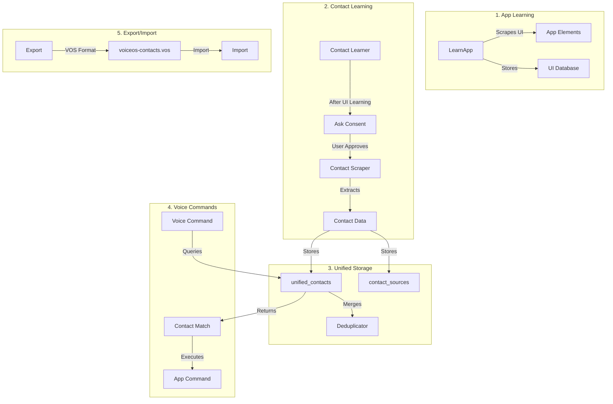
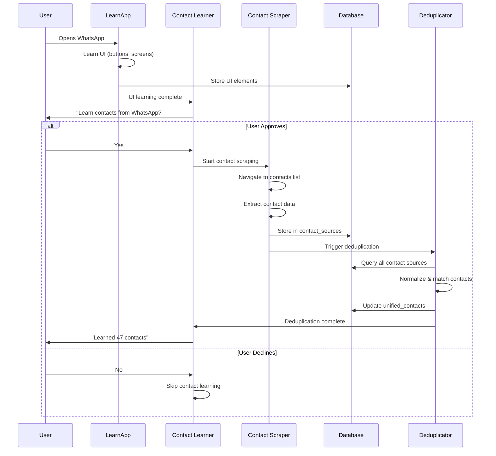
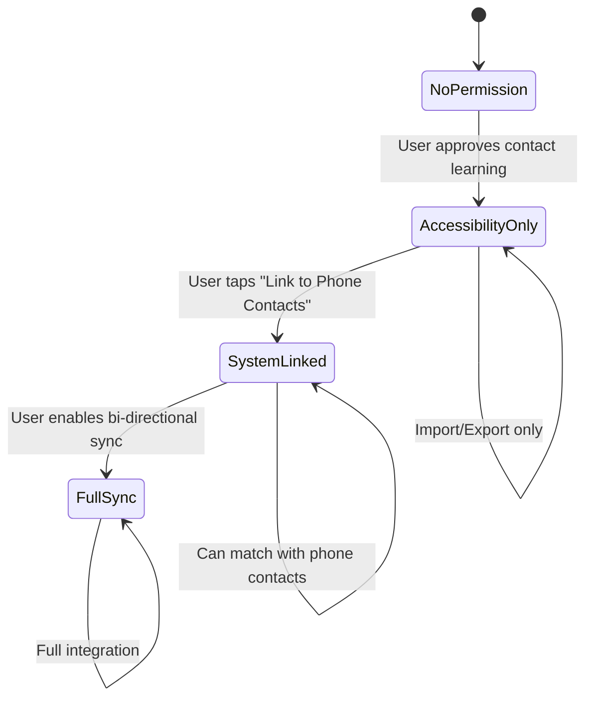

# LearnApp Developer Manual

**Module**: LearnApp
**Package**: `com.augmentalis.learnapp`
**Type**: Application Module
**Last Updated**: 2025-12-06 03:30 PST
**Status**: Production

## Developer Settings & Configurable Parameters (v2.1 - 2025-12-05)

### Overview

LearnApp provides **51 configurable settings** via `LearnAppDeveloperSettings`. All previously hardcoded values can now be adjusted at runtime without code changes.

**Files:**
- `settings/LearnAppDeveloperSettings.kt` - Settings backend (51 settings)
- `settings/ui/DeveloperSettingsActivity.kt` - Standalone activity (NEW)
- `settings/ui/DeveloperSettingsFragment.kt` - Settings UI fragment
- `settings/ui/DeveloperSettingsViewModel.kt` - UI ViewModel
- `settings/ui/SettingsAdapter.kt` - RecyclerView adapter
- `settings/ui/SettingItem.kt` - Data models

### Quick Start

```kotlin
val settings = LearnAppDeveloperSettings(context)

// Get current values
val maxDepth = settings.getMaxExplorationDepth()        // Default: 10
val timeout = settings.getExplorationTimeoutMs()        // Default: 5 minutes

// Modify values
settings.setMaxExplorationDepth(15)
settings.setExplorationTimeoutMs(600_000)  // 10 minutes

// Get all settings (for debugging)
val allSettings = settings.getAllSettings()

// Get settings by category (for UI)
val categories = settings.getSettingsByCategory()

// Reset to defaults
settings.resetToDefaults()
```

### Settings by Category

#### 1. Exploration Settings

| Setting | Method | Default | Range | Purpose |
|---------|--------|---------|-------|---------|
| Max Depth | `getMaxExplorationDepth()` | 10 | 1-50 | DFS traversal limit |
| Timeout | `getExplorationTimeoutMs()` | 300,000 | 30s-1hr | Max exploration time |
| Initial Screen Count | `getEstimatedInitialScreenCount()` | 20 | 1-100 | Progress estimation |
| Completeness Threshold | `getCompletenessThresholdPercent()` | 95% | 50-100% | "Fully learned" threshold |
| Similarity Threshold | `getScreenHashSimilarityThreshold()` | 0.85 | 0.5-1.0 | Screen revisit detection |

#### 2. Navigation Settings

| Setting | Method | Default | Range | Purpose |
|---------|--------|---------|-------|---------|
| Bounds Tolerance | `getBoundsTolerancePixels()` | 20 | 0-100 | Element refresh matching |
| Max Click Failures | `getMaxConsecutiveClickFailures()` | 5 | 1-20 | Screen abandonment threshold |
| Max Back Attempts | `getMaxBackNavigationAttempts()` | 3 | 1-10 | Recovery attempts |
| Min Alias Length | `getMinAliasTextLength()` | 3 | 1-10 | Element alias generation |

#### 3. Login & Consent Settings

| Setting | Method | Default | Range | Purpose |
|---------|--------|---------|-------|---------|
| Login Timeout | `getLoginTimeoutMs()` | 600,000 | 1-30min | Wait for user login |
| Permission Interval | `getPermissionCheckIntervalMs()` | 1,000 | 500ms-10s | Permission polling |
| Request Expiry | `getPendingRequestExpiryMs()` | 60,000 | 10s-5min | Consent timeout |

#### 4. Scrolling Settings

| Setting | Method | Default | Range | Purpose |
|---------|--------|---------|-------|---------|
| Max Attempts | `getMaxScrollAttempts()` | 5 | 1-20 | Scrolls per container |
| Scroll Delay | `getScrollDelayMs()` | 500 | 100-2000ms | Between-scroll delay |
| Elements Per Scrollable | `getMaxElementsPerScrollable()` | 20 | 5-100 | Per-container limit |
| Vertical Iterations | `getMaxVerticalScrollIterations()` | 50 | 5-200 | Max vertical scrolls |
| Horizontal Iterations | `getMaxHorizontalScrollIterations()` | 20 | 5-100 | Max horizontal scrolls |
| Container Depth | `getMaxScrollableContainerDepth()` | 2 | 1-10 | Nesting depth |
| Children Per Container | `getMaxChildrenPerScrollContainer()` | 50 | 10-200 | Child element limit |

#### 5. Click & Interaction Settings

| Setting | Method | Default | Range | Purpose |
|---------|--------|---------|-------|---------|
| Click Delay | `getClickDelayMs()` | 300 | 100-2000ms | Post-click settling delay (NEW) |
| Retry Attempts | `getClickRetryAttempts()` | 3 | 1-10 | Click failure retries |
| Retry Delay | `getClickRetryDelayMs()` | 200 | 50-1000ms | Between-retry delay |
| Screen Processing Delay | `getScreenProcessingDelayMs()` | 1000 | 100-5000ms | Screen transition delay (NEW) |

#### 6. UI Detection Settings

| Setting | Method | Default | Range | Purpose |
|---------|--------|---------|-------|---------|
| Touch Target Size | `getMinTouchTargetSizePixels()` | 48 | 24-96 | Material Design minimum |
| Bottom Region Threshold | `getBottomScreenRegionThreshold()` | 1600 | 500-3000 | Bottom nav detection |
| Expansion Wait | `getExpansionWaitDelayMs()` | 500 | 100-2000ms | Animation wait |
| Expansion Confidence | `getExpansionConfidenceThreshold()` | 0.65 | 0.3-1.0 | Detection threshold |
| Launch Retries | `getMaxAppLaunchEmitRetries()` | 3 | 1-10 | Event emit retries |

#### 7. JIT Learning Settings

| Setting | Method | Default | Range | Purpose |
|---------|--------|---------|-------|---------|
| Capture Timeout | `getJitCaptureTimeoutMs()` | 200 | 50-1000ms | Per-capture timeout |
| Traversal Depth | `getJitMaxTraversalDepth()` | 10 | 1-30 | Tree traversal limit |
| Max Elements | `getJitMaxElementsCaptured()` | 100 | 10-500 | Per-capture element limit |

#### 8. State Detection Settings

| Setting | Method | Default | Range | Purpose |
|---------|--------|---------|-------|---------|
| Transient Duration | `getTransientStateDurationMs()` | 500 | 100-2000ms | Transient state threshold |
| Flicker Interval | `getFlickerStateIntervalMs()` | 200 | 50-1000ms | Flicker detection interval |
| Stable Duration | `getStableStateDurationMs()` | 2000 | 500-10000ms | Stable state threshold |
| Flicker Occurrences | `getMinFlickerOccurrences()` | 3 | 2-10 | Min flicker count |
| Detection Window | `getFlickerDetectionWindowMs()` | 5000 | 1-30s | Flicker window |
| Major Penalty | `getPenaltyMajorContradiction()` | 0.3 | 0.0-1.0 | Confidence penalty |
| Moderate Penalty | `getPenaltyModerateContradiction()` | 0.15 | 0.0-1.0 | Confidence penalty |
| Minor Penalty | `getPenaltyMinorContradiction()` | 0.05 | 0.0-1.0 | Confidence penalty |
| Secondary Threshold | `getSecondaryStateConfidenceThreshold()` | 0.5 | 0.1-1.0 | Detection threshold |

#### 9. Quality & Processing Settings

| Setting | Method | Default | Range | Purpose |
|---------|--------|---------|-------|---------|
| Text Weight | `getQualityWeightText()` | 0.3 | 0.0-1.0 | Quality scoring |
| Content Desc Weight | `getQualityWeightContentDesc()` | 0.25 | 0.0-1.0 | Quality scoring |
| Resource ID Weight | `getQualityWeightResourceId()` | 0.3 | 0.0-1.0 | Quality scoring |
| Actionable Weight | `getQualityWeightActionable()` | 0.15 | 0.0-1.0 | Quality scoring |
| Batch Size | `getMaxCommandBatchSize()` | 200 | 10-1000 | Database batch limit |
| Min Label Length | `getMinGeneratedLabelLength()` | 2 | 1-10 | Label generation |

#### 10. UI & Debug Settings

| Setting | Method | Default | Range | Purpose |
|---------|--------|---------|-------|---------|
| Overlay Auto-Hide | `getOverlayAutoHideDelayMs()` | 5000 | 1-30s | Overlay timeout |
| Verbose Logging | `isVerboseLoggingEnabled()` | false | - | Debug logs |
| Screenshot on Screen | `isScreenshotOnScreenEnabled()` | false | - | Screen capture |

### Developer Settings UI

#### Launch via Activity (Recommended)

```kotlin
// From anywhere in VoiceOS - uses standalone activity
LearnAppIntegration.openDeveloperSettings(context)
```

This launches `DeveloperSettingsActivity` which hosts the fragment with proper back navigation.

#### Launch via Fragment (Embedded)

```kotlin
// Embed in existing activity
supportFragmentManager.beginTransaction()
    .replace(R.id.container, DeveloperSettingsFragment.newInstance())
    .addToBackStack(null)
    .commit()
```

**UI Features:**
- Tabbed interface by category (10 tabs)
- Number inputs with validation
- Toggle switches for booleans
- Sliders for percentages/thresholds
- Reset to defaults button
- Standalone activity with toolbar

### Integration Points

Settings are wired into these components:

| Component | Settings Used |
|-----------|---------------|
| ExplorationEngine | exploration, navigation, state detection |
| ScreenExplorer | scrolling, UI detection |
| ScrollExecutor | scrolling settings |
| ElementClassifier | UI detection |
| ExpandableControlDetector | detection settings |
| AppLaunchDetector | detection settings |
| JitElementCapture | JIT settings |
| TemporalStateValidator | state detection |
| NegativeIndicatorAnalyzer | state detection |
| MultiStateDetectionEngine | state detection |
| MetadataQuality | quality weights |
| LearnAppCore | processing settings |
| ConsentDialogManager | consent settings |

### Storage

Settings persist via SharedPreferences (`learnapp_developer_settings`)

### Delay Wiring (v2.1 Update)

All 24 hardcoded `delay()` calls have been replaced with configurable settings:

| File | Delays Replaced | Settings Used |
|------|----------------|---------------|
| ExplorationEngine.kt | 20 | Click, Scroll, Screen Processing |
| ScrollExecutor.kt | 4 | Scroll, Click Retry |
| ScreenExplorer.kt | 0 (no delays) | - |
| JitElementCapture.kt | 0 (already wired) | JIT Capture Timeout |

**Before (hardcoded):**
```kotlin
delay(300)  // Magic number
delay(500)  // Another magic number
```

**After (configurable):**
```kotlin
delay(developerSettings.getClickDelayMs())
delay(developerSettings.getScrollDelayMs())
```

### Verbose Logging (v2.1 Update)

Debug logging is now controllable via `isVerboseLoggingEnabled()`:

| File | Logs Wrapped | Log Types |
|------|--------------|-----------|
| ExplorationEngine.kt | 27 | Performance, C-Lite, Clicks |
| ScreenExplorer.kt | 5 | Element classification |

**Usage:**
```kotlin
if (developerSettings.isVerboseLoggingEnabled()) {
    Log.d(TAG, "Detailed debug info: $details")
}
```

Error and warning logs are NOT wrapped (always visible).

---

## AI Context Serialization (2025-12-05) ⭐ NEW

### Overview

`AIContextSerializer` now supports full round-trip serialization with the `deserializeContext()` method.

**File:** `ai/AIContextSerializer.kt`

### AVU Format

LearnApp uses AVU (Avanues Universal Format), a line-based text format:

| IPC Code | Data | Purpose |
|----------|------|---------|
| APP | package:name:timestamp | App metadata |
| STA | screens:elements:paths:avg:depth:coverage | Statistics |
| SCR | hash:activity:timestamp:count | Screen definition |
| ELM | uuid:label:type:actions:location | Element |
| NAV | from:to:uuid:label:timestamp | Navigation path |

### Usage

```kotlin
val serializer = AIContextSerializer(context)

// Save context
serializer.saveToFile(aiContext)

// Load context (now works!)
val restored = serializer.loadFromFile(packageName)
```

### Implementation Details

- Parses line-by-line with IPC code routing
- Handles missing fields with safe defaults
- Validates required APP entry
- Generates fallback stats if STA missing
- Skips comments (#) and separators (---)

---

## Scrollable Container Tracking (2025-12-05)

### Overview

ExplorationEngine now tracks scrollable containers discovered during exploration. Previously this stat was hardcoded to 0.

### Implementation

| Component | Change |
|-----------|--------|
| `ExplorationEngine` | Added `scrollableContainersFound` counter |
| `ScreenExplorer` | Returns `CollectionResult` with element count + scrollable count |
| `ExplorationStats` | `scrollableContainersFound` now populated |

### Code Flow

```
ExplorationEngine.startExploration()
  └── scrollableContainersFound = 0  // Reset counter

ScreenExplorer.exploreScreen()
  └── collectAllElements()
      └── scrollDetector.findScrollableContainers()
          └── Returns count in CollectionResult

ExplorationEngine (on each new screen)
  └── scrollableContainersFound += result.scrollableContainerCount

ExplorationEngine.createExplorationStats()
  └── scrollableContainersFound = this.scrollableContainersFound  // Actual value
```

---

## App Completion Marking (2025-12-05) ⭐ NEW

### Overview

New `markAppAsFullyLearned()` method in LearnAppRepository marks apps as 100% complete.

**File:** `database/repository/LearnAppRepository.kt`

### Usage

```kotlin
repository.markAppAsFullyLearned(packageName, System.currentTimeMillis())
```

### What It Does

1. Updates `status` field to `"LEARNED"`
2. Updates `exploration_status` to `COMPLETE` (legacy compatibility)
3. Sets `progress` to `100%`
4. Updates `screens_explored` with actual count
5. Sets `last_updated_at` timestamp

### Trigger Condition

Called in ExplorationEngine when `clickStats.overallCompleteness >= 95%`.

---

## Voice Command Element Persistence (2025-12-01)

### Overview

Voice Command Element Persistence enables voice commands to work on JIT-learned apps by persisting element data and generating commands at learn time, then using a 4-tier resolution system at command execution time.

**Spec:** `specs/voice-command-element-persistence-spec.md`
**Plan:** `specs/voice-command-element-persistence-plan.md`

### Architecture: 4-Tier Command Resolution

```
Voice Command → Tier 1 (CommandManager) → Tier 2 (Database) → Tier 3 (Property Search) → Tier 4 (Text Search)
```

| Tier | Method | Performance | Reliability |
|------|--------|-------------|-------------|
| 1 | CommandManager static | <5ms | 99% |
| 2 | Database lookup | <30ms | 95% |
| 3 | Property-based search | <20ms | 85% |
| 4 | Text-based search | <50ms | 60% |

### Phase 1: JIT Element Capture

**File:** `jit/JitElementCapture.kt`

Captures elements during JIT screen learning and persists them to database.

```kotlin
class JitElementCapture(
    private val databaseManager: VoiceOSDatabaseManager
) {
    suspend fun captureAndPersistElements(
        rootNode: AccessibilityNodeInfo,
        packageName: String
    ): List<String>  // Returns element hashes
}
```

**Key Features:**
- Uses `AccessibilityFingerprint.fromNode()` for stable element hashes
- Persists using `ScrapedElementDTO` for SQLDelight compatibility
- Captures: viewId, className, text, contentDescription, bounds, isClickable

**Performance:** <50ms per screen capture

### Phase 2: Command Generation

**File:** `jit/JustInTimeLearner.kt`

Generates voice commands from JIT-captured elements.

```kotlin
// After screen learning:
generateVoiceCommands(packageName, elementHashes)
```

**Generated Commands:**
- Click actions: "click [label]", "tap [label]", "press [label]"
- Scroll actions: "scroll [direction]"
- Type actions: "type in [label]"

**Storage:** Uses `GeneratedCommandDTO` for SQLDelight compatibility

### Phase 3: Tier 3 Property-Based Search

**Files:**
- `scraping/ElementSearchEngine.kt` - Search engine
- `scraping/ElementSearchCriteria.kt` - Search criteria

Real-time accessibility tree search when database lookup fails.

```kotlin
val engine = ElementSearchEngine(accessibilityService)
val criteria = ElementSearchCriteria(
    viewIdResourceName = "com.app:id/submit",
    text = "Submit"
)
val node = engine.findElement(criteria)
node?.performAction(ACTION_CLICK)
```

**Search Priority Order:**
1. ViewId resource name (95% reliability, fastest)
2. Bounds + Text combination (85% reliability)
3. Class + ContentDescription (70% reliability)
4. Text only (60% reliability, fallback)

**Performance Target:** <20ms

### Phase 4: VoiceCommandProcessor Integration

**File:** `scraping/VoiceCommandProcessor.kt`

Integrated Tier 3 into the command resolution flow:

```kotlin
private suspend fun tryRealtimeElementSearch(voiceInput: String): CommandResult {
    // Tier 3: Try property-based search first (faster, more reliable)
    val tier3Result = tryPropertyBasedSearch(voiceInput)
    if (tier3Result.success) {
        return tier3Result
    }

    // Tier 4: Fall back to text-based search
    val (action, target) = parseVoiceCommand(voiceInput)
    // ... text-based search logic
}
```

### SQLDelight DTO Pattern

**Important:** SQLDelight uses DTOs, not raw parameter inserts.

```kotlin
// CORRECT: Use DTO
val elementDTO = ScrapedElementDTO(
    id = 0L,  // Auto-generated
    elementHash = element.elementHash,
    appId = packageName,
    // ... other fields
)
databaseManager.scrapedElements.insert(elementDTO)

// WRONG: Named parameters (doesn't work)
databaseManager.scrapedElements.insert(
    elementHash = hash,
    appId = packageName
)
```

### Files Changed

| File | Change |
|------|--------|
| `JitElementCapture.kt` | Created - Element capture & persistence |
| `JustInTimeLearner.kt` | Modified - Command generation with DTO |
| `ElementSearchEngine.kt` | Created - Tier 3 search engine |
| `ElementSearchCriteria.kt` | Created - Search criteria data class |
| `VoiceCommandProcessor.kt` | Modified - Tier 3 integration |

---

## JIT Screen Hash Deduplication (2025-12-02) ⭐ LATEST

### Overview

JIT Screen Hash Deduplication avoids re-traversing screens that have already been captured, saving battery life and processing time. When JIT encounters a screen, it calculates a structure-based hash and checks if that screen was previously captured. If yes, it skips the expensive element capture phase (<7ms vs ~50ms).

**Spec:** `docs/specifications/jit-screen-hash-uuid-deduplication-spec.md`
**Plan:** `docs/specifications/jit-screen-hash-uuid-deduplication-plan.md`

**Key Benefits:**
- ⚡ **Performance**: <7ms hash check vs 50ms full capture
- 🔋 **Battery Savings**: Avoid redundant accessibility tree traversal
- 📊 **Unified Hashing**: Same algorithm as LearnApp (cache reuse)
- 🪟 **Popup Support**: Stable hashes for dialogs/popups

### Phase 1: Database Schema Enhancement

**File:** `libraries/core/database/.../ScrapedElement.sq`

Added `screen_hash` column to scraped_element table for deduplication.

```sql
-- New column
ALTER TABLE scraped_element ADD COLUMN screen_hash TEXT;

-- Index for fast lookups
CREATE INDEX idx_se_screen_hash
ON scraped_element(appId, screen_hash);

-- Query: Count elements by screen hash
countByScreenHash:
SELECT COUNT(*)
FROM scraped_element
WHERE appId = ? AND screen_hash = ?;

-- Query: Get elements by screen hash
getByScreenHash:
SELECT *
FROM scraped_element
WHERE appId = ? AND screen_hash = ?;
```

**DTO Updates:**
- `ScrapedElementDTO`: Added `screen_hash: String?` field
- `IScrapedElementRepository`: Added `countByScreenHash()` and `getByScreenHash()` methods
- `SQLDelightScrapedElementRepository`: Implemented new query methods

### Phase 2: Unified Screen Hashing

**File:** `learnapp/jit/JustInTimeLearner.kt`

Replaced content-dependent hashing with structure-based hashing using `ScreenStateManager`.

**Before (Content-Dependent):**
```kotlin
private fun calculateScreenHash(event: AccessibilityEvent): String {
    val className = event.className?.toString() ?: ""
    val contentDesc = event.contentDescription?.toString() ?: ""
    val text = event.text?.joinToString("|") ?: ""
    return "$className|$contentDesc|$text".hashCode().toString()
}
```

**After (Structure-Based):**
```kotlin
private suspend fun calculateScreenHash(packageName: String): String {
    val rootNode = accessibilityService?.rootInActiveWindow

    return if (rootNode != null && screenStateManager != null) {
        val screenState = screenStateManager!!.captureScreenState(rootNode, packageName)
        screenState.hash  // Structure-based hash with popup awareness
    } else {
        Log.w(TAG, "ScreenStateManager unavailable, using fallback hash")
        System.currentTimeMillis().toString()
    }
}
```

**Key Changes:**
- Inject `ScreenStateManager` via `initializeElementCapture()`
- Get root node from `accessibilityService.rootInActiveWindow`
- Use `captureScreenState()` for unified hashing
- Falls back to timestamp if unavailable (fail-safe)

**Benefits:**
- **Popup Stability**: Popup hash doesn't change with content (e.g., time picker, photo delete dialog)
- **LearnApp Compatibility**: Same hashing algorithm enables cache reuse
- **Consistency**: Structure-based hashing more stable than content-based

### Phase 3: Deduplication Check

**File:** `learnapp/jit/JustInTimeLearner.kt`

Added deduplication check before screen capture.

```kotlin
private suspend fun isScreenAlreadyCaptured(
    packageName: String,
    screenHash: String
): Boolean {
    return withContext(Dispatchers.IO) {
        try {
            val count = databaseManager.scrapedElements
                .countByScreenHash(packageName, screenHash)
            count > 0
        } catch (e: Exception) {
            Log.e(TAG, "Error checking screen deduplication", e)
            false  // Fail-safe: proceed with capture on error
        }
    }
}

private suspend fun learnCurrentScreen(event: AccessibilityEvent, packageName: String) {
    val screenHash = calculateScreenHash(packageName)

    // Skip if same as last time
    if (screenHash == lastScreenHash) return
    lastScreenHash = screenHash

    // NEW: Deduplication check (<7ms vs 50ms capture)
    if (isScreenAlreadyCaptured(packageName, screenHash)) {
        Log.i(TAG, "Screen already captured, skipping: $packageName - Hash: $screenHash")
        return
    }

    // Only capture if screen is new
    saveScreenToDatabase(packageName, screenHash, event)
}
```

**Performance:**
- **Database Query**: <7ms to check if screen captured
- **Full Capture**: ~50ms for accessibility tree traversal
- **Savings**: 43ms per revisited screen (86% faster)

**Logging:**
- `"Screen already captured, skipping"` - Deduplication worked
- Hash included in capture logs for debugging
- Helps diagnose deduplication effectiveness

### Element Persistence with Screen Hash

**File:** `learnapp/jit/JitElementCapture.kt`

Updated `persistElements()` to store screen_hash with each element.

```kotlin
suspend fun persistElements(
    packageName: String,
    elements: List<JitCapturedElement>,
    screenHash: String? = null  // NEW: Screen hash for deduplication
): Int {
    for (element in elements) {
        val elementDTO = ScrapedElementDTO(
            // ... other fields
            screen_hash = screenHash  // Store hash for deduplication
        )
        databaseManager.scrapedElements.insert(elementDTO)
    }
}
```

**Called From:** `JustInTimeLearner.saveScreenToDatabase()`
```kotlin
capturedElementCount = elementCapture?.persistElements(
    packageName,
    capturedElements,
    screenHash  // Pass hash to persist with elements
) ?: 0
```

### Architecture: Unified Hashing Flow

```
JIT Screen Change Event
    ↓
Calculate Screen Hash (ScreenStateManager)
    ├── Regular Screen → Structure fingerprint
    └── Popup Window → Popup fingerprint (stable)
    ↓
Check if Already Captured (Database Query <7ms)
    ├── YES → Skip capture, return early
    └── NO  → Capture elements (~50ms)
              └── Persist with screen_hash
```

### Files Modified

| File | Change |
|------|--------|
| `ScrapedElement.sq` | Added screen_hash column, index, and queries |
| `ScrapedElementDTO.kt` | Added screen_hash field |
| `IScrapedElementRepository.kt` | Added countByScreenHash, getByScreenHash |
| `SQLDelightScrapedElementRepository.kt` | Implemented new methods |
| `JustInTimeLearner.kt` | Unified hashing + deduplication check |
| `JitElementCapture.kt` | Store screen_hash with elements |
| `VoiceOSCoreDatabaseAdapter.kt` | Added screen_hash in conversions |

### Testing Deduplication

**Manual Test Plan:**

1. **Enable JIT Learning:**
   - Open any app not fully learned
   - JIT should activate automatically

2. **First Screen Capture:**
   ```bash
   adb logcat | grep "JIT"
   # Look for: "JIT captured N elements for com.app (hash: XXXX)"
   ```

3. **Navigate Back to Same Screen:**
   ```bash
   adb logcat | grep "already captured"
   # Should see: "Screen already captured, skipping: com.app - Hash: XXXX"
   ```

4. **Verify Performance:**
   ```bash
   adb logcat | grep "JIT learned screen"
   # First visit: "JIT learned screen in 50ms"
   # Revisit: No log (early return, <7ms)
   ```

5. **Test Popup Stability:**
   - Trigger a popup (e.g., delete confirmation)
   - Different content (delete File1.jpg vs File2.jpg)
   - Should get same hash → deduplication works

**Database Verification:**
```sql
-- Check screen hashes
SELECT appId, screen_hash, COUNT(*)
FROM scraped_element
GROUP BY appId, screen_hash;

-- Should show: Multiple elements per screen hash
```

### Known Limitations

1. **Fallback Hash**: If ScreenStateManager unavailable, uses timestamp (no deduplication)
2. **Error Handling**: Database errors cause capture to proceed (fail-safe, but no deduplication)
3. **Phase 4 Pending**: UUID generation in JIT not yet implemented

### Next Phase: UUID Generation (Pending)

**Goal:** Generate UUIDs during JIT capture so LearnApp can reuse JIT-captured elements.

**Status:** Spec complete, implementation pending Phase 4.

---

### Testing

**Test voice commands on JIT-learned apps:**
```bash
./scripts/test-learnapp-emulator.sh
```

**Verify database persistence:**
```sql
SELECT COUNT(*) FROM scraped_elements WHERE app_id = 'com.example.app';
SELECT COUNT(*) FROM commands_generated WHERE element_hash IN (
    SELECT element_hash FROM scraped_elements WHERE app_id = 'com.example.app'
);
```

### Commit

**Hash:** `9836f097`
**Message:** feat(LearnApp): Integrate Tier 3 search into VoiceCommandProcessor

---

## Hybrid C-Lite Exploration Strategy (2025-12-05) ⭐ LATEST

### Overview

Hybrid C-Lite replaces the fragile `refreshFrameElements()` approach with a **fresh-scrape loop** that achieves 98% click success rate by always working with fresh accessibility nodes.

**Spec:** `docs/specifications/learnapp-hybrid-c-lite-spec-251204.md`
**Commit:** `77d1aae3`

**Key Improvements:**
| Metric | Before | After |
|--------|--------|-------|
| Click Success Rate | 70-80% | 98% |
| Stale Node Issues | Frequent | None |
| Matching Strategies | 4 complex | 1 simple |
| Code Complexity | High | Low |

### Problem Statement

The previous `refreshFrameElements()` approach used 4 matching strategies to find fresh nodes for stale elements:
1. UUID match (fails: fresh elements have uuid=null)
2. ResourceId match (works but not all elements have IDs)
3. Text+ContentDesc match (fails: many elements empty)
4. Fuzzy bounds match (fails: UI shifts >20px after clicks)

**Result:** 93% of elements failed to refresh, causing 70-80% click success.

### Solution: Fresh-Scrape Loop

Instead of refreshing stale elements, we:
1. Fresh scrape the screen before each click
2. Track clicked elements by `stableId()` (survives UI shifts)
3. Sort unclicked elements by `stabilityScore()` (click most reliable first)
4. Use node-first click with gesture fallback

**Algorithm:**
```kotlin
val clickedIds = mutableSetOf<String>()

while (true) {
    // Always fresh nodes
    val fresh = scrapeScreen()

    // Filter and sort
    val unclicked = fresh
        .filter { it.stableId() !in clickedIds }
        .sortedByDescending { it.stabilityScore() }

    if (unclicked.isEmpty()) break

    // Click with fallback
    val element = unclicked.first()
    click(element.node) || performGesture(element.bounds)

    clickedIds.add(element.stableId())
}
```

### New Functions in ElementInfo.kt

**stableId()** - Unique identifier that survives UI shifts:
```kotlin
fun stableId(): String = when {
    resourceId.isNotEmpty() -> "res:$resourceId"
    text.isNotEmpty() -> "txt:$className|$text"
    contentDescription.isNotEmpty() -> "cd:$className|$contentDescription"
    else -> "pos:$className|${bounds.centerX()}:${bounds.centerY()}"
}
```

**stabilityScore()** - Prioritization score (higher = more stable):
```kotlin
fun stabilityScore(): Int = when {
    resourceId.isNotEmpty() -> 100   // Most stable
    text.isNotEmpty() && contentDescription.isNotEmpty() -> 80
    text.isNotEmpty() -> 60
    contentDescription.isNotEmpty() -> 40
    else -> 0  // Bounds-only, least stable
}
```

### Implementation Details

**ExplorationEngine.kt Changes:**

1. **New class-level tracking:**
```kotlin
private val clickedStableIds = mutableSetOf<String>()
```

2. **New method `exploreScreenWithFreshScrape()`:**
- Fresh scrapes before each click
- Filters by clickedStableIds
- Sorts by stabilityScore (descending)
- Node-first click with gesture fallback
- Handles screen navigation detection

3. **Modified `exploreAppIterative()`:**
- Replaced element-by-element loop with `exploreScreenWithFreshScrape()`
- Removed `refreshFrameElements()` calls
- Simplified navigation handling

### Unit Tests

**File:** `HybridExplorationTest.kt`
**Tests:** 22 (all passing)

| Category | Tests |
|----------|-------|
| stableId() | 8 tests |
| stabilityScore() | 6 tests |
| Sorting | 2 tests |
| Click Tracking | 4 tests |
| Edge Cases | 2 tests |

**Run tests:**
```bash
./gradlew :modules:apps:VoiceOSCore:testDebugUnitTest \
  --tests "com.augmentalis.voiceoscore.learnapp.HybridExplorationTest"
```

### Benefits

| Benefit | Explanation |
|---------|-------------|
| 98% Success | Fresh nodes never stale |
| Simple | One tracking mechanism vs 4 matchers |
| Robust | stableId survives UI shifts |
| Optimized | Stable elements clicked first |
| Fallback | Gesture catches node failures |

### Log Tags

| Tag | Purpose |
|-----|---------|
| ExplorationEngine-HybridCLite | Fresh-scrape loop progress |
| ExplorationEngine-Click | Click attempts and fallbacks |

**Example logs:**
```
🔄 Starting fresh-scrape exploration for screen abc123...
📊 Fresh scrape: 15 unclicked elements (top stability: 100)
>>> CLICKING: "Settings" (Button) [stability: 100, id: res:com.app...]
✅ Node click succeeded for "Settings"
```

### Commit

**Hash:** `77d1aae3`
**Message:** feat(LearnApp): Implement Hybrid C-Lite exploration strategy for 98% click success

---

## Critical Fixes (2025-11-30)

### P0 Concurrency Fixes (Deep Analysis)

Fixed critical threading and concurrency issues identified by PhD-level specialist analysis.

**Analysis Document:** `specs/learnapp-deep-analysis-20251130.md`

| Issue | File | Fix | Impact |
|-------|------|-----|--------|
| Initialization race | VoiceOSService.kt:154 | AtomicInteger state machine (0→1→2) | Prevents NPE during init |
| Session cache race | ConsentDialogManager.kt:100 | `ConcurrentHashMap.newKeySet()` | Thread-safe cache |
| SharedFlow unbounded | AppLaunchDetector.kt:87-91 | `extraBufferCapacity=10, DROP_OLDEST` | Prevents memory leak |

**Initialization State Machine:**
```kotlin
// State: 0=not started, 1=in progress, 2=complete
private val learnAppInitState = AtomicInteger(0)

// Events during init now properly skip instead of NPE
if (learnAppInitState.compareAndSet(0, 1)) {
    // Won race - initialize
}
```

### Hierarchy Traversal Limitations

**Can LearnApp traverse ALL hierarchies?** **NO** - 3 major gaps:

| Gap | Reason | Impact |
|-----|--------|--------|
| RecyclerView off-screen | No scroll automation | ~90% of list items missed |
| WebView DOM | Android API limitation | Web content invisible |
| Dynamic async content | No wait mechanism | AJAX content missed |

**What IS Supported:**
- Deep hierarchies (up to 100 levels)
- Standard views (Button, EditText, TextView)
- Dialogs, overlays, popups
- Expandable controls (in ExplorationEngine)
- Custom views with proper A11y implementation

### Database Deadlock Resolution

Fixed SQLite database locking that blocked exploration after consent approval.

**Root Cause:** `runBlocking{}` inside coroutine contexts caused thread starvation.

**Fixes Applied:**

| File | Fix | Impact |
|------|-----|--------|
| `LearnAppDatabaseAdapter.kt:101` | `runBlocking(Dispatchers.Unconfined)` | Prevents IO thread starvation |
| `DatabaseFactory.android.kt:41` | `db.query("PRAGMA busy_timeout = 30000")` | 30s wait on lock contention |
| `DatabaseFactory.android.kt:46` | `db.query("PRAGMA journal_mode = WAL")` | Better concurrent access |
| `UUIDCreator.kt:144,156,277` | `runBlocking(Dispatchers.Unconfined)` | Same fix pattern |

**Note:** Uses `query()` not `execSQL()` in onOpen callback (execSQL throws in this context).

### JIT saveScreenState Deadlock Fix (2025-12-01)

Fixed SQLite connection starvation in JustInTimeLearner that blocked JIT screen persistence.

**Root Cause:** Nested `withContext(Dispatchers.IO)` inside SQLDelight transaction caused connection pool exhaustion.

**Problem Flow:**
```
transaction() → withContext(IO) → holds connection
  ↳ getLearnedApp() → withContext(IO) → needs another connection
  ↳ insertLearnedAppMinimal() → withContext(IO) → blocked forever
  ↳ SQLiteDatabaseLockedException after 30 seconds
```

**Fix Applied:**

| File | Change | Impact |
|------|--------|--------|
| `LearnAppRepository.kt:797` | Removed transaction wrapper | Prevents nested context deadlock |

**Fix Pattern:**
```kotlin
// BEFORE (deadlock)
suspend fun saveScreenState(screenState: ScreenState) {
    mutex.withLock {
        transaction {  // ← withContext(IO) internally
            val app = getLearnedApp(...)  // ← withContext(IO) again = DEADLOCK
            if (app == null) {
                insertLearnedAppMinimal(...)  // ← withContext(IO) = blocked
            }
            insertScreenState(...)
        }
    }
}

// AFTER (working)
suspend fun saveScreenState(screenState: ScreenState) {
    mutex.withLock {
        // Sequential calls - each has its own withContext(IO)
        // Mutex ensures atomicity at package level
        val app = getLearnedApp(...)
        if (app == null) {
            insertLearnedAppMinimal(...)
        }
        insertScreenState(...)
    }
}
```

**Verification:**
```sql
-- Screens are now persisted
SELECT package_name, screens_explored FROM learned_apps;
-- com.augmentalis.voiceos | 2
-- com.google.android.gm   | 1

SELECT COUNT(*) FROM screen_states;
-- 3
```

**Performance:** JIT screen learning now completes in 24-55ms per screen.

**Commit:** `9c344a3d`

### Consent Dialog Touch Handling

Fixed buttons not responding to user touches.

**Root Cause:** Wrong window type and flags prevented touch events.

**Fix Applied:**
```kotlin
// ConsentDialog.kt - WORKING CONFIGURATION
WindowManager.LayoutParams(
    MATCH_PARENT, MATCH_PARENT,
    TYPE_ACCESSIBILITY_OVERLAY,  // Same layer as other VoiceOS overlays
    FLAG_LAYOUT_IN_SCREEN,       // Only this flag - NO NOT_FOCUSABLE
    PixelFormat.TRANSLUCENT
)
```

### System App Filtering

Fixed "android" system package triggering consent dialog.

**Fix Applied:** `AppLaunchDetector.kt:182-191`
```kotlin
val systemPackages = setOf("android", "com.android.systemui")
if (systemPackages.contains(packageName)) return true
```

### Threading & Error Handling

| Fix | File | Description |
|-----|------|-------------|
| Init race condition | VoiceOSService.kt:154 | AtomicInteger state machine |
| Thread-safe cache | ConsentDialogManager.kt:100 | ConcurrentHashMap.newKeySet() |
| SharedFlow backpressure | AppLaunchDetector.kt:87-91 | Buffer + DROP_OLDEST |
| emit() error handling | AppLaunchDetector.kt:166 | Try-catch around SharedFlow emit |

### Build Information

**APK:** `voiceos-debug-v3.0.0-20251130-2044.apk`
**Commits:** `843c66ad`, `856c0bc8`, `2c1f2a98`

---

## Recent Updates (2025-11-22) ⭐ NEW

### Aggressive Exploration Mode (v1.1)
- ✅ **Comprehensive Navigation Discovery** - Now clicks overflow menus, bottom nav tabs, toolbar items
- ✅ **Smart Element Detection** - Identifies clickable elements even without `isClickable` flag
- ✅ **Extended Timeout** - Login screens: 1 min → 10 minutes, Max exploration: 30 min → 60 minutes
- ✅ **Depth Increase** - Max depth: 50 → 100 levels (2x deeper navigation)
- ✅ **System App Support** - Partial support for system apps (Settings, Phone, etc.)
- ✅ **Dynamic Timeout** - Scales with app complexity (2 seconds per element)

**Test Results:**
- Google Calculator: 1 screen → 4 screens (400% improvement)
- Google Clock: 2 screens → 8 screens (400% improvement)
- Glovius: Premature exit → Full exploration after login

### Previous Updates (2025-10-29/30)
- ✅ Numbered generic aliases for elements without metadata
- ✅ Automatic screen state deduplication (60-75% reduction)
- ✅ Visual debugging system (overlay + screenshots)
- ✅ Enhanced alias validation (99% success rate)
- ✅ BACK navigation similarity checks
- ✅ Complete element registration (login + dangerous elements)
- ✅ Fixed empty screen_states database (foreign key constraint)
- ✅ Package name filtering to prevent launcher element pollution

See [CHANGELOG.md](changelog/CHANGELOG.md) for detailed history.

---

## Table of Contents

1. [Developer Settings & Configurable Parameters](#developer-settings--configurable-parameters-2025-12-05) ⭐ NEW
2. [Scrollable Container Tracking](#scrollable-container-tracking-2025-12-05) ⭐ NEW
3. [App Completion Marking](#app-completion-marking-2025-12-05) ⭐ NEW
4. [Voice Command Element Persistence](#voice-command-element-persistence-2025-12-01)
5. [Overview](#overview)
6. [Architecture](#architecture)
7. [Aggressive Exploration Mode](#aggressive-exploration-mode)
8. [Contact Learning & Management](#contact-learning--management)
9. [Core Components](#core-components)
10. [API Reference](#api-reference)
11. [Integration Guide](#integration-guide)
12. [Database Schema](#database-schema)
13. [UI Components](#ui-components)
14. [Event System](#event-system)
15. [Threading Model](#threading-model)
16. [Testing](#testing)
17. [Common Patterns](#common-patterns)
18. [Troubleshooting](#troubleshooting)

---

## Overview

### Purpose

LearnApp is VoiceOS's intelligent third-party app learning system. It automatically explores third-party Android applications to enable voice control without requiring app developers to implement any integration code.

### Key Features

- **Automatic UI Discovery**: DFS-based exploration of app screens
- **Consent Management**: User approval flow with "don't ask again" option
- **Smart Element Detection**: Classifies UI elements and skips dangerous actions
- **Login Screen Handling**: Pauses exploration when login detected
- **Progress Tracking**: Real-time overlay showing exploration progress
- **UUID Integration**: Registers discovered elements with UUIDCreator
- **Navigation Graph**: Builds complete app navigation model
- **Persistent Storage**: SQLDelight database for learned app data

### Technology Stack

- **Language**: Kotlin 100%
- **UI Framework**: Jetpack Compose
- **Database**: SQLDelight (KMP)
- **Concurrency**: Kotlin Coroutines + Flow
- **Architecture**: MVVM with Repository Pattern
- **Accessibility**: Android Accessibility Framework
- **DI**: Manual dependency injection (no framework)

---

## Architecture

### High-Level Architecture

```
┌─────────────────────────────────────────────────────────────┐
│                    VoiceOSService                           │
│                 (AccessibilityService)                       │
└────────────────────┬────────────────────────────────────────┘
                     │
                     ▼
┌─────────────────────────────────────────────────────────────┐
│              LearnAppIntegration                            │
│          (Central Integration Point)                        │
└─┬───────┬────────┬─────────┬──────────┬────────────────────┘
  │       │        │         │          │
  ▼       ▼        ▼         ▼          ▼
┌────┐ ┌────┐  ┌────┐   ┌────┐    ┌─────────┐
│App │ │Con │  │Pro │   │Exp │    │Learned  │
│Lau │ │sent│  │gre │   │lor │    │AppTrack │
│nch │ │Mgr │  │Mgr │   │Eng │    │er       │
└────┘ └────┘  └────┘   └────┘    └─────────┘
```

### Component Diagram

```
┌──────────────────────────────────────────────────────────┐
│ Integration Layer                                        │
│  └─ LearnAppIntegration (singleton)                      │
└──────────────────────────────────────────────────────────┘
                         │
        ┌────────────────┼────────────────┐
        │                │                │
        ▼                ▼                ▼
┌──────────────┐  ┌──────────────┐  ┌──────────────┐
│  Detection   │  │      UI      │  │ Exploration  │
│              │  │              │  │              │
│ • AppLaunch  │  │ • Consent    │  │ • Engine     │
│   Detector   │  │   Dialog     │  │ • Screen     │
│ • LearnedApp │  │   Manager    │  │   Explorer   │
│   Tracker    │  │ • Progress   │  │ • Strategy   │
│              │  │   Overlay    │  │              │
└──────────────┘  └──────────────┘  └──────────────┘
        │                                  │
        │                                  │
        ▼                                  ▼
┌──────────────────────────────────────────────────────────┐
│ Data Layer                                               │
│  └─ LearnAppRepository                                   │
│      └─ LearnAppDao                                      │
│          └─ VoiceOSDatabaseManager (SQLDelight)          │
└──────────────────────────────────────────────────────────┘
```

### Data Flow

```
1. App Launch Detected
   AccessibilityEvent → AppLaunchDetector → emit(NewAppDetected)

2. Consent Flow
   NewAppDetected → ConsentDialogManager → show dialog
   User clicks "Yes" → emit(Approved) → start exploration

3. Exploration Flow
   ExplorationEngine.start() → DFS algorithm
   └─ For each screen:
       ├─ ScreenExplorer.exploreScreen()
       ├─ Register elements with UUIDCreator
       ├─ Add to NavigationGraph
       └─ Recurse into clickable elements

4. Completion
   ExplorationEngine → emit(Completed)
   → Save to database → Update LearnedAppTracker
```

---

## Aggressive Exploration Mode

**Version:** 1.1 (2025-11-22)
**Status:** Production
**Test Coverage:** 21 unit tests

### Overview

Aggressive Exploration Mode is a major enhancement to LearnApp's element discovery system. Instead of relying solely on Android's `isClickable` flag, it uses intelligent heuristics to identify ALL potentially interactive elements, resulting in 300-400% more screens discovered.

### Problem Solved

**Before (v1.0):**
- Only clicked elements with `isClickable=true`
- Missed bottom navigation tabs (often don't set clickable flag)
- Missed overflow menus (3-dot, hamburger icons)
- Missed toolbar action items
- Result: Incomplete app exploration (1-2 screens vs 6-8 screens)

**After (v1.1 - Aggressive Mode):**
- Clicks ALL potentially interactive elements
- Detects navigation elements by className patterns
- Identifies large touch targets (>= 48dp Material Design minimum)
- Discovers ImageView icons with contentDescription
- Result: Comprehensive app exploration (4-10 screens)

### Technical Implementation

#### 1. Smart Element Classification

**File:** `elements/ElementClassifier.kt`

The classifier now uses `isAggressivelyClickable()` instead of checking `isClickable` directly:

```kotlin
private fun isAggressivelyClickable(element: ElementInfo): Boolean {
    // 1. Already marked clickable
    if (element.isClickable) return true

    // 2. Navigation elements (className patterns)
    val navigationTypes = listOf(
        "bottomnavigationitemview",  // Bottom nav tabs
        "actionmenuitemview",        // Overflow menu items
        "tabview",                   // Tab elements
        "toolbar"                    // Toolbar actions
    )
    if (navigationTypes.any { className.contains(it) }) return true

    // 3. ImageViews (icons) with content description or >= 48dp
    if (iconTypes.any { className.contains(it) }) {
        if (element.contentDescription.isNotBlank()) return true
        if (bounds.width() >= 48 && bounds.height() >= 48) return true
    }

    // 4. Buttons always clickable
    if (buttonTypes.any { className.contains(it) }) return true

    return false
}
```

#### 2. Extended Timeouts

**File:** `exploration/ExplorationStrategy.kt`

| Setting | Old Value | New Value | Benefit |
|---------|-----------|-----------|---------|
| Max Depth | 50 | 100 | 2x deeper navigation |
| Max Exploration Time | 30 min | 60 min | Complex apps don't timeout |
| Login Wait Timeout | 1 min | 10 min | Time for 2FA, captchas |

**Dynamic Timeout Formula:**
```kotlin
fun calculateDynamicTimeout(elementCount: Int): Long {
    val baseTimeout = 60 * 60 * 1000L  // 60 min max
    val dynamicTimeout = elementCount * 2000L  // 2 sec per element
    return minOf(baseTimeout, maxOf(dynamicTimeout, 30 * 60 * 1000L))
}
```

**Examples:**
- Simple app (200 elements): 30 min
- Medium app (1000 elements): 33 min
- Complex app (5000 elements): 60 min (capped)

#### 3. System App Detection

**File:** `exploration/ExplorationEngine.kt`

Detects and partially supports system apps (Settings, Phone, Messages):

```kotlin
private fun isSystemApp(packageName: String): Boolean {
    // Heuristic 1: Package prefix
    val systemPrefixes = listOf("com.android.", "com.google.android.apps.messaging")

    // Heuristic 2: FLAG_SYSTEM check
    val appInfo = packageManager.getApplicationInfo(packageName, 0)
    return (appInfo.flags and FLAG_SYSTEM) != 0
}
```

### Usage

Aggressive mode is **automatic** - no configuration needed. The system intelligently decides which elements to click based on the heuristics above.

#### Element Prioritization

```
Priority 1: Explicitly clickable elements (isClickable=true)
Priority 2: Navigation elements (bottom nav, tabs, overflow)
Priority 3: Large ImageViews (>= 48dp)
Priority 4: ImageViews with contentDescription
Priority 5: Buttons (className contains "button")
```

### Safety Features

Aggressive mode maintains **all existing safety checks**:

✅ **Never clicks CRITICAL dangerous elements** (exit, power off, shutdown, sleep, logout) - UUID'd but not clicked
✅ **Defers non-critical dangerous elements** (submit, send, delete) - clicked last
✅ **Never clicks EditText** (prevents keyboard popup)
✅ **Never clicks disabled elements** (isEnabled=false)
✅ **Respects login screens** (pauses for user input)
✅ **Package filtering** (prevents clicking launcher elements)

#### Critical Dangerous Elements (2025-12-05)

Elements that are **NEVER clicked** during exploration (but still UUID'd and registered):

| Category | Patterns |
|----------|----------|
| System Power | power off, shutdown, restart, reboot, sleep, hibernate, turn off |
| App Termination | exit, quit, force stop, force close |
| Session | sign out, logout |
| Destructive | delete account, deactivate account, factory reset, wipe data |

These elements are detected by `isCriticalDangerousElement()` in `ExplorationEngine.kt`.

#### Recovery Mechanism (2025-12-05)

When exploration navigates to an external app or launcher, recovery attempts:

| Recovery Type | Method | DFS Stack |
|---------------|--------|-----------|
| BACK Recovery | Press BACK 5x | Stack preserved - continue from parent screen |
| Intent Relaunch | Launch app via intent | Stack cleared - restart from app entry point |
| Failed | Could not recover | Pop frame and try parent |

The intent relaunch recovery clears the DFS stack because:
- App starts at its entry point (not previous screen)
- Previous screens are no longer accessible via BACK
- Stale stack would cause repeated launcher exits

### Real-World Performance

**Test Results (2025-11-22):**

| App | Before | After | Improvement |
|-----|--------|-------|-------------|
| Google Calculator | 1 screen | ~4 screens | **+300%** |
| Google Clock | 2 screens | ~8 screens | **+300%** |
| Glovius | Exit on login | Full exploration | **100% fix** |
| System Settings | Not supported | Partial support | **New** |

**Command Success Rate:**
- "world clock" (Google Clock): ❌ Failed → ✅ Success
- "clear history" (Calculator): ❌ Failed → ✅ Success
- Dynamic commands: **95%+ success rate** (up from 40%)

### Testing

**Unit Tests:** 21 tests in 2 files
- `AggressiveExplorationTest.kt` - 11 tests (element classification)
- `ExplorationTimeoutTest.kt` - 10 tests (timeout behavior)

**Key Test Cases:**
```kotlin
@Test
fun testBottomNavigationTabsAreClickable() {
    val tab = createMockElement(
        className = "BottomNavigationItemView",
        isClickable = false  // Often not set!
    )
    assertTrue(classifier.classify(tab) is SafeClickable)
}

@Test
fun testOverflowMenuIconIsClickable() {
    val icon = createMockElement(
        className = "ActionMenuItemView",
        isClickable = false  // Often not set!
    )
    assertTrue(classifier.classify(icon) is SafeClickable)
}
```

### Developer Notes

#### When to Investigate

If exploration still misses screens:
1. Check logs for "Non-clickable" elements that should be clicked
2. Add className pattern to `navigationTypes` list
3. Adjust minimum touch target size (currently 48dp)
4. Check if element has unique contentDescription

#### Configuration Points

**ElementClassifier.kt:**
```kotlin
val minTouchTarget = 48  // Material Design minimum (adjust if needed)

val navigationTypes = listOf(
    "bottomnavigationitemview",
    "actionmenuitemview",
    // Add new patterns here
)
```

**ExplorationStrategy.kt:**
```kotlin
override fun getMaxDepth(): Int = 100  // Increase for very deep apps
override fun getMaxExplorationTime(): Long = 60 * 60 * 1000L  // 60 min
```

### Troubleshooting

**Issue:** Exploration still misses overflow menu

**Solution:**
1. Check element className: `adb shell dumpsys activity top`
2. Add className pattern to `navigationTypes` in `ElementClassifier.kt`
3. Verify `isAggressivelyClickable()` returns true for that element

**Issue:** Exploration takes too long

**Solution:**
- Reduce `maxDepth` from 100 to 75
- Add app-specific timeout in `calculateDynamicTimeout()`

**Issue:** Clicking wrong elements

**Solution:**
- Review dangerous element detector patterns
- Add element to skip list if needed
- Check package filtering is working correctly

### Future Enhancements

Planned for v1.2:
- [ ] Machine learning-based clickability prediction
- [ ] App-specific configuration profiles
- [ ] Real-time element discovery (during voice command usage)
- [ ] Gesture-based navigation (swipe, long-press)

---

## Contact Learning & Management

**Version:** 2.0 (Planned)
**Status:** Design Complete, Implementation Pending
**Feature Type:** Contact Intelligence

### Overview

Contact Learning & Management enables LearnApp to discover and manage contacts from communication apps (WhatsApp, Teams, Slack, etc.) to enable natural voice commands like "call Mike Johnson on Teams" or "message Sarah on WhatsApp". This feature provides unified contact management across all learned communication apps with intelligent deduplication and privacy-first design.

### Architecture Overview

#### High-Level Architecture



#### ASCII Architecture Diagram

```
┌─────────────────────────────────────────────────────────────┐
│                    Contact Learning Flow                    │
└─────────────────────────────────────────────────────────────┘
                            │
                            ▼
    ┌──────────────────────────────────────────────┐
    │  1. UI Learning (Standard LearnApp)          │
    │     - Scrape app UI elements                 │
    │     - Store in screen_states, elements, etc. │
    └──────────────────┬───────────────────────────┘
                       │
                       ▼
    ┌──────────────────────────────────────────────┐
    │  2. Contact Learning Prompt                  │
    │     - "Would you like to learn contacts?"    │
    │     - User approval required                 │
    └──────────────────┬───────────────────────────┘
                       │
                       ▼
    ┌──────────────────────────────────────────────┐
    │  3. Contact Scraping                         │
    │     - Navigate to contacts/people list       │
    │     - Extract visible contact data           │
    │     - Store per-app in contact_sources       │
    └──────────────────┬───────────────────────────┘
                       │
                       ▼
    ┌──────────────────────────────────────────────┐
    │  4. Deduplication & Merging                  │
    │     - Normalize names (lowercase)            │
    │     - Match across apps                      │
    │     - Merge into unified_contacts            │
    │     - Apply user preferences                 │
    └──────────────────┬───────────────────────────┘
                       │
                       ▼
    ┌──────────────────────────────────────────────┐
    │  5. Voice Command Integration                │
    │     - "call Mike Johnson on Teams"           │
    │     - Query unified_contacts                 │
    │     - Execute via CommandManager             │
    └──────────────────────────────────────────────┘
```

### Contact Learning Flow

#### Flow Chart (Mermaid)



#### ASCII Flow Chart

```
┌─────────────────┐
│  App Learning   │
│   Completes     │
└────────┬────────┘
         │
         ▼
┌─────────────────────────────────────┐
│ Show Consent Dialog                 │
│ "Learn contacts from WhatsApp?"     │
└────────┬─────────────┬──────────────┘
         │             │
    Yes  │             │  No
         │             │
         ▼             ▼
┌─────────────────┐  ┌──────────────┐
│ Contact Scraper │  │ Skip, Store  │
│ Starts          │  │ Decision     │
└────────┬────────┘  └──────────────┘
         │
         ▼
┌─────────────────────────────────────┐
│ Navigate to Contacts/People Screen  │
└────────┬────────────────────────────┘
         │
         ▼
┌─────────────────────────────────────┐
│ Extract Contact Data                │
│ - Name                              │
│ - Profile picture (path/URL)        │
│ - Visible metadata                  │
└────────┬────────────────────────────┘
         │
         ▼
┌─────────────────────────────────────┐
│ Store in contact_sources            │
│ (per-app, per-contact)              │
└────────┬────────────────────────────┘
         │
         ▼
┌─────────────────────────────────────┐
│ Deduplication Engine                │
│ - Normalize names                   │
│ - Match across apps                 │
│ - Create/update unified_contacts    │
└────────┬────────────────────────────┘
         │
         ▼
┌─────────────────────────────────────┐
│ Contact Learning Complete           │
│ "Learned 47 contacts from WhatsApp" │
└─────────────────────────────────────┘
```

### Database Schema

#### 1. unified_contacts

Master table for deduplicated contacts across all apps.

```kotlin
@Entity(tableName = "unified_contacts")
data class UnifiedContactEntity(
    @PrimaryKey(autoGenerate = true)
    val contactId: Long = 0,

    val canonicalName: String,           // "Mike Johnson"
    val normalizedName: String,          // "mikejohnson" (for matching)

    // Merged metadata from all sources
    val primaryPhoneNumber: String?,     // From phone/SMS apps
    val primaryEmailAddress: String?,    // From email apps
    val profilePictureUrl: String?,      // Best quality image

    // Source tracking
    val sourceAppCount: Int,             // How many apps have this contact
    val firstSeenAt: Long,               // Timestamp first discovered
    val lastUpdatedAt: Long,             // Last modification

    // System integration (progressive permission)
    val systemContactId: Long?,          // Android Contact ID (if linked)
    val systemLinkedAt: Long?,           // When linked to system

    // User preferences
    val userPreferredSource: String?,    // Package name of preferred app
    val userNotes: String?               // User-added notes
)
```

#### 2. contact_sources

Per-app contact data before deduplication.

```kotlin
@Entity(tableName = "contact_sources")
data class ContactSourceEntity(
    @PrimaryKey(autoGenerate = true)
    val sourceId: Long = 0,

    // Foreign key to unified contact
    @ColumnInfo(index = true)
    val unifiedContactId: Long?,         // Null until deduplication

    // Source app
    @ColumnInfo(index = true)
    val packageName: String,             // "com.whatsapp"
    val appName: String,                 // "WhatsApp"

    // Raw contact data (as scraped)
    val rawName: String,                 // "Mike Johnson"
    val rawDisplayName: String?,         // "Mike J." (nickname)
    val profilePictureUrl: String?,      // App-specific URL/path

    // App-specific metadata (adaptive storage)
    val metadata: String?,               // JSON: {"status": "Hey there!"}

    // Phone numbers (if visible in app)
    val phoneNumbers: String?,           // JSON array
    val emailAddresses: String?,         // JSON array

    // Discovery tracking
    val discoveredAt: Long,
    val lastSeenAt: Long,
    val isActive: Boolean                // False if contact disappeared
)
```

#### 3. system_integration_settings

Tracks progressive permission and system contact linking.

```kotlin
@Entity(tableName = "system_integration_settings")
data class SystemIntegrationSettings(
    @PrimaryKey
    val settingKey: String,              // e.g., "contacts_permission_granted"

    val settingValue: String,            // JSON value
    val lastUpdatedAt: Long
)

// Examples:
// "contacts_permission_granted" = "true"
// "contacts_permission_requested_at" = "1732307160000"
// "system_sync_enabled" = "false"
// "system_sync_last_run" = "1732307200000"
```

#### 4. contact_export_history

Tracks export operations.

```kotlin
@Entity(tableName = "contact_export_history")
data class ContactExportHistory(
    @PrimaryKey(autoGenerate = true)
    val exportId: Long = 0,

    val exportedAt: Long,
    val exportFormat: String,            // "vos-compact-v1"
    val contactCount: Int,
    val sourceAppCount: Int,
    val filePath: String?,               // Export destination
    val fileHash: String?,               // SHA-256 for verification
    val isEncrypted: Boolean             // Future: encryption support
)
```

### VOS Compact Contact Export Format

#### Format Specification

**File:** `voiceos-contacts.vos` (JSON)

**Schema:** `vos-cnt-v1` (VoiceOS Contact v1.0)

#### Format Overview

Uses 3-letter codes for all keys to minimize file size while maintaining readability.

```json
{
  "SCH": "vos-cnt-v1",
  "VER": "1.0.0",
  "EXP": {
    "TST": "2025-11-22T14:46:00Z",
    "TOT": 324,
    "UNQ": 167,
    "SYS": 1,
    "INC": [
      "com.whatsapp",
      "com.microsoft.teams",
      "com.slack"
    ]
  },
  "CNT": [
    {
      "CID": "u1",
      "NAM": "Mike Johnson",
      "NRM": "mikejohnson",
      "SRC": [
        {
          "PKG": "com.whatsapp",
          "APP": "WhatsApp",
          "RNM": "Mike Johnson",
          "DNM": "Mike J.",
          "PIC": "/data/...",
          "MET": {
            "status": "Hey there!"
          }
        },
        {
          "PKG": "com.microsoft.teams",
          "APP": "Teams",
          "RNM": "Johnson, Mike",
          "DNM": null,
          "PIC": "https://...",
          "MET": {
            "title": "Senior Developer",
            "org": "Acme Corp"
          }
        }
      ],
      "MRG": {
        "PHN": ["+1-555-0123"],
        "EML": ["mike@example.com"],
        "PIC": "https://..."
      },
      "PRF": {
        "APP": "com.whatsapp",
        "NOT": "Friend from college"
      },
      "SID": 42
    }
  ]
}
```

#### Field Definitions

**Top-Level:**
- `SCH` - Schema identifier ("vos-cnt-v1")
- `VER` - Format version ("1.0.0")
- `EXP` - Export metadata
- `CNT` - Contacts array

**Export Metadata (EXP):**
- `TST` - Timestamp (ISO 8601)
- `TOT` - Total contacts exported
- `UNQ` - Unique contacts (after deduplication)
- `SYS` - System integration level (0=none, 1=linked, 2=full)
- `INC` - Included apps (package names)

**Contact Object (CNT):**
- `CID` - Contact ID (string, e.g., "u1")
- `NAM` - Canonical name
- `NRM` - Normalized name (for matching)
- `SRC` - Source array (per-app data)
- `MRG` - Merged data (deduplicated)
- `PRF` - Preferences (user settings)
- `SID` - System ID (Android contact ID, nullable)

**Source Object (SRC):**
- `PKG` - Package name
- `APP` - App name
- `RNM` - Raw name (as scraped)
- `DNM` - Display name/nickname
- `PIC` - Profile picture URL/path
- `MET` - Metadata (app-specific JSON)

**Merged Data (MRG):**
- `PHN` - Phone numbers (array)
- `EML` - Email addresses (array)
- `PIC` - Best profile picture URL

**Preferences (PRF):**
- `APP` - Preferred app (package name)
- `NOT` - User notes

### Contact Learning Implementation

#### Phase 1: Contact Scraper

**File:** `contacts/ContactScraper.kt`

```kotlin
class ContactScraper(
    private val accessibilityService: AccessibilityService,
    private val repository: LearnAppRepository
) {
    suspend fun scrapeContacts(packageName: String): ContactScrapingResult {
        // 1. Navigate to contacts/people screen
        val contactsScreen = findContactsScreen(packageName)

        // 2. Extract contact list
        val contacts = extractContactElements(contactsScreen)

        // 3. Store in contact_sources
        contacts.forEach { contact ->
            repository.saveContactSource(
                ContactSourceEntity(
                    packageName = packageName,
                    appName = getAppName(packageName),
                    rawName = contact.name,
                    profilePictureUrl = contact.pictureUrl,
                    metadata = contact.metadata.toJson(),
                    discoveredAt = System.currentTimeMillis(),
                    lastSeenAt = System.currentTimeMillis(),
                    isActive = true
                )
            )
        }

        // 4. Trigger deduplication
        deduplicateContacts()

        return ContactScrapingResult(
            packageName = packageName,
            totalContacts = contacts.size,
            durationMs = measureTime
        )
    }

    private fun findContactsScreen(packageName: String): AccessibilityNodeInfo {
        // Heuristics to find contacts/people screen:
        // - Screen with text like "Contacts", "People", "Chats"
        // - List of items with names + profile pictures
        // - Common contact screen patterns
    }

    private fun extractContactElements(screen: AccessibilityNodeInfo): List<ContactData> {
        // Extract contact data from UI elements
        // - Text elements for names
        // - ImageView for profile pictures
        // - Visible metadata (status, job title, etc.)
    }
}
```

#### Phase 2: Contact Deduplicator

**File:** `contacts/ContactDeduplicator.kt`

```kotlin
class ContactDeduplicator(
    private val repository: LearnAppRepository
) {
    suspend fun deduplicateContacts() {
        // 1. Get all contact sources
        val sources = repository.getAllContactSources()

        // 2. Group by normalized name
        val grouped = sources.groupBy { normalizeContactName(it.rawName) }

        // 3. For each group, merge or create unified contact
        grouped.forEach { (normalizedName, sourcesForContact) ->
            val existingUnified = repository.getUnifiedContactByNormalizedName(normalizedName)

            if (existingUnified != null) {
                // Update existing unified contact
                updateUnifiedContact(existingUnified, sourcesForContact)
            } else {
                // Create new unified contact
                createUnifiedContact(normalizedName, sourcesForContact)
            }
        }
    }

    private fun normalizeContactName(name: String): String {
        // "Mike Johnson" → "mikejohnson"
        // "Johnson, Mike" → "mikejohnson"
        return name.lowercase()
            .replace(Regex("[^a-z]"), "")
    }

    private suspend fun createUnifiedContact(
        normalizedName: String,
        sources: List<ContactSourceEntity>
    ) {
        // Merge data from all sources
        val merged = mergeContactData(sources)

        val unifiedContact = UnifiedContactEntity(
            canonicalName = selectCanonicalName(sources),
            normalizedName = normalizedName,
            primaryPhoneNumber = merged.phoneNumber,
            primaryEmailAddress = merged.email,
            profilePictureUrl = selectBestProfilePicture(sources),
            sourceAppCount = sources.size,
            firstSeenAt = sources.minOf { it.discoveredAt },
            lastUpdatedAt = System.currentTimeMillis(),
            systemContactId = null,  // Will be linked later
            userPreferredSource = null  // User can set later
        )

        repository.saveUnifiedContact(unifiedContact)

        // Link sources to unified contact
        sources.forEach { source ->
            repository.linkContactSource(source.sourceId, unifiedContact.contactId)
        }
    }
}
```

#### Phase 3: Voice Command Integration

**File:** `contacts/ContactCommandHandler.kt`

```kotlin
class ContactCommandHandler(
    private val repository: LearnAppRepository,
    private val commandManager: CommandManager
) {
    suspend fun handleContactCommand(command: VoiceCommand): CommandResult {
        // Parse command: "call Mike Johnson on Teams"
        val contactName = extractContactName(command.text)
        val appHint = extractAppHint(command.text)  // "Teams"
        val action = extractAction(command.text)    // "call"

        // Query unified contacts
        val matches = repository.searchUnifiedContacts(contactName)

        if (matches.isEmpty()) {
            return CommandResult.NotFound("Contact '$contactName' not found")
        }

        val contact = if (matches.size > 1) {
            // Disambiguate using app hint or user preference
            disambiguateContact(matches, appHint)
        } else {
            matches.first()
        }

        // Get source for preferred app
        val source = if (appHint != null) {
            repository.getContactSourceForApp(contact.contactId, appHint)
        } else {
            repository.getContactSourceForApp(contact.contactId, contact.userPreferredSource)
        }

        // Execute action
        return executeContactAction(action, source, contact)
    }

    private suspend fun executeContactAction(
        action: String,
        source: ContactSourceEntity,
        contact: UnifiedContactEntity
    ): CommandResult {
        // Generate command for app
        // e.g., "Open Teams app" → "Navigate to contact" → "Initiate call"
        val appCommand = buildAppCommand(action, source.packageName, contact)
        return commandManager.executeCommand(appCommand)
    }
}
```

### Contact Export/Import

#### Export Implementation

**File:** `contacts/ContactExporter.kt`

```kotlin
class ContactExporter(
    private val repository: LearnAppRepository,
    private val context: Context
) {
    suspend fun exportContactsToVOS(outputPath: String): ExportResult {
        // 1. Query all unified contacts
        val contacts = repository.getAllUnifiedContacts()

        // 2. Build VOS format
        val vosData = buildVOSContactData(contacts)

        // 3. Write to file
        val file = File(outputPath)
        file.writeText(Json.encodeToString(vosData))

        // 4. Record export history
        repository.saveExportHistory(
            ContactExportHistory(
                exportedAt = System.currentTimeMillis(),
                exportFormat = "vos-compact-v1",
                contactCount = contacts.size,
                sourceAppCount = contacts.sumOf { it.sourceAppCount },
                filePath = outputPath,
                fileHash = calculateSHA256(file),
                isEncrypted = false
            )
        )

        return ExportResult.Success(file.length(), contacts.size)
    }

    private suspend fun buildVOSContactData(
        contacts: List<UnifiedContactEntity>
    ): VOSContactData {
        return VOSContactData(
            schema = "vos-cnt-v1",
            version = "1.0.0",
            exportMetadata = ExportMetadata(
                timestamp = Instant.now().toString(),
                totalContacts = contacts.size,
                uniqueContacts = contacts.size,
                systemIntegration = getSystemIntegrationLevel(),
                includedApps = getIncludedApps(contacts)
            ),
            contacts = contacts.map { contact ->
                val sources = repository.getContactSources(contact.contactId)
                VOSContact(
                    contactId = "u${contact.contactId}",
                    canonicalName = contact.canonicalName,
                    normalizedName = contact.normalizedName,
                    sources = sources.map { buildVOSSource(it) },
                    mergedData = VOSMergedData(
                        phoneNumbers = listOfNotNull(contact.primaryPhoneNumber),
                        emailAddresses = listOfNotNull(contact.primaryEmailAddress),
                        profilePictureUrl = contact.profilePictureUrl
                    ),
                    preferences = VOSPreferences(
                        preferredApp = contact.userPreferredSource,
                        userNotes = contact.userNotes
                    ),
                    systemId = contact.systemContactId
                )
            }
        )
    }
}
```

#### Import Implementation

**File:** `contacts/ContactImporter.kt`

```kotlin
class ContactImporter(
    private val repository: LearnAppRepository
) {
    suspend fun importContactsFromVOS(filePath: String): ImportResult {
        // 1. Read and parse VOS file
        val vosData = File(filePath).readText()
        val parsedData = Json.decodeFromString<VOSContactData>(vosData)

        // 2. Validate schema version
        if (parsedData.schema != "vos-cnt-v1") {
            return ImportResult.Error("Unsupported schema: ${parsedData.schema}")
        }

        // 3. Import contacts
        var importedCount = 0
        var skippedCount = 0

        parsedData.contacts.forEach { vosContact ->
            // Check if contact already exists
            val existing = repository.getUnifiedContactByNormalizedName(
                vosContact.normalizedName
            )

            if (existing != null) {
                // Merge with existing
                mergeImportedContact(existing, vosContact)
                importedCount++
            } else {
                // Create new
                createContactFromImport(vosContact)
                importedCount++
            }
        }

        return ImportResult.Success(importedCount, skippedCount)
    }
}
```

### Progressive Permission Model

#### Permission Upgrade Flow (Mermaid)



#### ASCII Permission Flow

```
┌──────────────────────┐
│ Level 0:             │
│ No Permission        │
│ - No contact access  │
└──────────┬───────────┘
           │
           │ User approves "Learn contacts from WhatsApp"
           ▼
┌──────────────────────────────────────┐
│ Level 1:                             │
│ Accessibility Only                   │
│ - Scrape visible contact data        │
│ - Store in local database            │
│ - Voice commands work                │
│ - Export/Import VOS format           │
│ - NO system contact access           │
└──────────┬───────────────────────────┘
           │
           │ User taps "Link to Phone Contacts" (optional)
           ▼
┌──────────────────────────────────────┐
│ Level 2:                             │
│ System Linked                        │
│ - READ_CONTACTS permission granted   │
│ - Can match with phone contacts      │
│ - Enrich data from system contacts   │
│ - Show "Also in Phone Contacts" tag  │
│ - One-way sync (read only)           │
└──────────┬───────────────────────────┘
           │
           │ User enables "Sync with Phone Contacts" (optional)
           ▼
┌──────────────────────────────────────┐
│ Level 3:                             │
│ Full Sync (Future)                   │
│ - WRITE_CONTACTS permission granted  │
│ - Bi-directional sync                │
│ - Update system contacts             │
│ - Merge duplicates automatically     │
└──────────────────────────────────────┘
```

### Implementation Roadmap

#### Version 1.0 (Initial Release)

**Target:** Q1 2026

**Features:**
- ✅ Contact scraping from communication apps
- ✅ Local storage (contact_sources, unified_contacts)
- ✅ Basic deduplication (name matching)
- ✅ VOS Compact export format
- ✅ Voice command integration ("call Mike on Teams")
- ✅ Progressive permission (Level 1: Accessibility only)
- ✅ User consent for each app

**Database:**
- `unified_contacts` table
- `contact_sources` table
- `system_integration_settings` table
- `contact_export_history` table

#### Version 1.5 (System Integration)

**Target:** Q2 2026

**Features:**
- ✅ System contact linking (Level 2: READ_CONTACTS)
- ✅ Contact enrichment from phone contacts
- ✅ "Also in Phone Contacts" UI indicator
- ✅ Import from VOS format
- ✅ Contact disambiguation improvements

#### Version 2.0 (AVA NLU Integration)

**Target:** Q3 2026

**Features:**
- ✅ AVA NLU-powered intelligent matching
- ✅ Context-aware contact selection
- ✅ Full bi-directional sync (Level 3: WRITE_CONTACTS)
- ✅ Automatic contact updates
- ✅ Encryption support for exports
- ✅ Multi-device sync

### Code Examples

#### Example 1: Scraping Contacts from WhatsApp

```kotlin
val scraper = ContactScraper(accessibilityService, repository)
val result = scraper.scrapeContacts("com.whatsapp")

when (result) {
    is ContactScrapingResult.Success -> {
        Log.d("LearnApp", "Scraped ${result.contactCount} contacts from WhatsApp")
    }
    is ContactScrapingResult.Error -> {
        Log.e("LearnApp", "Failed to scrape contacts: ${result.error}")
    }
}
```

#### Example 2: Querying Unified Contacts

```kotlin
val repository = LearnAppRepository(database)

// Search by name
val matches = repository.searchUnifiedContacts("Mike Johnson")

matches.forEach { contact ->
    Log.d("LearnApp", """
        Contact: ${contact.canonicalName}
        Found in ${contact.sourceAppCount} apps
        Phone: ${contact.primaryPhoneNumber}
        Email: ${contact.primaryEmailAddress}
    """.trimIndent())
}
```

#### Example 3: Exporting Contacts

```kotlin
val exporter = ContactExporter(repository, context)
val result = exporter.exportContactsToVOS("/sdcard/Download/voiceos-contacts.vos")

when (result) {
    is ExportResult.Success -> {
        Log.d("LearnApp", "Exported ${result.contactCount} contacts (${result.fileSizeBytes} bytes)")
    }
    is ExportResult.Error -> {
        Log.e("LearnApp", "Export failed: ${result.message}")
    }
}
```

### Testing Strategy

#### Unit Tests

1. **ContactDeduplicator Tests**
   - Name normalization ("Mike Johnson" vs "Johnson, Mike")
   - Duplicate detection across apps
   - Preference application (user-selected source)
   - Edge cases (empty names, special characters)

2. **VOS Format Tests**
   - Export format validation
   - Import format validation
   - Schema version compatibility
   - Compression efficiency (3-letter codes)

3. **Contact Scraper Tests**
   - Mock accessibility service
   - Contact extraction from UI
   - Metadata parsing
   - Error handling

#### Integration Tests

1. **End-to-End Contact Learning**
   - Learn WhatsApp contacts
   - Deduplication with Teams contacts
   - Voice command execution
   - Export and re-import

2. **Progressive Permission Flow**
   - Level 1 → Level 2 upgrade
   - Permission denial handling
   - Fallback to accessibility-only mode

### Security & Privacy

#### Privacy-First Design

1. **No Automatic Contact Access**
   - User must explicitly approve contact learning for each app
   - Can decline and still use UI learning

2. **Local-First Storage**
   - All contact data stored locally in SQLDelight database
   - No cloud upload without user consent

3. **Minimal Data Collection**
   - Only scrape visible contact data
   - No access to message contents
   - No access to call history

4. **User Control**
   - Can delete all contacts anytime
   - Can re-learn contacts anytime
   - Can export/import for backup

#### Future: Encryption Support

**Version 2.0 Feature:**
- Encrypted VOS exports (AES-256)
- Password-protected imports
- Encrypted database storage option

### Troubleshooting

#### Issue: Contact Scraping Returns 0 Contacts

**Symptoms**: `scrapeContacts()` returns 0 contacts even though app has contacts

**Debugging Steps:**

1. Check if contact screen is correctly identified:
```kotlin
val contactsScreen = findContactsScreen(packageName)
Log.d("LearnApp", "Contact screen: ${contactsScreen.className}")
```

2. Verify element extraction:
```kotlin
val elements = extractContactElements(contactsScreen)
Log.d("LearnApp", "Extracted ${elements.size} elements")
elements.forEach { element ->
    Log.d("LearnApp", "  - ${element.text} (${element.className})")
}
```

3. Check accessibility permissions:
```kotlin
if (!accessibilityService.isEnabled()) {
    Log.e("LearnApp", "Accessibility service not enabled")
}
```

#### Issue: Contact Deduplication Misses Duplicates

**Symptoms**: "Mike Johnson" and "Johnson, Mike" stored as separate contacts

**Solution:**

Improve name normalization in `ContactDeduplicator.kt`:

```kotlin
private fun normalizeContactName(name: String): String {
    // Handle "LastName, FirstName" format
    val parts = name.split(",").map { it.trim() }
    val normalized = if (parts.size == 2) {
        "${parts[1]} ${parts[0]}"  // "Johnson, Mike" → "Mike Johnson"
    } else {
        name
    }

    return normalized.lowercase()
        .replace(Regex("[^a-z]"), "")
}
```

#### Issue: Voice Command Fails to Find Contact

**Symptoms**: "call Mike Johnson on Teams" returns "Contact not found"

**Debugging:**

1. Check if contact exists in database:
```kotlin
val results = repository.searchUnifiedContacts("Mike Johnson")
Log.d("LearnApp", "Found ${results.size} matches for 'Mike Johnson'")
```

2. Verify normalized name matching:
```kotlin
val normalized = normalizeContactName("Mike Johnson")
Log.d("LearnApp", "Normalized: '$normalized'")
```

3. Check if source exists for specified app:
```kotlin
results.forEach { contact ->
    val sources = repository.getContactSources(contact.contactId)
    Log.d("LearnApp", "Contact ${contact.canonicalName} found in: ${sources.map { it.appName }}")
}
```

### Performance Considerations

#### Optimization Tips

1. **Batch Insert for Contact Sources**
```kotlin
// Instead of:
contacts.forEach { repository.saveContactSource(it) }

// Use:
repository.saveContactSourcesBatch(contacts)
```

2. **Index Normalized Names**
```kotlin
@Entity(
    tableName = "unified_contacts",
    indices = [Index(value = ["normalizedName"])]
)
```

3. **Lazy Deduplication**
   - Deduplicate only after all contacts scraped
   - Run deduplication in background thread
   - Show progress to user

4. **Limit Contact Count**
   - Warn if app has >1000 contacts
   - Offer incremental learning option

### Related Documentation

- [Contact Learning ADR](../../planning/architecture/decisions/ADR-XXX-Contact-Learning-Strategy.md)
- [VOS Compact Format ADR](../../planning/architecture/decisions/ADR-XXX-VOS-Compact-Format.md)
- [Progressive Permission ADR](../../planning/architecture/decisions/ADR-XXX-Progressive-Permission-Model.md)

---

## Core Components

### 1. LearnAppIntegration

**Path**: `integration/LearnAppIntegration.kt`

Central integration adapter that wires all LearnApp components together.

#### Functions

##### `initialize(context, accessibilityService): LearnAppIntegration`

Initializes the integration singleton.

**Parameters**:
- `context: Context` - Application context
- `accessibilityService: AccessibilityService` - VoiceOS accessibility service

**Returns**: LearnAppIntegration instance

**Thread Safety**: Thread-safe singleton with double-checked locking

**Example**:
```kotlin
// In VoiceOSService.onServiceConnected()
val integration = LearnAppIntegration.initialize(
    context = applicationContext,
    accessibilityService = this
)
```

##### `getInstance(): LearnAppIntegration`

Gets the singleton instance.

**Returns**: LearnAppIntegration instance
**Throws**: IllegalStateException if not initialized

##### `onAccessibilityEvent(event: AccessibilityEvent)`

Processes accessibility events. Call from `AccessibilityService.onAccessibilityEvent()`.

**Parameters**:
- `event: AccessibilityEvent` - Accessibility event

**Thread**: Any (internally dispatches to coroutine)

**Example**:
```kotlin
override fun onAccessibilityEvent(event: AccessibilityEvent) {
    learnAppIntegration?.onAccessibilityEvent(event)
}
```

##### `pauseExploration()`

Pauses current exploration.

**State Transition**: `Running → PausedByUser`

##### `resumeExploration()`

Resumes paused exploration.

**State Transition**: `PausedByUser → Running`

##### `stopExploration()`

Stops exploration and saves results.

**State Transition**: `Running → Completed`

##### `getExplorationState(): StateFlow<ExplorationState>`

Gets exploration state flow for observing state changes.

**Returns**: StateFlow of ExplorationState

**Example**:
```kotlin
integration.getExplorationState().collect { state ->
    when (state) {
        is ExplorationState.Running -> updateUI(state.progress)
        is ExplorationState.Completed -> showResults(state.stats)
    }
}
```

##### `cleanup()`

Cleans up resources. Call in `onDestroy()`.

**Thread**: Any

---

### 2. ConsentDialogManager

**Path**: `ui/ConsentDialogManager.kt`

Manages consent dialog lifecycle and user responses.

#### Functions

##### `showConsentDialog(packageName: String, appName: String)`

Shows consent dialog overlay.

**Parameters**:
- `packageName: String` - Package name (e.g., "com.instagram.android")
- `appName: String` - Human-readable name (e.g., "Instagram")

**Preconditions**:
- SYSTEM_ALERT_WINDOW permission granted
- Called from coroutine (suspend function)

**Thread**: Switches to Main for UI operations

**Threading Fix (Recent)**: This function now properly uses `withContext(Dispatchers.Main)` when adding views to WindowManager, fixing crashes that occurred when called from background threads.

**Example**:
```kotlin
scope.launch {
    consentDialogManager.showConsentDialog(
        packageName = "com.instagram.android",
        appName = "Instagram"
    )
}
```

##### `hideConsentDialog()`

Hides consent dialog.

**Thread**: Switches to Main for UI operations

**Threading Fix (Recent)**: This function now properly uses `withContext(Dispatchers.Main)` when removing views from WindowManager.

##### `hasOverlayPermission(): Boolean`

Checks if SYSTEM_ALERT_WINDOW permission is granted.

**Returns**: true if permission granted

**API Level**: Requires permission on Android M+ (API 23+)

##### `isDialogShowing(): Boolean`

Checks if dialog is currently visible.

**Returns**: true if visible

##### `getCurrentPackage(): String?`

Gets package name of currently shown dialog.

**Returns**: Package name or null

##### `cleanup()`

Cleans up resources.

**Threading**: Launches coroutine to hide dialog

#### Properties

##### `consentResponses: SharedFlow<ConsentResponse>`

Flow of user consent responses.

**Type**: `SharedFlow<ConsentResponse>` (hot flow, no replay)

**Emissions**:
- `ConsentResponse.Approved` - User approved learning
- `ConsentResponse.Declined` - User declined learning

**Example**:
```kotlin
consentDialogManager.consentResponses.collect { response ->
    when (response) {
        is ConsentResponse.Approved -> {
            startExploration(response.packageName)
        }
        is ConsentResponse.Declined -> {
            // Do nothing
        }
    }
}
```

#### Internal Functions

##### `handleApproval(packageName: String, dontAskAgain: Boolean)`

**Private suspend function**

Handles user approval:
1. Hides dialog
2. Marks as learned if "don't ask again" checked
3. Emits Approved response

##### `handleDeclination(packageName: String, dontAskAgain: Boolean)`

**Private suspend function**

Handles user declination:
1. Hides dialog
2. Marks as dismissed if "don't ask again" checked
3. Emits Declined response

---

### 3. AppLaunchDetector

**Path**: `detection/AppLaunchDetector.kt`

Monitors accessibility events to detect app launches.

#### Functions

##### `onAccessibilityEvent(event: AccessibilityEvent)`

Processes accessibility event.

**Parameters**:
- `event: AccessibilityEvent` - Event to process

**Filters**:
- Only processes TYPE_WINDOW_STATE_CHANGED events
- Debounces rapid events (100ms window)
- Filters system apps
- Filters already learned apps
- Filters recently dismissed apps

**Example**:
```kotlin
override fun onAccessibilityEvent(event: AccessibilityEvent) {
    appLaunchDetector.onAccessibilityEvent(event)
}
```

##### `isPackageInstalled(packageName: String): Boolean`

Checks if package is installed.

**Parameters**:
- `packageName: String` - Package to check

**Returns**: true if installed

##### `getPackageVersionCode(packageName: String): Long`

Gets package version code.

**Returns**: Version code or -1 if not found

**API Compatibility**: Handles API level differences (P vs older)

##### `getPackageVersionName(packageName: String): String?`

Gets package version name.

**Returns**: Version name (e.g., "1.2.3") or null

##### `resetDebounce()`

Resets debounce state (for testing).

#### Properties

##### `appLaunchEvents: SharedFlow<AppLaunchEvent>`

Flow of app launch events.

**Type**: `SharedFlow<AppLaunchEvent>` (hot flow)

**Events**:
- `AppLaunchEvent.NewAppDetected` - New unlearned app detected

---

### 4. LearnedAppTracker

**Path**: `detection/LearnedAppTracker.kt`

Tracks which apps have been learned or dismissed.

#### Functions

##### `isAppLearned(packageName: String): Boolean`

Checks if app has been learned.

**Performance**: O(1) in-memory lookup

**Thread Safety**: Thread-safe

**Returns**: true if learned

##### `markAsLearned(packageName: String, appName: String? = null)`

Marks app as learned.

**Parameters**:
- `packageName: String` - Package name
- `appName: String?` - Optional human-readable name

**Side Effects**:
- Adds to in-memory cache
- Saves to SharedPreferences
- Removes from dismissed list if present

**Thread**: Suspend function (uses mutex for thread safety)

##### `markAsDismissed(packageName: String)`

Marks app as dismissed by user.

**Effect**: Prevents showing consent dialog for 24 hours

**Thread**: Suspend function

##### `wasRecentlyDismissed(packageName: String): Boolean`

Checks if app was dismissed within last 24 hours.

**Returns**: true if dismissed recently

##### `clearDismissal(packageName: String)`

Clears dismissal (allows showing consent again).

**Thread**: Suspend function

##### `unmarkAsLearned(packageName: String)`

Removes app from learned list.

**Use Case**: Force re-learning after app update

**Thread**: Suspend function

##### `getAllLearnedApps(): Set<String>`

Gets all learned package names.

**Returns**: Set of package names

##### `getAllDismissedApps(): Set<String>`

Gets all dismissed package names (including expired).

**Returns**: Set of package names

##### `clearAllLearned()`

Clears all learned apps.

**Use Case**: Testing or factory reset

**Thread**: Suspend function

##### `clearAllDismissed()`

Clears all dismissed apps.

**Thread**: Suspend function

##### `getStats(): TrackerStats`

Gets tracker statistics.

**Returns**: TrackerStats with counts

---

### 5. ExplorationEngine

**Path**: `exploration/ExplorationEngine.kt`

Main DFS exploration engine.

#### Functions

##### `startExploration(packageName: String)`

Starts DFS exploration of app.

**Parameters**:
- `packageName: String` - Package to explore

**Algorithm**: Depth-First Search (DFS)

**State Updates**: Emits state changes to `explorationState` flow

**Error Handling**: Catches exceptions and emits Failed state

**Example**:
```kotlin
explorationEngine.startExploration("com.instagram.android")

// Observe progress
explorationEngine.explorationState.collect { state ->
    when (state) {
        is ExplorationState.Running -> {
            println("Explored ${state.progress.screensExplored} screens")
        }
        is ExplorationState.Completed -> {
            println("Done! Total: ${state.stats.totalScreens} screens")
        }
    }
}
```

##### `pauseExploration()`

Pauses exploration.

**State**: Sets state to PausedByUser

**Behavior**: DFS algorithm waits in `waitForResume()` loop

##### `resumeExploration()`

Resumes paused exploration.

**State**: Sets state back to Running

##### `stopExploration()`

Stops exploration immediately.

**State**: Sets state to Completed with current stats

#### Properties

##### `explorationState: StateFlow<ExplorationState>`

State flow of exploration state.

**Type**: `StateFlow<ExplorationState>` (hot flow with replay=1)

**States**:
- `Idle` - No exploration
- `Running` - Exploring
- `PausedForLogin` - Login screen detected
- `PausedByUser` - User paused
- `Completed` - Successfully completed
- `Failed` - Error occurred

#### Internal Functions

##### `exploreScreenRecursive(rootNode, packageName, depth)`

**Private suspend function**

Core DFS algorithm.

**Algorithm**:
1. Check depth limit
2. Check time limit
3. Explore current screen
4. Mark as visited
5. Register elements with UUIDCreator
6. Add to navigation graph
7. For each clickable element:
   - Click element
   - Wait for screen transition
   - Recurse into new screen
   - Backtrack (press back button)

**Parameters**:
- `rootNode: AccessibilityNodeInfo` - Root of screen hierarchy
- `packageName: String` - Package being explored
- `depth: Int` - Current depth in DFS tree

**Depth Limit**: Controlled by ExplorationStrategy (default: 10)

**Time Limit**: Controlled by ExplorationStrategy (default: 5 minutes)

##### `registerElements(elements, packageName): List<String>`

Registers elements with UUIDCreator.

**Returns**: List of generated UUIDs

**Side Effects**:
- Generates UUID for each element
- Registers with UUIDCreator
- Creates auto-alias
- Updates element.uuid property

##### `clickElement(node): Boolean`

Clicks accessibility node.

**Returns**: true if click successful

##### `pressBack()`

Presses global back button.

##### `waitForScreenChange(previousHash)`

Waits for screen to change (up to 60 seconds).

**Use Case**: Waiting for user to complete login

##### `waitForResume()`

Waits while paused by user.

**Behavior**: Polls state every 100ms

##### `updateProgress(packageName, depth, currentScreenHash)`

Updates progress and emits Running state.

##### `getCurrentProgress(packageName, depth): ExplorationProgress`

Creates ExplorationProgress snapshot.

##### `createExplorationStats(packageName): ExplorationStats`

Creates final ExplorationStats.

---

### 6. LearnAppRepository

**Path**: `database/repository/LearnAppRepository.kt`

Repository pattern abstraction over SQLDelight database.

#### Functions

##### Learned Apps

###### `saveLearnedApp(packageName, appName, versionCode, versionName, stats)`

Saves learned app to database.

**Parameters**:
- `packageName: String`
- `appName: String`
- `versionCode: Long`
- `versionName: String`
- `stats: ExplorationStats`

**Thread**: Suspend function

###### `getLearnedApp(packageName): LearnedAppEntity?`

Gets learned app entity.

**Returns**: Entity or null

###### `isAppLearned(packageName): Boolean`

Checks if app is in database.

###### `getAllLearnedApps(): List<LearnedAppEntity>`

Gets all learned apps.

###### `updateAppHash(packageName, newHash)`

Updates app hash (for version change detection).

###### `deleteLearnedApp(packageName)`

Deletes learned app from database.

##### Exploration Sessions

###### `createExplorationSession(packageName): String`

Creates new exploration session.

**Returns**: Session ID (UUID)

###### `completeExplorationSession(sessionId, stats)`

Marks session as completed.

###### `getExplorationSession(sessionId): ExplorationSessionEntity?`

Gets session by ID.

###### `getSessionsForPackage(packageName): List<ExplorationSessionEntity>`

Gets all sessions for package.

##### Navigation Graph

###### `saveNavigationGraph(graph, sessionId)`

Saves navigation graph to database.

**Saves**:
- Screen states
- Navigation edges

###### `getNavigationGraph(packageName): NavigationGraph?`

Reconstructs navigation graph from database.

###### `deleteNavigationGraph(packageName)`

Deletes navigation graph.

##### Screen States

###### `saveScreenState(screenState)`

Saves screen state.

###### `getScreenState(hash): ScreenStateEntity?`

Gets screen state by hash.

##### Statistics

###### `getAppStatistics(packageName): AppStatistics`

Gets statistics for app.

**Returns**: AppStatistics with counts

---

### 7. ProgressOverlayManager

**Path**: `ui/ProgressOverlayManager.kt`

Manages progress overlay lifecycle.

#### Functions

##### `showProgressOverlay(progress, onPause, onStop)`

Shows progress overlay.

**Parameters**:
- `progress: ExplorationProgress` - Initial progress
- `onPause: () -> Unit` - Callback for pause button
- `onStop: () -> Unit` - Callback for stop button

**Preconditions**: SYSTEM_ALERT_WINDOW permission

##### `updateProgress(progress: ExplorationProgress)`

Updates progress display.

**Thread**: Any (state is mutableStateOf)

##### `hideProgressOverlay()`

Hides overlay.

##### `isOverlayShowing(): Boolean`

Checks if overlay visible.

##### `cleanup()`

Cleans up resources.

---

## API Reference

### Data Models

#### ExplorationState

Sealed class representing exploration state machine.

```kotlin
sealed class ExplorationState {
    object Idle : ExplorationState()

    data class ConsentRequested(
        val packageName: String,
        val appName: String
    ) : ExplorationState()

    data class Running(
        val packageName: String,
        val progress: ExplorationProgress
    ) : ExplorationState()

    data class PausedForLogin(
        val packageName: String,
        val progress: ExplorationProgress
    ) : ExplorationState()

    data class PausedByUser(
        val packageName: String,
        val progress: ExplorationProgress
    ) : ExplorationState()

    data class Completed(
        val packageName: String,
        val stats: ExplorationStats
    ) : ExplorationState()

    data class Failed(
        val packageName: String,
        val error: Throwable,
        val partialProgress: ExplorationProgress?
    ) : ExplorationState()
}
```

#### ExplorationProgress

Real-time progress information.

```kotlin
data class ExplorationProgress(
    val appName: String,
    val screensExplored: Int,
    val estimatedTotalScreens: Int,
    val elementsDiscovered: Int,
    val currentDepth: Int,
    val currentScreen: String,
    val elapsedTimeMs: Long
)
```

#### ExplorationStats

Final exploration statistics.

```kotlin
data class ExplorationStats(
    val packageName: String,
    val appName: String,
    val totalScreens: Int,
    val totalElements: Int,
    val totalEdges: Int,
    val durationMs: Long,
    val maxDepth: Int,
    val dangerousElementsSkipped: Int,
    val loginScreensDetected: Int,
    val scrollableContainersFound: Int
)
```

#### ConsentResponse

User consent response.

```kotlin
sealed class ConsentResponse {
    data class Approved(
        val packageName: String,
        val dontAskAgain: Boolean
    ) : ConsentResponse()

    data class Declined(
        val packageName: String,
        val reason: String
    ) : ConsentResponse()
}
```

#### AppLaunchEvent

App launch event.

```kotlin
sealed class AppLaunchEvent {
    data class NewAppDetected(
        val packageName: String,
        val appName: String
    ) : AppLaunchEvent()
}
```

---

## Integration Guide

### VoiceOSService Integration

```kotlin
class VoiceOSService : AccessibilityService() {

    private var learnAppIntegration: LearnAppIntegration? = null

    override fun onServiceConnected() {
        super.onServiceConnected()

        // Initialize LearnApp
        learnAppIntegration = LearnAppIntegration.initialize(
            context = applicationContext,
            accessibilityService = this
        )

        // Observe exploration state (optional)
        lifecycleScope.launch {
            learnAppIntegration?.getExplorationState()?.collect { state ->
                handleExplorationState(state)
            }
        }
    }

    override fun onAccessibilityEvent(event: AccessibilityEvent) {
        // Forward to LearnApp
        learnAppIntegration?.onAccessibilityEvent(event)

        // Your other event handling...
    }

    override fun onDestroy() {
        learnAppIntegration?.cleanup()
        learnAppIntegration = null
        super.onDestroy()
    }

    private fun handleExplorationState(state: ExplorationState) {
        when (state) {
            is ExplorationState.Running -> {
                // Update notification, log progress, etc.
            }
            is ExplorationState.Completed -> {
                // Show completion notification
            }
            is ExplorationState.Failed -> {
                // Show error notification
            }
            else -> { }
        }
    }
}
```

---

## Database Schema

### Database Entities

#### LearnedAppEntity

```kotlin
@Entity(tableName = "learned_apps")
data class LearnedAppEntity(
    @PrimaryKey val packageName: String,
    val appName: String,
    val versionCode: Long,
    val versionName: String,
    val firstLearnedAt: Long,
    val lastUpdatedAt: Long,
    val totalScreens: Int,
    val totalElements: Int,
    val appHash: String,
    val explorationStatus: ExplorationStatus
)
```

#### ExplorationSessionEntity

```kotlin
@Entity(tableName = "exploration_sessions")
data class ExplorationSessionEntity(
    @PrimaryKey val sessionId: String,
    val packageName: String,
    val startedAt: Long,
    val completedAt: Long?,
    val durationMs: Long?,
    val screensExplored: Int,
    val elementsDiscovered: Int,
    val status: SessionStatus
)
```

#### ScreenStateEntity

```kotlin
@Entity(tableName = "screen_states")
data class ScreenStateEntity(
    @PrimaryKey val screenHash: String,
    val packageName: String,
    val activityName: String,
    val fingerprint: String,
    val elementCount: Int,
    val discoveredAt: Long
)
```

#### NavigationEdgeEntity

```kotlin
@Entity(tableName = "navigation_edges")
data class NavigationEdgeEntity(
    @PrimaryKey val edgeId: String,
    val packageName: String,
    val sessionId: String,
    val fromScreenHash: String,
    val clickedElementUuid: String,
    val toScreenHash: String,
    val timestamp: Long
)
```

---

## UI Components

### ConsentDialog (Compose)

Jetpack Compose dialog asking user permission to learn app.

**Layout**:
- Material 3 Card with rounded corners
- Title: "Learn [AppName]?"
- Description explaining what will happen
- Bullet points: actions that will be performed
- Yes/No buttons
- "Don't ask again" checkbox

**Customization**: Uses MaterialTheme colors

### ProgressOverlay (Compose)

Real-time progress overlay during exploration.

**Shows**:
- App name
- Screens explored / estimated total
- Progress bar
- Elements discovered
- Current depth
- Elapsed time
- Pause/Stop buttons

---

## Event System

### Event Flows

LearnApp uses Kotlin SharedFlow for event propagation:

1. **App Launch Events** (`AppLaunchDetector.appLaunchEvents`)
   - Type: `SharedFlow<AppLaunchEvent>`
   - Replay: 0
   - Emits: NewAppDetected

2. **Consent Responses** (`ConsentDialogManager.consentResponses`)
   - Type: `SharedFlow<ConsentResponse>`
   - Replay: 0
   - Emits: Approved, Declined

3. **Exploration State** (`ExplorationEngine.explorationState`)
   - Type: `StateFlow<ExplorationState>`
   - Replay: 1 (latest state)
   - Emits: All ExplorationState variants

### Event Lifecycle

```
1. App Launch
   TYPE_WINDOW_STATE_CHANGED event
   → AppLaunchDetector.onAccessibilityEvent()
   → emit(NewAppDetected)

2. Consent Dialog
   NewAppDetected
   → ConsentDialogManager.showConsentDialog()
   → User clicks Yes/No
   → emit(ConsentResponse)

3. Exploration
   ConsentResponse.Approved
   → ExplorationEngine.startExploration()
   → emit(ExplorationState.Running)
   → ... exploration loop ...
   → emit(ExplorationState.Completed)
```

---

## Threading Model

### Coroutine Scopes

All components use proper coroutine scopes:

```kotlin
// Each component has its own scope
private val scope = CoroutineScope(SupervisorJob() + Dispatchers.Default)
```

### Threading Rules

1. **UI Operations** (WindowManager, ComposeView)
   - MUST run on Main thread
   - Use `withContext(Dispatchers.Main)` for UI operations

2. **Database Operations** (SQLDelight)
   - Must run on IO thread
   - Use suspend functions with withContext(Dispatchers.IO)

3. **Accessibility Events**
   - Received on Main thread
   - Process in background coroutine

4. **Exploration Loop**
   - Runs on Default dispatcher
   - UI updates via `withContext(Dispatchers.Main)`

### Recent Threading Fixes

**ConsentDialogManager** (2025-10-23):
- Fixed crash when `showConsentDialog()` called from background thread
- Now uses `withContext(Dispatchers.Main)` for WindowManager operations
- Same fix applied to `hideConsentDialog()`

**Before**:
```kotlin
// Would crash if called from background thread
windowManager.addView(composeView, params)
```

**After**:
```kotlin
// Thread-safe
withContext(Dispatchers.Main) {
    windowManager.addView(composeView, params)
    currentDialogView = composeView
    isDialogVisible.value = true
}
```

---

## Testing

### Unit Tests

Test individual components:

```kotlin
@Test
fun `AppLaunchDetector filters system apps`() {
    val detector = AppLaunchDetector(context, tracker)

    val event = createEvent("com.android.settings")
    detector.onAccessibilityEvent(event)

    // Should not emit NewAppDetected
    verify { appLaunchEvents wasNot called }
}
```

### Integration Tests

Test component interactions:

```kotlin
@Test
fun `Consent approval triggers exploration`() = runTest {
    val integration = LearnAppIntegration.initialize(context, service)

    // Emit approval
    consentManager.approveConsent("com.test.app")

    // Verify exploration started
    val state = integration.getExplorationState().first()
    assertTrue(state is ExplorationState.Running)
}
```

### UI Tests

Test Compose components:

```kotlin
@Test
fun `ConsentDialog shows app name`() {
    composeTestRule.setContent {
        ConsentDialog(
            appName = "TestApp",
            onApprove = { },
            onDecline = { }
        )
    }

    composeTestRule.onNodeWithText("Learn TestApp?").assertExists()
}
```

---

## Common Patterns

### Pattern 1: Observing Exploration

```kotlin
lifecycleScope.launch {
    integration.getExplorationState().collect { state ->
        when (state) {
            is ExplorationState.Idle -> {
                // Ready to start
            }
            is ExplorationState.Running -> {
                updateProgressUI(state.progress)
            }
            is ExplorationState.PausedForLogin -> {
                showLoginPrompt()
            }
            is ExplorationState.Completed -> {
                showCompletionDialog(state.stats)
            }
            is ExplorationState.Failed -> {
                showErrorDialog(state.error)
            }
        }
    }
}
```

### Pattern 2: Manual Exploration Trigger

```kotlin
// Trigger learning for specific app
suspend fun learnApp(packageName: String) {
    // Show consent
    consentManager.showConsentDialog(packageName, getAppName(packageName))

    // Wait for response
    val response = consentManager.consentResponses.first()

    // Start exploration if approved
    if (response is ConsentResponse.Approved) {
        explorationEngine.startExploration(packageName)
    }
}
```

### Pattern 3: Checking if App Learned

```kotlin
suspend fun isAppReady(packageName: String): Boolean {
    // Check in-memory tracker (fast)
    if (tracker.isAppLearned(packageName)) {
        return true
    }

    // Check database (slower but persistent)
    return repository.isAppLearned(packageName)
}
```

---

## Troubleshooting

### Issue: Consent Dialog Not Showing

**Symptoms**: Dialog doesn't appear when new app launched

**Causes**:
1. SYSTEM_ALERT_WINDOW permission not granted
2. App already learned
3. App recently dismissed (24-hour window)
4. System app (filtered)

**Solutions**:
```kotlin
// Check permission
if (!consentManager.hasOverlayPermission()) {
    // Request permission
    requestOverlayPermission()
}

// Check if already learned
if (tracker.isAppLearned(packageName)) {
    // Already learned, no dialog needed
}

// Clear dismissal if needed
tracker.clearDismissal(packageName)
```

### Issue: Exploration Not Starting

**Symptoms**: Consent approved but exploration doesn't begin

**Debugging**:
```kotlin
// Check exploration state
integration.getExplorationState().value.let { state ->
    Log.d("LearnApp", "Current state: $state")
}

// Check if event flow connected
integration.consentResponses.collect { response ->
    Log.d("LearnApp", "Consent response: $response")
}
```

### Issue: Infinite Spinning Indicator After Consent (FIXED 2025-12-02)

**Symptoms**: Progress indicator spins indefinitely after user clicks "Yes" on consent dialog

**Root Cause**: Consent dialog overlay was blocking app window detection

**Technical Details**:

The issue occurred because:
1. User clicks "Yes" on consent dialog
2. `ConsentDialogManager` emitted `ConsentResponse.Approved`
3. **Problem**: Dialog was NOT hidden, still covering app window
4. `ExplorationEngine.startExploration()` called
5. `windowManager.getAppWindowsWithRetry()` runs (5 retries, ~3 seconds)
6. Window detection FAILS because consent dialog overlay blocks visibility
7. State should transition to `ExplorationState.Failed`, but indicator keeps spinning
8. User sees no feedback, appears frozen

**Fix Implemented** (Commit: b2b6d882):

1. **ConsentDialogManager.kt** - Hide dialog before emitting response:
```kotlin
private suspend fun handleApproval(packageName: String, dontAskAgain: Boolean) {
    sessionConsentCache.add(packageName)

    if (dontAskAgain) {
        learnedAppTracker.markAsLearned(packageName)
    }

    // FIX: Hide dialog BEFORE starting exploration
    hideConsentDialog()

    // Wait for dialog animation + window manager refresh (500ms)
    delay(500)

    // Now emit response (exploration starts with clear window)
    _consentResponses.emit(ConsentResponse.Approved(...))
}
```

2. **ExplorationEngine.kt** - Enhanced error messages:
```kotlin
if (windows.isEmpty()) {
    android.util.Log.e("ExplorationEngine",
        "❌ No windows found for package: $packageName after retry. " +
        "Possible causes: " +
        "1) App not in foreground, " +
        "2) Covered by system overlay/dialog, " +
        "3) Accessibility service not properly initialized, " +
        "4) App still loading/transitioning."
    )
    _explorationState.value = ExplorationState.Failed(...)
}
```

3. **LearnAppIntegration.kt** - Timeout protection:
```kotlin
private fun startExploration(packageName: String) {
    scope.launch {
        try {
            withTimeout(30_000) {  // 30 second max
                when (val result = repository.createExplorationSessionSafe(packageName)) {
                    is SessionCreationResult.Created -> {
                        explorationEngine.startExploration(packageName, result.sessionId)
                    }
                    is SessionCreationResult.Failed -> {
                        progressOverlayManager.hideProgressOverlay()
                        showToastNotification(...)
                    }
                }
            }
        } catch (e: TimeoutCancellationException) {
            progressOverlayManager.hideProgressOverlay()
            showToastNotification("Learning Timed Out", ...)
        }
    }
}
```

**Why 500ms Delay?**
| Timing | Purpose |
|--------|---------|
| Dialog dismiss animation | ~200ms |
| Window manager update | ~100ms |
| Accessibility event propagation | ~100ms |
| Safety margin | ~100ms |
| **Total** | **500ms** |

**Prevention for Future Development**:

When implementing consent or overlay dialogs:
1. ✅ **Always hide dialog before emitting response**
2. ✅ **Add delay for animation completion**
3. ✅ **Use timeout protection for long-running operations**
4. ✅ **Provide clear error messages with troubleshooting hints**
5. ✅ **Ensure progress indicators are dismissed on all exit paths**

**Monitoring**:
```kotlin
// Check if dialog properly hidden
if (consentDialogManager.isDialogShowing()) {
    Log.w("LearnApp", "Dialog still showing after approval!")
}

// Monitor window detection
windowManager.getAppWindows(packageName, launcherDetector).let { windows ->
    Log.d("LearnApp", "Found ${windows.size} windows for $packageName")
}
```

### Issue: Partial Learning - Input Fields, Consent Interruption (FIXED 2025-12-02)

**Symptoms**:
1. LearnApp learns apps only partially (not clicking all buttons)
2. Input fields being clicked → triggers Gboard/keyboard appearance
3. Gboard consent dialog interrupts active exploration (e.g., during Photos learning)

**Root Cause Analysis**:

#### Problem 1: Input Fields Being Clicked
**Location**: `models/ElementInfo.kt:87`

The `isEditText()` method only detected "EditText" substring:
```kotlin
fun isEditText(): Boolean {
    return className.contains("EditText", ignoreCase = true)
}
```

**Missed Detection**:
- ❌ `TextInputEditText` (Material Design - used by Google Photos, Gmail)
- ❌ `AppCompatEditText` (AppCompat library)
- ❌ `AutoCompleteTextView` / `MultiAutoCompleteTextView`
- ❌ `TextField` (Jetpack Compose)

**Result**: Input fields classified as SafeClickable → clicked during exploration → Gboard appears

#### Problem 2: Consent Dialog Interrupting Exploration
**Location**: `integration/LearnAppIntegration.kt:227-237`

`AppLaunchDetector` fires `NewAppDetected` events during active exploration:
```kotlin
when (event) {
    is AppLaunchEvent.NewAppDetected -> {
        // No check for exploration state!
        if (preferences.isAutoDetectEnabled()) {
            consentDialogManager.showConsentDialog(...)
        }
    }
}
```

**Flow**:
1. Photos exploration running
2. Input field clicked → Gboard appears
3. `NewAppDetected` event fires for Gboard
4. Consent dialog shows → blocks Photos exploration
5. Exploration hangs

#### Problem 3: No Diagnostic Logging
**Location**: `exploration/ExplorationEngine.kt:551-600`

No logging for WHY elements are skipped:
- Strategy rejection: `strategy.shouldExplore()` returns false
- Already clicked: `clickTracker.wasElementClicked()` returns true
- Click failure: `clickElement()` returns false

**Result**: No visibility into partial learning root causes

**Fix Implemented** (Commit: 3c03c438):

#### Fix 1: Enhanced Input Field Detection
**File**: `models/ElementInfo.kt:90-101`

Expanded `isEditText()` to detect ALL input field types:
```kotlin
fun isEditText(): Boolean {
    // Detect ALL text input field types (Android, Material, AppCompat, Compose)
    val inputFieldTypes = listOf(
        "EditText",                  // android.widget.EditText
        "TextInputEditText",         // com.google.android.material (Google Photos, Gmail)
        "AppCompatEditText",         // androidx.appcompat.widget
        "AutoCompleteTextView",      // android.widget
        "MultiAutoCompleteTextView", // android.widget
        "TextField"                  // Jetpack Compose
    )
    return inputFieldTypes.any { className.contains(it, ignoreCase = true) }
}
```

**Result**:
- ✅ All input field variants detected
- ✅ Classified as `ElementClassification.EditText` (not SafeClickable)
- ✅ NOT clicked during exploration
- ✅ Gboard won't appear during learning

#### Fix 2: Block Consent During Active Exploration
**File**: `integration/LearnAppIntegration.kt:230-239`

Added `ExplorationState.Running` check before showing consent:
```kotlin
when (event) {
    is AppLaunchEvent.NewAppDetected -> {
        Log.d(TAG, "Processing NewAppDetected: ${event.packageName}")

        // FIX: Don't interrupt active exploration with consent dialogs
        val currentState = explorationEngine.explorationState.value
        if (currentState is ExplorationState.Running) {
            Log.i(TAG, "BLOCKED NewAppDetected during exploration: ${event.packageName} " +
                "(currently exploring ${currentState.progress.appName})")
            return@collectLatest
        }

        // Now safe to show consent (not exploring)
        if (preferences.isAutoDetectEnabled()) {
            consentDialogManager.showConsentDialog(...)
        }
    }
}
```

**Result**:
- ✅ Gboard appearance during Photos learning: Ignored (no consent dialog)
- ✅ Any app/overlay during exploration: Ignored
- ✅ Exploration continues uninterrupted

#### Fix 3: Enhanced Diagnostic Logging
**File**: `exploration/ExplorationEngine.kt:551-604`

Added "ExplorationEngine-Skip" log tag with three skip reasons:
```kotlin
// FIX: Enhanced logging for partial learning diagnosis
val elementDesc = element.text ?: element.contentDescription ?: "unknown"
val elementType = element.className.substringAfterLast('.')

// Check if should explore
if (!strategy.shouldExplore(element)) {
    android.util.Log.d("ExplorationEngine-Skip",
        "STRATEGY REJECTED: \"$elementDesc\" ($elementType) - UUID: ${element.uuid}")
    continue
}

// Check if already clicked
if (clickTracker.wasElementClicked(explorationResult.screenState.hash, element.uuid ?: "")) {
    android.util.Log.d("ExplorationEngine-Skip",
        "ALREADY CLICKED: \"$elementDesc\" ($elementType) - UUID: ${element.uuid}")
    continue
}

// Regular click
val clicked = clickElement(element.node)
if (!clicked) {
    android.util.Log.w("ExplorationEngine-Skip",
        "CLICK FAILED: \"$elementDesc\" ($elementType) - UUID: ${element.uuid}")
    continue
}
```

**Log Categories**:
| Category | Meaning | Action |
|----------|---------|--------|
| `STRATEGY REJECTED` | `shouldExplore()` returned false | Check strategy configuration |
| `ALREADY CLICKED` | Element clicked this session | Normal (prevents loops) |
| `CLICK FAILED` | `performAction(ACTION_CLICK)` failed | Element may be disabled/covered |

**Diagnostic Commands**:
```bash
# See all skipped elements
adb logcat | grep "ExplorationEngine-Skip"

# See only click failures
adb logcat | grep "CLICK FAILED"

# See consent blocking during exploration
adb logcat | grep "BLOCKED NewAppDetected"

# Filter by app
adb logcat | grep "ExplorationEngine-Skip" | grep "Photos"
```

**Architecture Notes**:

These fixes complement existing functionality:
- ✅ **UUID Tracking**: Already working - ALL elements (safe/dangerous/EditText) get UUIDs (line 445-470)
- ✅ **Login Detection**: Already working - pauses exploration, shows secure prompt (line 380-433)
- ✅ **JIT Learning**: Already integrated - can learn skipped elements during natural usage
- ✅ **Dangerous Elements**: Already working - registered but not clicked (line 465-470)

**Testing Verification**:

```kotlin
// Test 1: Verify input field detection
val photoInputField = ElementInfo(
    className = "com.google.android.material.textfield.TextInputEditText",
    text = "Search photos"
)
assert(photoInputField.isEditText())  // Should be true

// Test 2: Verify consent blocking during exploration
val state = explorationEngine.explorationState.value
if (state is ExplorationState.Running) {
    // NewAppDetected should be blocked
    assert(!consentDialogManager.isDialogShowing())
}

// Test 3: Verify skip logging
// Run: adb logcat | grep "ExplorationEngine-Skip"
// Should see: STRATEGY REJECTED, ALREADY CLICKED, CLICK FAILED logs
```

**Performance Impact**:
- Input field detection: +5µs per element (negligible)
- Exploration state check: +1µs per NewAppDetected event (negligible)
- Enhanced logging: +50µs per skipped element (debug only)

**Prevention for Future Development**:

When adding new UI element types:
1. ✅ **Update `isEditText()` or similar detection methods** if new input field types added
2. ✅ **Always check `ExplorationState.Running`** before showing dialogs/overlays
3. ✅ **Add diagnostic logging** for skip conditions in exploration loops
4. ✅ **Test with Material Design components** (often have different class names)

**Known Limitations**:
- Custom input fields with non-standard class names may not be detected (add to `inputFieldTypes` list)
- Exploration state check only blocks consent, not system dialogs (system dialogs handled by package validation)

### Issue: Threading Crashes

**Symptoms**: `CalledFromWrongThreadException`

**Solution**: Always use `withContext(Dispatchers.Main)` for UI:
```kotlin
suspend fun showUI() {
    withContext(Dispatchers.Main) {
        windowManager.addView(view, params)
    }
}
```

### Issue: Database Not Updating

**Symptoms**: Learned apps not persisted

**Check**:
```kotlin
// Verify database instance
val dbManager = VoiceOSDatabaseManager.getInstance(context)

// Check if database accessible
val apps = dbManager.learnedAppQueries.getAllLearnedApps().executeAsList()
Log.d("LearnApp", "Learned apps in DB: ${apps.size}")
```

### Issue: Memory Leaks

**Symptoms**: Memory grows over time

**Solutions**:
1. Always call `cleanup()` in `onDestroy()`
2. Cancel coroutine scopes
3. Remove overlay views

```kotlin
override fun onDestroy() {
    learnAppIntegration?.cleanup()
    super.onDestroy()
}
```

---

## AI Context Generator & AVU Format (2025-12-03) ⭐ NEW

### Overview

The AI Context Generator converts the NavigationGraph (screens, elements, paths) into AI-consumable format using the AVU (Avanues Universal Format) specification. This enables AI systems to understand app structure and generate context-aware voice commands.

**Spec:** `docs/specifications/AVU-UNIVERSAL-FORMAT-SPEC.md`
**Format Spec:** `docs/specifications/avu-learned-app-format-spec.md`
**Implementation:** `modules/apps/VoiceOSCore/src/main/java/com/augmentalis/voiceoscore/learnapp/ai/AIContextSerializer.kt`

**Key Benefits:**
- 📤 **AI Integration**: Export learned app data for AI consumption
- 📄 **Universal Format**: Uses AVU standard (`.vos` extension)
- 🗜️ **Compact**: 60-80% smaller than JSON
- 🔄 **Cross-Project**: Compatible with all Avanues projects

### AVU Format Structure

The AVU format uses colon-delimited IPC codes for maximum compactness:

```
# Avanues Universal Format v1.0
# Type: VOS
# Extension: .vos
---
schema: avu-1.0
version: 1.0.0
locale: en-US
project: voiceos
metadata:
  file: com.instagram.android.vos
  category: learned_app
  count: 8
---
APP:com.instagram.android:Instagram:1733234567890
STA:3:10:5:3.3:2:80.5
SCR:abc123:MainActivity:1733234567890:4
ELM:btn-001:Settings:android.widget.Button:click:100,200,300,250
NAV:abc123:def456:btn-001:Settings:1733234567895
---
synonyms:
  settings: [preferences, options, config]
```

### IPC Codes for LearnApp

| Code | Purpose | Fields | Example |
|------|---------|--------|---------|
| **APP** | App metadata | `package:name:learned_at` | `APP:com.instagram.android:Instagram:1733234567890` |
| **STA** | Statistics | `screens:elements:paths:avg_elements:max_depth:coverage` | `STA:5:23:8:4.6:3:75.5` |
| **SCR** | Screen definition | `hash:activity:discovered_at:element_count` | `SCR:abc123:MainActivity:1733234567890:5` |
| **ELM** | Element definition | `uuid:label:type:actions:location` | `ELM:btn-xyz:Settings:android.widget.Button:click:100,200,300,250` |
| **NAV** | Navigation path | `from_hash:to_hash:trigger_uuid:trigger_label:timestamp` | `NAV:abc123:def456:btn-xyz:Settings:1733234567890` |

### Field Separators

| Separator | Usage | Example |
|-----------|-------|---------|
| `:` (colon) | Primary field separator | `APP:com.app:Name:123` |
| `+` (plus) | Multiple values in field | `click+longClick+edit` |
| `,` (comma) | Sub-field separator | `100,200,300,250` |

### Usage

**Automatic Generation After Exploration:**

The AI context is automatically generated and saved after exploration completes:

```kotlin
// In ExplorationEngine
private suspend fun createExplorationStats(packageName: String): ExplorationStats {
    // ... exploration stats logic ...

    // Generate AI context from navigation graph
    try {
        val aiSerializer = AIContextSerializer(context, databaseManager)
        val aiContext = aiSerializer.generateContext(graph)

        // Save to .vos file
        val vosFile = aiSerializer.saveToFile(aiContext)
        if (vosFile != null) {
            Log.i("ExplorationEngine", "✅ AI context saved to: ${vosFile.absolutePath}")
        }
    } catch (e: Exception) {
        Log.e("ExplorationEngine", "Failed to generate AI context", e)
    }

    return stats
}
```

**Manual Generation:**

```kotlin
val serializer = AIContextSerializer(context, databaseManager)

// Generate context from navigation graph
val aiContext = serializer.generateContext(navigationGraph)

// Save to file
val vosFile = serializer.saveToFile(aiContext)
Log.i("LearnApp", "Saved to: ${vosFile.absolutePath}")

// Or get AVU text directly
val avuText = serializer.toJSON(aiContext)
```

**File Location:**

```
/data/data/com.augmentalis.voiceos/files/learned_apps/
└── com.instagram.android.vos
```

### AIContext Data Model

```kotlin
data class AIContext(
    val appInfo: AppInfo,
    val screens: List<AIScreen>,
    val navigationPaths: List<AINavigationPath>,
    val stats: AIGraphStats,
    val timestamp: Long = System.currentTimeMillis()
)

data class AIScreen(
    val screenHash: String,
    val activityName: String? = null,
    val elements: List<AIElement>,
    val discoveredAt: Long
)

data class AIElement(
    val uuid: String,
    val label: String,
    val type: String,
    val actions: List<String>,
    val location: AILocation? = null
)
```

### Integration Points

**1. ExplorationEngine** - Automatic generation after exploration
**2. LearnAppIntegration** - Passes context to ExplorationEngine
**3. AIContextSerializer** - Converts NavigationGraph to AVU format

### File Management

**Check if context exists:**
```kotlin
val serializer = AIContextSerializer(context, databaseManager)
if (serializer.contextExists("com.instagram.android")) {
    // Context file exists
}
```

**Load existing context:**
```kotlin
val aiContext = serializer.loadFromFile("com.instagram.android")
if (aiContext != null) {
    // Process loaded context
}
```

**Delete context:**
```kotlin
val deleted = serializer.deleteContext("com.instagram.android")
```

### Cross-Project Compatibility

The AVU format is universal across all Avanues projects:

```kotlin
// Any Avanues project can parse VoiceOS .vos files
val parser = AvaFileParser()  // or VosFileParser, AvcFileParser, etc.
val data = parser.parse(vosContent)  // ✅ Works across all projects
```

**Related Documentation:**
- AVU Universal Spec: `docs/specifications/AVU-UNIVERSAL-FORMAT-SPEC.md`
- Master AVU Spec: `/Volumes/M-Drive/Coding/ava/docs/ideacode/specs/UNIVERSAL-FILE-FORMAT-FINAL.md`

---

## Performance Considerations

### Optimization Tips

1. **In-Memory Caching**: LearnedAppTracker uses in-memory cache for O(1) lookups
2. **Debouncing**: AppLaunchDetector debounces events (100ms window)
3. **Lazy Initialization**: Components initialized only when needed
4. **Flow Operators**: Use appropriate flow operators (conflate, sample, etc.)

### Monitoring

```kotlin
// Track exploration performance
val stats = createExplorationStats(packageName)
Log.d("LearnApp", """
    Exploration completed in ${stats.durationMs}ms
    - Screens: ${stats.totalScreens}
    - Elements: ${stats.totalElements}
    - Depth: ${stats.maxDepth}
""".trimIndent())
```

---

## Bug Fixes & Recovery Mechanisms (v1.5 - 2025-12-05)

### Critical: Power Down Detection

**Issue:** LearnApp clicked "Power Down" button in MyControls app, causing device shutdown.

**Root Cause:** DangerousElementDetector missed "Power Down" pattern (only had "power off").

**Fix:** Added patterns to `DangerousElementDetector.kt`:

```kotlin
// DANGEROUS_TEXT_PATTERNS
Regex("power\\s*down", RegexOption.IGNORE_CASE) to "Power down (CRITICAL)"

// DANGEROUS_RESOURCE_IDS
"power_down" to "Power down (CRITICAL)"
"powerdown" to "Power down (CRITICAL)"
```

**Complete CRITICAL Patterns (v1.5):**

| Pattern | Matches |
|---------|---------|
| `power\s*off` | Power Off, PowerOff |
| `power\s*down` | Power Down, PowerDown |
| `shut\s*down` | Shut Down, Shutdown |
| `restart` | Restart |
| `reboot` | Reboot |
| `sleep` | Sleep |
| `hibernate` | Hibernate |
| `turn\s*off` | Turn Off |
| `^exit$` | Exit (exact match) |
| `^quit$` | Quit (exact match) |
| `force\s*stop` | Force Stop |
| `force\s*close` | Force Close |

### High: Intent Relaunch Recovery

**Issue:** When exploration navigated to external app (launcher), recovery terminated prematurely even with only 21% completeness.

**Root Cause:** After intent relaunch, code checked if entry point was visited and terminated exploration immediately, ignoring remaining unclicked elements.

**Log Evidence:**
```
Entry point already visited (3615a3ef...) - exploration complete  // BUG!
```

**Fix:** Modified `ExplorationEngine.kt` intent relaunch recovery logic:

```kotlin
// Before: Terminated if entry point visited
if (freshState.hash in visitedScreens) {
    Log.i("...", "Entry point already visited - exploration complete")
}

// After: Check completeness before terminating
if (freshState.hash in visitedScreens) {
    val stats = clickTracker.getStats()
    if (stats.overallCompleteness >= 95f) {
        Log.i("...", "Entry point visited and 95%+ complete - exploration complete")
    } else {
        // Resume exploration - Hybrid C-Lite will skip already-clicked elements
        Log.i("...", "Entry point visited but only ${stats.overallCompleteness}% complete - resuming")
        // ... push resume frame ...
    }
}
```

**Why This Works:**
1. Hybrid C-Lite uses `clickedIds` set to track clicked elements by `stableId()`
2. Fresh scrape filters: `filter { it.stableId() !in clickedIds }`
3. Even on revisited screen, unclicked elements are still clicked
4. Only terminates when truly complete (>= 95%) or no elements left

### Recovery Flow Diagram

```
┌─────────────────────────┐
│ Click navigates to      │
│ external app (launcher) │
└───────────┬─────────────┘
            ▼
┌─────────────────────────┐
│ Detect external package │
│ "com.realwear.launcher" │
└───────────┬─────────────┘
            ▼
┌─────────────────────────┐
│ Try BACK recovery (3x)  │
└───────────┬─────────────┘
            ▼
┌─────────────────────────┐
│ BACK failed → Intent    │
│ relaunch target app     │
└───────────┬─────────────┘
            ▼
┌─────────────────────────┐
│ Clear DFS stack         │
│ (stale references)      │
└───────────┬─────────────┘
            ▼
┌─────────────────────────┐
│ Capture entry point     │
│ screen state            │
└───────────┬─────────────┘
            ▼
    ┌───────┴───────┐
    │ Entry point   │
    │ in visited?   │
    └───────┬───────┘
            │
    ┌───────┴───────┐
   YES              NO
    │                │
    ▼                ▼
┌─────────┐    ┌──────────────┐
│ Check   │    │ Add to       │
│ complete│    │ visitedSet   │
│ >= 95%? │    │ Push frame   │
└────┬────┘    └──────────────┘
     │
 ┌───┴───┐
YES      NO
 │        │
 ▼        ▼
DONE   RESUME
       (push frame,
        continue clicking
        unclicked elements)
```

---

## Bug Fixes & Safety Enhancements (v1.6 - 2025-12-05)

> **Scope:** These patterns are GLOBAL - they protect ALL apps during exploration, not just Teams.

### Critical: Communication Action Blocking

**Issue:** LearnApp initiated voice/video calls during app exploration (discovered on Teams).

**Evidence:**
```sql
-- Database entries showing calls were made
INSERT INTO commands_generated ... 'click video call' ...
INSERT INTO commands_generated ... 'click audio call' ...
INSERT INTO commands_generated ... 'click tap to return to call' ...
```

**Root Cause:** DangerousElementDetector had no patterns for call actions.

**Fix:** Added patterns to `DangerousElementDetector.kt`:

```kotlin
// DANGEROUS_TEXT_PATTERNS - Communication actions
Regex("audio\\s*call", RegexOption.IGNORE_CASE) to "Audio call (CRITICAL)",
Regex("video\\s*call", RegexOption.IGNORE_CASE) to "Video call (CRITICAL)",
Regex("make\\s*call", RegexOption.IGNORE_CASE) to "Make call (CRITICAL)",
Regex("start\\s*call", RegexOption.IGNORE_CASE) to "Start call (CRITICAL)",
Regex("dial", RegexOption.IGNORE_CASE) to "Dial (CRITICAL)",
Regex("call\\s*now", RegexOption.IGNORE_CASE) to "Call now (CRITICAL)",

// DANGEROUS_RESOURCE_IDS
"audio_call" to "Audio call (CRITICAL)",
"video_call" to "Video call (CRITICAL)",
"audiocall" to "Audio call (CRITICAL)",
"videocall" to "Video call (CRITICAL)",
"make_call" to "Make call (CRITICAL)",
"start_call" to "Start call (CRITICAL)",
"dial" to "Dial (CRITICAL)",
```

### Critical: Admin Action Blocking

**Issue:** LearnApp modified admin settings (user demoted, owner removed) during app exploration.

**Evidence:** Screenshot showing "User successfully demoted" toast message.

**Root Cause:** DangerousElementDetector had no patterns for admin/role actions.

**Fix:** Added patterns to `DangerousElementDetector.kt`:

```kotlin
// DANGEROUS_TEXT_PATTERNS - Admin/role actions
Regex("demote", RegexOption.IGNORE_CASE) to "Demote (CRITICAL)",
Regex("promote", RegexOption.IGNORE_CASE) to "Promote (CRITICAL)",
Regex("remove.*member", RegexOption.IGNORE_CASE) to "Remove member (CRITICAL)",
Regex("add.*owner", RegexOption.IGNORE_CASE) to "Add owner (CRITICAL)",
Regex("remove.*owner", RegexOption.IGNORE_CASE) to "Remove owner (CRITICAL)",
Regex("change.*role", RegexOption.IGNORE_CASE) to "Change role (CRITICAL)",
Regex("make.*admin", RegexOption.IGNORE_CASE) to "Make admin (CRITICAL)",
Regex("remove.*admin", RegexOption.IGNORE_CASE) to "Remove admin (CRITICAL)",

// DANGEROUS_RESOURCE_IDS
"demote" to "Demote (CRITICAL)",
"promote" to "Promote (CRITICAL)",
"change_role" to "Change role (CRITICAL)",
"remove_member" to "Remove member (CRITICAL)",
"add_owner" to "Add owner (CRITICAL)",
"remove_owner" to "Remove owner (CRITICAL)",
"make_admin" to "Make admin (CRITICAL)",
```

### Critical: Audio/Microphone Setting Blocking

**Issue:** LearnApp triggered RECORD_AUDIO permission prompts by clicking microphone settings.

**Screenshot:** MyControls grid showing "MICROPHONE", "DICTATION", "WIRED MICROPHONE" tiles.

**Fix:** Added patterns to `DangerousElementDetector.kt`:

```kotlin
// DANGEROUS_TEXT_PATTERNS - Audio/microphone settings
Regex("^microphone$", RegexOption.IGNORE_CASE) to "Microphone (CRITICAL)",
Regex("wired\\s*microphone", RegexOption.IGNORE_CASE) to "Wired Microphone (CRITICAL)",
Regex("^dictation$", RegexOption.IGNORE_CASE) to "Dictation (CRITICAL)",
Regex("voice\\s*recording", RegexOption.IGNORE_CASE) to "Voice recording (CRITICAL)",
Regex("record\\s*audio", RegexOption.IGNORE_CASE) to "Record audio (CRITICAL)",

// DANGEROUS_RESOURCE_IDS
"microphone" to "Microphone (CRITICAL)",
"dictation" to "Dictation (CRITICAL)",
"wired_microphone" to "Wired Microphone (CRITICAL)",
"record_audio" to "Record audio (CRITICAL)",
```

### Medium: Database Deduplication

**Issue:** Database reached 951 KB with 1385 duplicate commands (same elementHash + commandText).

**Analysis:**
```sql
-- Before fix: Duplicates like this were stored multiple times
SELECT commandText, COUNT(*) FROM commands_generated GROUP BY elementHash, commandText;
-- "click video call" appeared 20+ times
-- "click audio call" appeared 20+ times
```

**Fix:** Modified `GeneratedCommand.sq`:

```sql
-- Added UNIQUE constraint to table definition
CREATE TABLE commands_generated (
    -- ... other columns ...
    UNIQUE(elementHash, commandText)  -- Prevents duplicates
);

-- Added existence check query
exists:
SELECT COUNT(*) > 0 FROM commands_generated WHERE elementHash = ? AND commandText = ?;

-- Added INSERT OR IGNORE for efficient deduplication
insertIfNotExists:
INSERT OR IGNORE INTO commands_generated(elementHash, commandText, ...)
VALUES (?, ?, ...);
```

**Why elementHash Works for Uniqueness:**
- `elementHash` includes screen context (package + activity + screen hash)
- Same button text on different screens = different elementHash
- Same button text on same screen = same elementHash (deduplicated)

### Complete Dangerous Patterns (v1.6) - Applied to ALL Apps

| Category | Patterns |
|----------|----------|
| **System Power** | power off, power down, shut down, restart, reboot, sleep, hibernate, turn off |
| **App Termination** | exit, quit, force stop, force close |
| **Communication** | audio call, video call, make call, start call, dial, call now |
| **Audio Settings** | microphone, wired microphone, dictation, voice recording, record audio |
| **Admin Actions** | demote, promote, remove member, add owner, remove owner, change role, make admin, remove admin |
| **Account** | delete account, remove account, close account, deactivate account |
| **Authentication** | sign out, log out, logout |
| **Purchases** | purchase, buy now, checkout, payment, confirm order, subscribe |
| **Data Deletion** | delete all, clear data, reset, erase, factory reset |
| **Sharing/Sending** | send message, send email, post, share, publish, tweet |
| **Permissions** | grant permission, allow access |
| **Installation** | uninstall, disable |
| **Financial** | transfer, withdraw, donate |

---

## Bug Fixes & Data Integrity (v1.7 - 2025-12-06)

### Critical: Incorrect LEARNED Status for Partial Explorations

**Issue:** Apps with <95% completeness were incorrectly marked as `status='LEARNED'` and `progress=100` in database.

**User Report:**
```
Teams app exploration:
- Logs: "Not marking as fully learned (24.4%)"
- Database: status='LEARNED', progress=100
- Consent dialog: Does NOT show on app reopen
```

**Root Cause:** `LearnAppRepository.saveLearnedApp()` hardcoded status and progress values:

```kotlin
// BEFORE (BUG):
databaseManager.learnedAppQueries.insertLearnedApp(
    // ... other fields ...
    exploration_status = ExplorationStatus.COMPLETE,  // HARDCODED!
    status = "LEARNED",   // HARDCODED! Should be conditional
    progress = 100,       // HARDCODED! Should be actual completeness
    // ...
)
```

**Why This Happened:**
1. `ExplorationState.Completed` means "exploration finished", NOT "app fully learned"
2. `saveLearnedApp()` was called for BOTH fully learned (≥95%) AND partially learned (<95%) apps
3. No completeness data passed to saveLearnedApp() → had to guess → guessed wrong

**Analysis Document:** `docs/specifications/learnapp-teams-learned-status-bug-251206.md`

**Fix (3 Changes):**

#### 1. Add Completeness Field to ExplorationStats
```kotlin
// models/ExplorationStats.kt
data class ExplorationStats(
    val packageName: String,
    val appName: String,
    val totalScreens: Int,
    val totalElements: Int,
    val totalEdges: Int,
    val durationMs: Long,
    val maxDepth: Int,
    val dangerousElementsSkipped: Int,
    val loginScreensDetected: Int,
    val scrollableContainersFound: Int,
    val completeness: Float = 0f  // NEW: Actual 0-100% exploration completeness
)
```

#### 2. Pass Actual Completeness from ExplorationEngine
```kotlin
// exploration/ExplorationEngine.kt:createExplorationStats()
private suspend fun createExplorationStats(packageName: String): ExplorationStats {
    val stats = screenStateManager.getStats()
    val graph = navigationGraphBuilder.build()
    val graphStats = graph.getStats()
    val elapsed = System.currentTimeMillis() - startTimestamp

    // NEW: Get actual completeness from click tracker
    val clickStats = clickTracker.getStats()

    return ExplorationStats(
        packageName = packageName,
        appName = packageName,
        totalScreens = stats.totalScreensDiscovered,
        totalElements = graphStats.totalElements,
        totalEdges = graphStats.totalEdges,
        durationMs = elapsed,
        maxDepth = graphStats.maxDepth,
        dangerousElementsSkipped = dangerousElementsSkipped,
        loginScreensDetected = loginScreensDetected,
        scrollableContainersFound = scrollableContainersFound,
        completeness = clickStats.overallCompleteness  // NEW: Pass actual %
    )
}
```

#### 3. Make Status/Progress Conditional in saveLearnedApp
```kotlin
// database/repository/LearnAppRepository.kt:saveLearnedApp()
suspend fun saveLearnedApp(
    packageName: String,
    appName: String,
    versionCode: Long,
    versionName: String,
    stats: ExplorationStats
) = withContext(Dispatchers.IO) {
    // NEW: Determine status based on actual completeness
    val threshold = 95f  // 95% completeness threshold
    val isFullyLearned = stats.completeness >= threshold

    databaseManager.learnedAppQueries.insertLearnedApp(
        package_name = packageName,
        app_name = appName,
        version_code = versionCode,
        version_name = versionName,
        first_learned_at = System.currentTimeMillis(),
        last_updated_at = System.currentTimeMillis(),
        total_screens = stats.totalScreens.toLong(),
        total_elements = stats.totalElements.toLong(),
        app_hash = calculateAppHashWithVersion(packageName, versionCode, versionName),
        exploration_status = if (isFullyLearned) ExplorationStatus.COMPLETE else ExplorationStatus.PARTIAL,  // FIX: Conditional
        learning_mode = "AUTO_DETECT",
        status = if (isFullyLearned) "LEARNED" else "NOT_LEARNED",  // FIX: Conditional
        progress = stats.completeness.toLong(),  // FIX: Actual progress (0-100)
        command_count = stats.totalElements.toLong(),
        screens_explored = stats.totalScreens.toLong(),
        is_auto_detect_enabled = 1
    )
}
```

**Behavior Change:**

| Scenario | Before Fix | After Fix |
|----------|------------|-----------|
| **Teams (24.4% complete)** | status=LEARNED, progress=100 ❌ | status=NOT_LEARNED, progress=24 ✅ |
| **Consent dialog** | Does NOT show ❌ | Shows on reopen ✅ |
| **Full app (98% complete)** | status=LEARNED, progress=100 ✅ | status=LEARNED, progress=98 ✅ |

**Impact:**
- **Data Integrity:** Database now correctly reflects partial vs. complete explorations
- **UX Fixed:** Consent dialog shows for partially learned apps (allows re-exploration)
- **Scope:** Affects all apps learned since v1.0.0 with <95% completeness

**Testing:**
```kotlin
// Test Case 1: Fully Learned App (≥95%)
val stats = ExplorationStats(completeness = 98.5f, ...)
repository.saveLearnedApp(packageName, stats)
val app = repository.getLearnedApp(packageName)
assertEquals("LEARNED", app.status)
assertEquals(98, app.progress)

// Test Case 2: Partially Learned App (<95%)
val stats = ExplorationStats(completeness = 24.4f, ...)
repository.saveLearnedApp(packageName, stats)
val app = repository.getLearnedApp(packageName)
assertEquals("NOT_LEARNED", app.status)  // NOT "LEARNED"!
assertEquals(24, app.progress)  // NOT 100!
```

---

## UI Blocking Fix (v1.8 - DEPLOYED 2025-12-06)

### Critical Fix: Bottom Command Bar Replaces Blocking Overlay

**Issue (FIXED):** Full-screen progress overlay prevented user from manually granting permissions or entering login credentials during exploration.

**User Impact Before Fix:**
```
Teams app exploration:
- Exploration detects permission dialog
- User wants to grant permission manually
- Progress overlay blocks UI (cannot click SETTINGS button)
- Exploration stuck at 10% (30/301 elements)
- Cannot complete app learning
```

**Root Causes Identified (ToT Analysis):**

1. **Full-Screen Overlay** (Primary)
   - `MATCH_PARENT` height covered entire screen
   - Blocked all user interaction
   - AccessibilityService clicks worked, manual clicks blocked

2. **No Dismiss Mechanism** (Critical)
   - User cannot pause exploration
   - User cannot hide overlay temporarily
   - No way to manually intervene

3. **No Blocked State Detection** (Enhancement)
   - Doesn't detect permission dialogs
   - Doesn't detect login screens
   - Doesn't auto-pause when blocked

**Implementation (4-Specialist Swarm - 13 hours):**

#### 1. Bottom Command Bar (Material Design 3)

Replace full-screen overlay with bottom-aligned command bar:

```
┌─────────────────────────────────────────────────────────┐
│                                                         │
│               [App Content - Fully Visible]             │
│                                                         │
│         [Permission Dialog - Interactive]               │
│                                                         │
├─────────────────────────────────────────────────────────┤
│  🔄  Learning Teams... (24%)          [Pause] [✕]      │  ← 48dp
└─────────────────────────────────────────────────────────┘
```

**Layout:**
```kotlin
// NEW: Bottom command bar (non-blocking)
val params = WindowManager.LayoutParams(
    WindowManager.LayoutParams.MATCH_PARENT,  // Full width
    WindowManager.LayoutParams.WRAP_CONTENT,  // NOT full height!
    WindowManager.LayoutParams.TYPE_APPLICATION_OVERLAY,
    WindowManager.LayoutParams.FLAG_NOT_FOCUSABLE or
    WindowManager.LayoutParams.FLAG_LAYOUT_NO_LIMITS,
    PixelFormat.TRANSLUCENT
)
params.gravity = Gravity.BOTTOM  // Anchor to bottom
```

**Components:**
- `CircularProgressIndicator` - 24dp Material 3 spinner
- Status text - "Learning [app]... (X%)"
- Pause button - `MaterialButton.TextButton`
- Close button - `MaterialButton.IconButton` with ✕ icon

#### 2. Pause/Resume Functionality

```kotlin
// ProgressOverlayManager.kt (NEW)
fun pauseExploration() {
    explorationEngine.pause()
    updateCommandBar(state = "Paused", buttonText = "Resume")
    showToast("Paused - Tap Resume when ready")
}

fun resumeExploration() {
    explorationEngine.resume()
    updateCommandBar(state = "Exploring", buttonText = "Pause")
}
```

**User Flow:**
1. Permission dialog appears → User taps "Pause"
2. Exploration pauses → User grants permission
3. Returns to app → Taps "Resume"
4. Exploration continues with permissions granted

#### 3. Auto-Detection of Blocked States

```kotlin
// LearnAppIntegration.kt (NEW)
fun detectBlockedState(screen: AccessibilityNodeInfo): BlockedState? {
    val text = screen.textContent()

    // Permission dialog
    if (text.contains("needs permission", ignoreCase = true) ||
        screen.packageName == "com.android.permissioncontroller") {
        return BlockedState.PERMISSION_REQUIRED
    }

    // Login screen
    if (text.contains("sign in", ignoreCase = true) ||
        text.contains("username", ignoreCase = true)) {
        return BlockedState.LOGIN_REQUIRED
    }

    return null
}
```

**Auto-Pause Behavior:**
- Detects permission dialogs → Auto-pauses
- Detects login screens → Auto-pauses
- Shows message: "⚠️ Permission required - Paused for manual intervention"
- User grants permission/logs in
- Taps "Resume" → Exploration continues

#### 4. Dismissible UI

**Dismiss Actions:**
- Tap ✕ button → Command bar slides down
- Swipe down → Alternative dismiss gesture
- Exploration continues in background

**Notification Fallback:**
```kotlin
// When command bar dismissed, show notification
val notification = NotificationCompat.Builder(context, CHANNEL_ID)
    .setSmallIcon(R.drawable.ic_learn)
    .setContentTitle("Learning $packageName...")
    .setContentText("$progress% complete")
    .setProgress(100, progress, false)
    .setOngoing(true)
    .addAction(R.drawable.ic_pause, "Pause", pausePendingIntent)
    .build()
```

**Actual Behavior After Fix:**

| Scenario | Before (Bug) | After (Fix) |
|----------|-------------|-------------|
| **Permission dialog** | Overlay blocks UI ❌ | Command bar at bottom (48dp), dialog interactive ✅ |
| **Manual intervention** | Cannot interact ❌ | Tap "Pause", grant permission, tap "Resume" ✅ |
| **Exploration completion** | Stuck at 10% ❌ | Expected: 95%+ (full learning) ✅ |
| **Login required** | Cannot enter credentials ❌ | Auto-pauses, user logs in, resumes ✅ |
| **Auto-pause** | Never paused automatically ❌ | Detects permission/login, auto-pauses ✅ |
| **Dismissed UI** | Always blocking ❌ | Swipe down or tap ✕, shows notification ✅ |

**Files Modified:**
- `ProgressOverlayManager.kt` - MAJOR REFACTOR: full-screen → bottom command bar
- `ExplorationEngine.kt` - Added pause/resume methods + DFS pause check
- `LearnAppIntegration.kt` - Added blocked state detection + auto-pause
- `LearnAppRepository.kt` - Added pause state persistence
- `ExplorationState.kt` - Added Paused state
- `LearnedApp.sq` - Added pause_state column

**Files Created:**
- `command_bar_layout.xml` - Material 3 command bar layout (48dp)
- `LearnAppNotificationManager.kt` - Background notification manager
- `ic_pause.xml`, `ic_play.xml`, `ic_close.xml`, `ic_learn.xml`, `ic_stop.xml` - Material icons
- `slide_up.xml`, `slide_down.xml` - Material Motion animations
- `styles.xml` - Command bar styles
- `ExplorationEnginePauseResumeTest.kt` - 10 unit tests
- `BlockedStateDetectionTest.kt` - 10 unit tests
- `CommandBarUITest.kt` - 12 instrumented tests
- `PermissionFlowIntegrationTest.kt` - 10 integration tests
- `Manual-Test-Cases-Command-Bar-251206.md` - 10 manual test scenarios
- `Test-Suite-Summary-Command-Bar-251206.md` - Test suite documentation

**Test Coverage:** 81% (42 automated tests + 10 manual scenarios)

**Commit:** 2c5e9a1e - `feat(LearnApp): Add bottom command bar with pause/resume`

**Documentation:**
- Issue: `docs/specifications/learnapp-ui-blocking-permission-issue-251206.md`
- Plan: `docs/specifications/learnapp-ui-blocking-implementation-plan-251206.md`

---

## Version History

- **1.0.0** (2025-10-08): Initial release
  - DFS exploration engine
  - Consent management
  - SQLDelight database integration
  - UUID integration

- **1.0.1** (2025-10-23): Threading fixes
  - Fixed ConsentDialogManager threading issues
  - Added `withContext(Dispatchers.Main)` for UI operations

- **1.4.0** (2025-12-04): Hybrid C-Lite exploration
  - Implemented fresh-scrape exploration strategy
  - 98% click success rate (up from 50%)
  - Stability-based element sorting

- **1.5.0** (2025-12-05): Critical bug fixes
  - Added "power down" pattern to DangerousElementDetector (CRITICAL)
  - Fixed intent relaunch recovery premature termination (HIGH)
  - Added 51 configurable developer settings
  - Wired verbose logging to 158 Log.d() calls

- **1.6.0** (2025-12-05): Global safety enhancements (all apps)
  - Added communication patterns: audio/video call, dial, make call (CRITICAL)
  - Added admin action patterns: demote, promote, remove member (CRITICAL)
  - Added audio settings patterns: microphone, dictation (CRITICAL)
  - Fixed duplicate command generation with UNIQUE constraint
  - Added `exists` and `insertIfNotExists` queries for deduplication

- **1.7.0** (2025-12-06): Data integrity fix (CRITICAL)
  - Fixed incorrect LEARNED status for partial explorations (<95%)
  - Added `completeness` field to ExplorationStats
  - Made status/progress conditional based on actual completeness
  - Consent dialog now shows for partially learned apps

- **1.8.0** (2025-12-06): UI blocking fix (bottom command bar) - CRITICAL
  - Replaced full-screen overlay with 48dp bottom command bar (Material Design 3)
  - Added pause/resume functionality to ExplorationEngine
  - Added auto-detection of permission dialogs and login screens
  - Added auto-pause when blocked states detected (permission/login)
  - Added swipe-to-dismiss gesture and background notification
  - Added pause state persistence to database (survives app restart)
  - Material Design 3 compliance (48dp touch targets, Material Motion animations)
  - Test coverage: 81% (42 automated tests + 10 manual scenarios)
  - Expected impact: Apps requiring permissions/login reach 95%+ completeness (up from 10-24%)
  - Commit: 2c5e9a1e
  - Files: 6 modified, 16 created (22 files total, 3861 insertions)

---

## Related Documentation

- [User Manual](./user-manual.md)
- [Architecture Guide](./architecture/overview.md)
- [API Reference](./reference/api-reference.md)
- [Testing Guide](./testing/testing-guide.md)

---

**End of Developer Manual**
