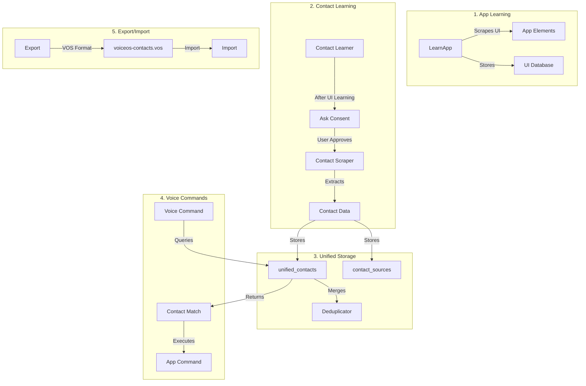
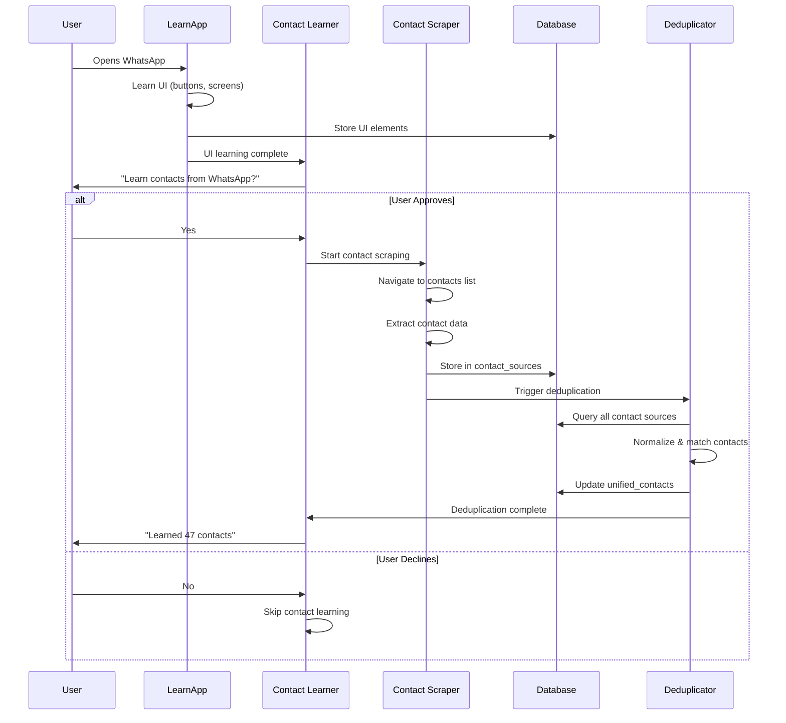
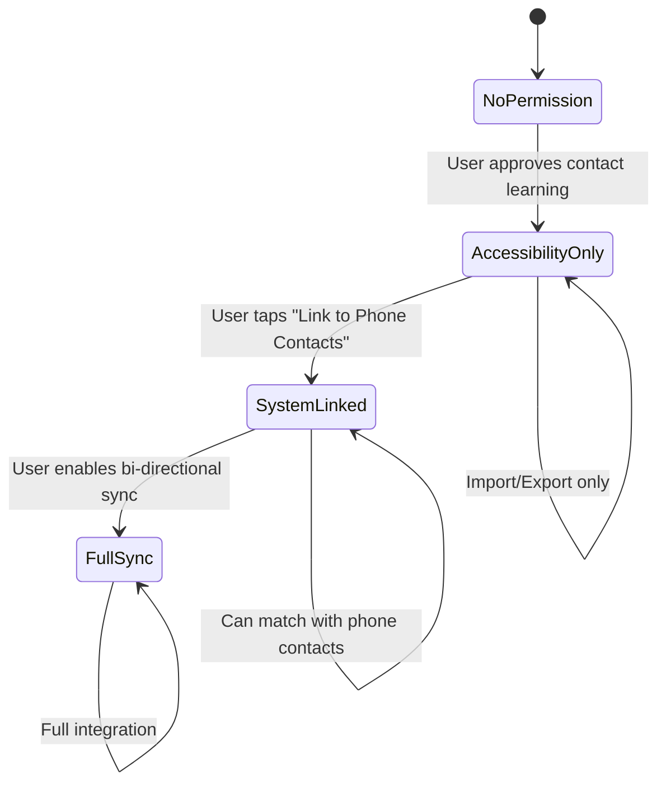

# Chapter 4: Database & Persistence

**Module**: LearnApp
**Package**: `com.augmentalis.voiceoscore.learnapp.database`
**Last Updated**: 2025-12-08

---

## Database Schema

### Database Entities

#### LearnedAppEntity

```kotlin
@Entity(tableName = "learned_apps")
data class LearnedAppEntity(
    @PrimaryKey val packageName: String,
    val appName: String,
    val versionCode: Long,
    val versionName: String,
    val firstLearnedAt: Long,
    val lastUpdatedAt: Long,
    val totalScreens: Int,
    val totalElements: Int,
    val appHash: String,
    val explorationStatus: ExplorationStatus
)
```

#### ExplorationSessionEntity

```kotlin
@Entity(tableName = "exploration_sessions")
data class ExplorationSessionEntity(
    @PrimaryKey val sessionId: String,
    val packageName: String,
    val startedAt: Long,
    val completedAt: Long?,
    val durationMs: Long?,
    val screensExplored: Int,
    val elementsDiscovered: Int,
    val status: SessionStatus
)
```

#### ScreenStateEntity

```kotlin
@Entity(tableName = "screen_states")
data class ScreenStateEntity(
    @PrimaryKey val screenHash: String,
    val packageName: String,
    val activityName: String,
    val fingerprint: String,
    val elementCount: Int,
    val discoveredAt: Long
)
```

#### NavigationEdgeEntity

```kotlin
@Entity(tableName = "navigation_edges")
data class NavigationEdgeEntity(
    @PrimaryKey val edgeId: String,
    val packageName: String,
    val sessionId: String,
    val fromScreenHash: String,
    val clickedElementUuid: String,
    val toScreenHash: String,
    val timestamp: Long
)
```

---
## UI Components

### ConsentDialog (Compose)

Jetpack Compose dialog asking user permission to learn app.

**Layout**:
- Material 3 Card with rounded corners
- Title: "Learn [AppName]?"
- Description explaining what will happen
- Bullet points: actions that will be performed
- Yes/No buttons
- "Don't ask again" checkbox

**Customization**: Uses MaterialTheme colors

### ProgressOverlay (Compose)

Real-time progress overlay during exploration.

**Shows**:
- App name
- Screens explored / estimated total
- Progress bar
- Elements discovered
- Current depth
- Elapsed time
- Pause/Stop buttons

---
## Voice Command Element Persistence (2025-12-01)

### Overview

Voice Command Element Persistence enables voice commands to work on JIT-learned apps by persisting element data and generating commands at learn time, then using a 4-tier resolution system at command execution time.

**Spec:** `specs/voice-command-element-persistence-spec.md`
**Plan:** `specs/voice-command-element-persistence-plan.md`

### Architecture: 4-Tier Command Resolution

```
Voice Command → Tier 1 (CommandManager) → Tier 2 (Database) → Tier 3 (Property Search) → Tier 4 (Text Search)
```

| Tier | Method | Performance | Reliability |
|------|--------|-------------|-------------|
| 1 | CommandManager static | <5ms | 99% |
| 2 | Database lookup | <30ms | 95% |
| 3 | Property-based search | <20ms | 85% |
| 4 | Text-based search | <50ms | 60% |

### Phase 1: JIT Element Capture

**File:** `jit/JitElementCapture.kt`

Captures elements during JIT screen learning and persists them to database.

```kotlin
class JitElementCapture(
    private val databaseManager: VoiceOSDatabaseManager
) {
    suspend fun captureAndPersistElements(
        rootNode: AccessibilityNodeInfo,
        packageName: String
    ): List<String>  // Returns element hashes
}
```

**Key Features:**
- Uses `AccessibilityFingerprint.fromNode()` for stable element hashes
- Persists using `ScrapedElementDTO` for SQLDelight compatibility
- Captures: viewId, className, text, contentDescription, bounds, isClickable

**Performance:** <50ms per screen capture

### Phase 2: Command Generation

**File:** `jit/JustInTimeLearner.kt`

Generates voice commands from JIT-captured elements.

```kotlin
// After screen learning:
generateVoiceCommands(packageName, elementHashes)
```

**Generated Commands:**
- Click actions: "click [label]", "tap [label]", "press [label]"
- Scroll actions: "scroll [direction]"
- Type actions: "type in [label]"

**Storage:** Uses `GeneratedCommandDTO` for SQLDelight compatibility

### Phase 3: Tier 3 Property-Based Search

**Files:**
- `scraping/ElementSearchEngine.kt` - Search engine
- `scraping/ElementSearchCriteria.kt` - Search criteria

Real-time accessibility tree search when database lookup fails.

```kotlin
val engine = ElementSearchEngine(accessibilityService)
val criteria = ElementSearchCriteria(
    viewIdResourceName = "com.app:id/submit",
    text = "Submit"
)
val node = engine.findElement(criteria)
node?.performAction(ACTION_CLICK)
```

**Search Priority Order:**
1. ViewId resource name (95% reliability, fastest)
2. Bounds + Text combination (85% reliability)
3. Class + ContentDescription (70% reliability)
4. Text only (60% reliability, fallback)

**Performance Target:** <20ms

### Phase 4: VoiceCommandProcessor Integration

**File:** `scraping/VoiceCommandProcessor.kt`

Integrated Tier 3 into the command resolution flow:

```kotlin
private suspend fun tryRealtimeElementSearch(voiceInput: String): CommandResult {
    // Tier 3: Try property-based search first (faster, more reliable)
    val tier3Result = tryPropertyBasedSearch(voiceInput)
    if (tier3Result.success) {
        return tier3Result
    }

    // Tier 4: Fall back to text-based search
    val (action, target) = parseVoiceCommand(voiceInput)
    // ... text-based search logic
}
```

### SQLDelight DTO Pattern

**Important:** SQLDelight uses DTOs, not raw parameter inserts.

```kotlin
// CORRECT: Use DTO
val elementDTO = ScrapedElementDTO(
    id = 0L,  // Auto-generated
    elementHash = element.elementHash,
    appId = packageName,
    // ... other fields
)
databaseManager.scrapedElements.insert(elementDTO)

// WRONG: Named parameters (doesn't work)
databaseManager.scrapedElements.insert(
    elementHash = hash,
    appId = packageName
)
```

### Files Changed

| File | Change |
|------|--------|
| `JitElementCapture.kt` | Created - Element capture & persistence |
| `JustInTimeLearner.kt` | Modified - Command generation with DTO |
| `ElementSearchEngine.kt` | Created - Tier 3 search engine |
| `ElementSearchCriteria.kt` | Created - Search criteria data class |
| `VoiceCommandProcessor.kt` | Modified - Tier 3 integration |

---
## JIT Screen Hash Deduplication (2025-12-02) ⭐ LATEST

### Overview

JIT Screen Hash Deduplication avoids re-traversing screens that have already been captured, saving battery life and processing time. When JIT encounters a screen, it calculates a structure-based hash and checks if that screen was previously captured. If yes, it skips the expensive element capture phase (<7ms vs ~50ms).

**Spec:** `docs/specifications/jit-screen-hash-uuid-deduplication-spec.md`
**Plan:** `docs/specifications/jit-screen-hash-uuid-deduplication-plan.md`

**Key Benefits:**
- ⚡ **Performance**: <7ms hash check vs 50ms full capture
- 🔋 **Battery Savings**: Avoid redundant accessibility tree traversal
- 📊 **Unified Hashing**: Same algorithm as LearnApp (cache reuse)
- 🪟 **Popup Support**: Stable hashes for dialogs/popups

### Phase 1: Database Schema Enhancement

**File:** `libraries/core/database/.../ScrapedElement.sq`

Added `screen_hash` column to scraped_element table for deduplication.

```sql
-- New column
ALTER TABLE scraped_element ADD COLUMN screen_hash TEXT;

-- Index for fast lookups
CREATE INDEX idx_se_screen_hash
ON scraped_element(appId, screen_hash);

-- Query: Count elements by screen hash
countByScreenHash:
SELECT COUNT(*)
FROM scraped_element
WHERE appId = ? AND screen_hash = ?;

-- Query: Get elements by screen hash
getByScreenHash:
SELECT *
FROM scraped_element
WHERE appId = ? AND screen_hash = ?;
```

**DTO Updates:**
- `ScrapedElementDTO`: Added `screen_hash: String?` field
- `IScrapedElementRepository`: Added `countByScreenHash()` and `getByScreenHash()` methods
- `SQLDelightScrapedElementRepository`: Implemented new query methods

### Phase 2: Unified Screen Hashing

**File:** `learnapp/jit/JustInTimeLearner.kt`

Replaced content-dependent hashing with structure-based hashing using `ScreenStateManager`.

**Before (Content-Dependent):**
```kotlin
private fun calculateScreenHash(event: AccessibilityEvent): String {
    val className = event.className?.toString() ?: ""
    val contentDesc = event.contentDescription?.toString() ?: ""
    val text = event.text?.joinToString("|") ?: ""
    return "$className|$contentDesc|$text".hashCode().toString()
}
```

**After (Structure-Based):**
```kotlin
private suspend fun calculateScreenHash(packageName: String): String {
    val rootNode = accessibilityService?.rootInActiveWindow

    return if (rootNode != null && screenStateManager != null) {
        val screenState = screenStateManager!!.captureScreenState(rootNode, packageName)
        screenState.hash  // Structure-based hash with popup awareness
    } else {
        Log.w(TAG, "ScreenStateManager unavailable, using fallback hash")
        System.currentTimeMillis().toString()
    }
}
```

**Key Changes:**
- Inject `ScreenStateManager` via `initializeElementCapture()`
- Get root node from `accessibilityService.rootInActiveWindow`
- Use `captureScreenState()` for unified hashing
- Falls back to timestamp if unavailable (fail-safe)

**Benefits:**
- **Popup Stability**: Popup hash doesn't change with content (e.g., time picker, photo delete dialog)
- **LearnApp Compatibility**: Same hashing algorithm enables cache reuse
- **Consistency**: Structure-based hashing more stable than content-based

### Phase 3: Deduplication Check

**File:** `learnapp/jit/JustInTimeLearner.kt`

Added deduplication check before screen capture.

```kotlin
private suspend fun isScreenAlreadyCaptured(
    packageName: String,
    screenHash: String
): Boolean {
    return withContext(Dispatchers.IO) {
        try {
            val count = databaseManager.scrapedElements
                .countByScreenHash(packageName, screenHash)
            count > 0
        } catch (e: Exception) {
            Log.e(TAG, "Error checking screen deduplication", e)
            false  // Fail-safe: proceed with capture on error
        }
    }
}

private suspend fun learnCurrentScreen(event: AccessibilityEvent, packageName: String) {
    val screenHash = calculateScreenHash(packageName)

    // Skip if same as last time
    if (screenHash == lastScreenHash) return
    lastScreenHash = screenHash

    // NEW: Deduplication check (<7ms vs 50ms capture)
    if (isScreenAlreadyCaptured(packageName, screenHash)) {
        Log.i(TAG, "Screen already captured, skipping: $packageName - Hash: $screenHash")
        return
    }

    // Only capture if screen is new
    saveScreenToDatabase(packageName, screenHash, event)
}
```

**Performance:**
- **Database Query**: <7ms to check if screen captured
- **Full Capture**: ~50ms for accessibility tree traversal
- **Savings**: 43ms per revisited screen (86% faster)

**Logging:**
- `"Screen already captured, skipping"` - Deduplication worked
- Hash included in capture logs for debugging
- Helps diagnose deduplication effectiveness

### Element Persistence with Screen Hash

**File:** `learnapp/jit/JitElementCapture.kt`

Updated `persistElements()` to store screen_hash with each element.

```kotlin
suspend fun persistElements(
    packageName: String,
    elements: List<JitCapturedElement>,
    screenHash: String? = null  // NEW: Screen hash for deduplication
): Int {
    for (element in elements) {
        val elementDTO = ScrapedElementDTO(
            // ... other fields
            screen_hash = screenHash  // Store hash for deduplication
        )
        databaseManager.scrapedElements.insert(elementDTO)
    }
}
```

**Called From:** `JustInTimeLearner.saveScreenToDatabase()`
```kotlin
capturedElementCount = elementCapture?.persistElements(
    packageName,
    capturedElements,
    screenHash  // Pass hash to persist with elements
) ?: 0
```

### Architecture: Unified Hashing Flow

```
JIT Screen Change Event
    ↓
Calculate Screen Hash (ScreenStateManager)
    ├── Regular Screen → Structure fingerprint
    └── Popup Window → Popup fingerprint (stable)
    ↓
Check if Already Captured (Database Query <7ms)
    ├── YES → Skip capture, return early
    └── NO  → Capture elements (~50ms)
              └── Persist with screen_hash
```

### Files Modified

| File | Change |
|------|--------|
| `ScrapedElement.sq` | Added screen_hash column, index, and queries |
| `ScrapedElementDTO.kt` | Added screen_hash field |
| `IScrapedElementRepository.kt` | Added countByScreenHash, getByScreenHash |
| `SQLDelightScrapedElementRepository.kt` | Implemented new methods |
| `JustInTimeLearner.kt` | Unified hashing + deduplication check |
| `JitElementCapture.kt` | Store screen_hash with elements |
| `VoiceOSCoreDatabaseAdapter.kt` | Added screen_hash in conversions |

### Testing Deduplication

**Manual Test Plan:**

1. **Enable JIT Learning:**
   - Open any app not fully learned
   - JIT should activate automatically

2. **First Screen Capture:**
   ```bash
   adb logcat | grep "JIT"
   # Look for: "JIT captured N elements for com.app (hash: XXXX)"
   ```

3. **Navigate Back to Same Screen:**
   ```bash
   adb logcat | grep "already captured"
   # Should see: "Screen already captured, skipping: com.app - Hash: XXXX"
   ```

4. **Verify Performance:**
   ```bash
   adb logcat | grep "JIT learned screen"
   # First visit: "JIT learned screen in 50ms"
   # Revisit: No log (early return, <7ms)
   ```

5. **Test Popup Stability:**
   - Trigger a popup (e.g., delete confirmation)
   - Different content (delete File1.jpg vs File2.jpg)
   - Should get same hash → deduplication works

**Database Verification:**
```sql
-- Check screen hashes
SELECT appId, screen_hash, COUNT(*)
FROM scraped_element
GROUP BY appId, screen_hash;

-- Should show: Multiple elements per screen hash
```

### Known Limitations

1. **Fallback Hash**: If ScreenStateManager unavailable, uses timestamp (no deduplication)
2. **Error Handling**: Database errors cause capture to proceed (fail-safe, but no deduplication)
3. **Phase 4 Pending**: UUID generation in JIT not yet implemented

### Next Phase: UUID Generation (Pending)

**Goal:** Generate UUIDs during JIT capture so LearnApp can reuse JIT-captured elements.

**Status:** Spec complete, implementation pending Phase 4.

---

### Testing

**Test voice commands on JIT-learned apps:**
```bash
./scripts/test-learnapp-emulator.sh
```

**Verify database persistence:**
```sql
SELECT COUNT(*) FROM scraped_elements WHERE app_id = 'com.example.app';
SELECT COUNT(*) FROM commands_generated WHERE element_hash IN (
    SELECT element_hash FROM scraped_elements WHERE app_id = 'com.example.app'
);
```

### Commit

**Hash:** `9836f097`
**Message:** feat(LearnApp): Integrate Tier 3 search into VoiceCommandProcessor

---
## Contact Learning & Management

**Version:** 2.0 (Planned)
**Status:** Design Complete, Implementation Pending
**Feature Type:** Contact Intelligence

### Overview

Contact Learning & Management enables LearnApp to discover and manage contacts from communication apps (WhatsApp, Teams, Slack, etc.) to enable natural voice commands like "call Mike Johnson on Teams" or "message Sarah on WhatsApp". This feature provides unified contact management across all learned communication apps with intelligent deduplication and privacy-first design.

### Architecture Overview

#### High-Level Architecture



#### ASCII Architecture Diagram

```
┌─────────────────────────────────────────────────────────────┐
│                    Contact Learning Flow                    │
└─────────────────────────────────────────────────────────────┘
                            │
                            ▼
    ┌──────────────────────────────────────────────┐
    │  1. UI Learning (Standard LearnApp)          │
    │     - Scrape app UI elements                 │
    │     - Store in screen_states, elements, etc. │
    └──────────────────┬───────────────────────────┘
                       │
                       ▼
    ┌──────────────────────────────────────────────┐
    │  2. Contact Learning Prompt                  │
    │     - "Would you like to learn contacts?"    │
    │     - User approval required                 │
    └──────────────────┬───────────────────────────┘
                       │
                       ▼
    ┌──────────────────────────────────────────────┐
    │  3. Contact Scraping                         │
    │     - Navigate to contacts/people list       │
    │     - Extract visible contact data           │
    │     - Store per-app in contact_sources       │
    └──────────────────┬───────────────────────────┘
                       │
                       ▼
    ┌──────────────────────────────────────────────┐
    │  4. Deduplication & Merging                  │
    │     - Normalize names (lowercase)            │
    │     - Match across apps                      │
    │     - Merge into unified_contacts            │
    │     - Apply user preferences                 │
    └──────────────────┬───────────────────────────┘
                       │
                       ▼
    ┌──────────────────────────────────────────────┐
    │  5. Voice Command Integration                │
    │     - "call Mike Johnson on Teams"           │
    │     - Query unified_contacts                 │
    │     - Execute via CommandManager             │
    └──────────────────────────────────────────────┘
```

### Contact Learning Flow

#### Flow Chart (Mermaid)



#### ASCII Flow Chart

```
┌─────────────────┐
│  App Learning   │
│   Completes     │
└────────┬────────┘
         │
         ▼
┌─────────────────────────────────────┐
│ Show Consent Dialog                 │
│ "Learn contacts from WhatsApp?"     │
└────────┬─────────────┬──────────────┘
         │             │
    Yes  │             │  No
         │             │
         ▼             ▼
┌─────────────────┐  ┌──────────────┐
│ Contact Scraper │  │ Skip, Store  │
│ Starts          │  │ Decision     │
└────────┬────────┘  └──────────────┘
         │
         ▼
┌─────────────────────────────────────┐
│ Navigate to Contacts/People Screen  │
└────────┬────────────────────────────┘
         │
         ▼
┌─────────────────────────────────────┐
│ Extract Contact Data                │
│ - Name                              │
│ - Profile picture (path/URL)        │
│ - Visible metadata                  │
└────────┬────────────────────────────┘
         │
         ▼
┌─────────────────────────────────────┐
│ Store in contact_sources            │
│ (per-app, per-contact)              │
└────────┬────────────────────────────┘
         │
         ▼
┌─────────────────────────────────────┐
│ Deduplication Engine                │
│ - Normalize names                   │
│ - Match across apps                 │
│ - Create/update unified_contacts    │
└────────┬────────────────────────────┘
         │
         ▼
┌─────────────────────────────────────┐
│ Contact Learning Complete           │
│ "Learned 47 contacts from WhatsApp" │
└─────────────────────────────────────┘
```

### Database Schema

#### 1. unified_contacts

Master table for deduplicated contacts across all apps.

```kotlin
@Entity(tableName = "unified_contacts")
data class UnifiedContactEntity(
    @PrimaryKey(autoGenerate = true)
    val contactId: Long = 0,

    val canonicalName: String,           // "Mike Johnson"
    val normalizedName: String,          // "mikejohnson" (for matching)

    // Merged metadata from all sources
    val primaryPhoneNumber: String?,     // From phone/SMS apps
    val primaryEmailAddress: String?,    // From email apps
    val profilePictureUrl: String?,      // Best quality image

    // Source tracking
    val sourceAppCount: Int,             // How many apps have this contact
    val firstSeenAt: Long,               // Timestamp first discovered
    val lastUpdatedAt: Long,             // Last modification

    // System integration (progressive permission)
    val systemContactId: Long?,          // Android Contact ID (if linked)
    val systemLinkedAt: Long?,           // When linked to system

    // User preferences
    val userPreferredSource: String?,    // Package name of preferred app
    val userNotes: String?               // User-added notes
)
```

#### 2. contact_sources

Per-app contact data before deduplication.

```kotlin
@Entity(tableName = "contact_sources")
data class ContactSourceEntity(
    @PrimaryKey(autoGenerate = true)
    val sourceId: Long = 0,

    // Foreign key to unified contact
    @ColumnInfo(index = true)
    val unifiedContactId: Long?,         // Null until deduplication

    // Source app
    @ColumnInfo(index = true)
    val packageName: String,             // "com.whatsapp"
    val appName: String,                 // "WhatsApp"

    // Raw contact data (as scraped)
    val rawName: String,                 // "Mike Johnson"
    val rawDisplayName: String?,         // "Mike J." (nickname)
    val profilePictureUrl: String?,      // App-specific URL/path

    // App-specific metadata (adaptive storage)
    val metadata: String?,               // JSON: {"status": "Hey there!"}

    // Phone numbers (if visible in app)
    val phoneNumbers: String?,           // JSON array
    val emailAddresses: String?,         // JSON array

    // Discovery tracking
    val discoveredAt: Long,
    val lastSeenAt: Long,
    val isActive: Boolean                // False if contact disappeared
)
```

#### 3. system_integration_settings

Tracks progressive permission and system contact linking.

```kotlin
@Entity(tableName = "system_integration_settings")
data class SystemIntegrationSettings(
    @PrimaryKey
    val settingKey: String,              // e.g., "contacts_permission_granted"

    val settingValue: String,            // JSON value
    val lastUpdatedAt: Long
)

// Examples:
// "contacts_permission_granted" = "true"
// "contacts_permission_requested_at" = "1732307160000"
// "system_sync_enabled" = "false"
// "system_sync_last_run" = "1732307200000"
```

#### 4. contact_export_history

Tracks export operations.

```kotlin
@Entity(tableName = "contact_export_history")
data class ContactExportHistory(
    @PrimaryKey(autoGenerate = true)
    val exportId: Long = 0,

    val exportedAt: Long,
    val exportFormat: String,            // "vos-compact-v1"
    val contactCount: Int,
    val sourceAppCount: Int,
    val filePath: String?,               // Export destination
    val fileHash: String?,               // SHA-256 for verification
    val isEncrypted: Boolean             // Future: encryption support
)
```

### VOS Compact Contact Export Format

#### Format Specification

**File:** `voiceos-contacts.vos` (JSON)

**Schema:** `vos-cnt-v1` (VoiceOS Contact v1.0)

#### Format Overview

Uses 3-letter codes for all keys to minimize file size while maintaining readability.

```json
{
  "SCH": "vos-cnt-v1",
  "VER": "1.0.0",
  "EXP": {
    "TST": "2025-11-22T14:46:00Z",
    "TOT": 324,
    "UNQ": 167,
    "SYS": 1,
    "INC": [
      "com.whatsapp",
      "com.microsoft.teams",
      "com.slack"
    ]
  },
  "CNT": [
    {
      "CID": "u1",
      "NAM": "Mike Johnson",
      "NRM": "mikejohnson",
      "SRC": [
        {
          "PKG": "com.whatsapp",
          "APP": "WhatsApp",
          "RNM": "Mike Johnson",
          "DNM": "Mike J.",
          "PIC": "/data/...",
          "MET": {
            "status": "Hey there!"
          }
        },
        {
          "PKG": "com.microsoft.teams",
          "APP": "Teams",
          "RNM": "Johnson, Mike",
          "DNM": null,
          "PIC": "https://...",
          "MET": {
            "title": "Senior Developer",
            "org": "Acme Corp"
          }
        }
      ],
      "MRG": {
        "PHN": ["+1-555-0123"],
        "EML": ["mike@example.com"],
        "PIC": "https://..."
      },
      "PRF": {
        "APP": "com.whatsapp",
        "NOT": "Friend from college"
      },
      "SID": 42
    }
  ]
}
```

#### Field Definitions

**Top-Level:**
- `SCH` - Schema identifier ("vos-cnt-v1")
- `VER` - Format version ("1.0.0")
- `EXP` - Export metadata
- `CNT` - Contacts array

**Export Metadata (EXP):**
- `TST` - Timestamp (ISO 8601)
- `TOT` - Total contacts exported
- `UNQ` - Unique contacts (after deduplication)
- `SYS` - System integration level (0=none, 1=linked, 2=full)
- `INC` - Included apps (package names)

**Contact Object (CNT):**
- `CID` - Contact ID (string, e.g., "u1")
- `NAM` - Canonical name
- `NRM` - Normalized name (for matching)
- `SRC` - Source array (per-app data)
- `MRG` - Merged data (deduplicated)
- `PRF` - Preferences (user settings)
- `SID` - System ID (Android contact ID, nullable)

**Source Object (SRC):**
- `PKG` - Package name
- `APP` - App name
- `RNM` - Raw name (as scraped)
- `DNM` - Display name/nickname
- `PIC` - Profile picture URL/path
- `MET` - Metadata (app-specific JSON)

**Merged Data (MRG):**
- `PHN` - Phone numbers (array)
- `EML` - Email addresses (array)
- `PIC` - Best profile picture URL

**Preferences (PRF):**
- `APP` - Preferred app (package name)
- `NOT` - User notes

### Contact Learning Implementation

#### Phase 1: Contact Scraper

**File:** `contacts/ContactScraper.kt`

```kotlin
class ContactScraper(
    private val accessibilityService: AccessibilityService,
    private val repository: LearnAppRepository
) {
    suspend fun scrapeContacts(packageName: String): ContactScrapingResult {
        // 1. Navigate to contacts/people screen
        val contactsScreen = findContactsScreen(packageName)

        // 2. Extract contact list
        val contacts = extractContactElements(contactsScreen)

        // 3. Store in contact_sources
        contacts.forEach { contact ->
            repository.saveContactSource(
                ContactSourceEntity(
                    packageName = packageName,
                    appName = getAppName(packageName),
                    rawName = contact.name,
                    profilePictureUrl = contact.pictureUrl,
                    metadata = contact.metadata.toJson(),
                    discoveredAt = System.currentTimeMillis(),
                    lastSeenAt = System.currentTimeMillis(),
                    isActive = true
                )
            )
        }

        // 4. Trigger deduplication
        deduplicateContacts()

        return ContactScrapingResult(
            packageName = packageName,
            totalContacts = contacts.size,
            durationMs = measureTime
        )
    }

    private fun findContactsScreen(packageName: String): AccessibilityNodeInfo {
        // Heuristics to find contacts/people screen:
        // - Screen with text like "Contacts", "People", "Chats"
        // - List of items with names + profile pictures
        // - Common contact screen patterns
    }

    private fun extractContactElements(screen: AccessibilityNodeInfo): List<ContactData> {
        // Extract contact data from UI elements
        // - Text elements for names
        // - ImageView for profile pictures
        // - Visible metadata (status, job title, etc.)
    }
}
```

#### Phase 2: Contact Deduplicator

**File:** `contacts/ContactDeduplicator.kt`

```kotlin
class ContactDeduplicator(
    private val repository: LearnAppRepository
) {
    suspend fun deduplicateContacts() {
        // 1. Get all contact sources
        val sources = repository.getAllContactSources()

        // 2. Group by normalized name
        val grouped = sources.groupBy { normalizeContactName(it.rawName) }

        // 3. For each group, merge or create unified contact
        grouped.forEach { (normalizedName, sourcesForContact) ->
            val existingUnified = repository.getUnifiedContactByNormalizedName(normalizedName)

            if (existingUnified != null) {
                // Update existing unified contact
                updateUnifiedContact(existingUnified, sourcesForContact)
            } else {
                // Create new unified contact
                createUnifiedContact(normalizedName, sourcesForContact)
            }
        }
    }

    private fun normalizeContactName(name: String): String {
        // "Mike Johnson" → "mikejohnson"
        // "Johnson, Mike" → "mikejohnson"
        return name.lowercase()
            .replace(Regex("[^a-z]"), "")
    }

    private suspend fun createUnifiedContact(
        normalizedName: String,
        sources: List<ContactSourceEntity>
    ) {
        // Merge data from all sources
        val merged = mergeContactData(sources)

        val unifiedContact = UnifiedContactEntity(
            canonicalName = selectCanonicalName(sources),
            normalizedName = normalizedName,
            primaryPhoneNumber = merged.phoneNumber,
            primaryEmailAddress = merged.email,
            profilePictureUrl = selectBestProfilePicture(sources),
            sourceAppCount = sources.size,
            firstSeenAt = sources.minOf { it.discoveredAt },
            lastUpdatedAt = System.currentTimeMillis(),
            systemContactId = null,  // Will be linked later
            userPreferredSource = null  // User can set later
        )

        repository.saveUnifiedContact(unifiedContact)

        // Link sources to unified contact
        sources.forEach { source ->
            repository.linkContactSource(source.sourceId, unifiedContact.contactId)
        }
    }
}
```

#### Phase 3: Voice Command Integration

**File:** `contacts/ContactCommandHandler.kt`

```kotlin
class ContactCommandHandler(
    private val repository: LearnAppRepository,
    private val commandManager: CommandManager
) {
    suspend fun handleContactCommand(command: VoiceCommand): CommandResult {
        // Parse command: "call Mike Johnson on Teams"
        val contactName = extractContactName(command.text)
        val appHint = extractAppHint(command.text)  // "Teams"
        val action = extractAction(command.text)    // "call"

        // Query unified contacts
        val matches = repository.searchUnifiedContacts(contactName)

        if (matches.isEmpty()) {
            return CommandResult.NotFound("Contact '$contactName' not found")
        }

        val contact = if (matches.size > 1) {
            // Disambiguate using app hint or user preference
            disambiguateContact(matches, appHint)
        } else {
            matches.first()
        }

        // Get source for preferred app
        val source = if (appHint != null) {
            repository.getContactSourceForApp(contact.contactId, appHint)
        } else {
            repository.getContactSourceForApp(contact.contactId, contact.userPreferredSource)
        }

        // Execute action
        return executeContactAction(action, source, contact)
    }

    private suspend fun executeContactAction(
        action: String,
        source: ContactSourceEntity,
        contact: UnifiedContactEntity
    ): CommandResult {
        // Generate command for app
        // e.g., "Open Teams app" → "Navigate to contact" → "Initiate call"
        val appCommand = buildAppCommand(action, source.packageName, contact)
        return commandManager.executeCommand(appCommand)
    }
}
```

### Contact Export/Import

#### Export Implementation

**File:** `contacts/ContactExporter.kt`

```kotlin
class ContactExporter(
    private val repository: LearnAppRepository,
    private val context: Context
) {
    suspend fun exportContactsToVOS(outputPath: String): ExportResult {
        // 1. Query all unified contacts
        val contacts = repository.getAllUnifiedContacts()

        // 2. Build VOS format
        val vosData = buildVOSContactData(contacts)

        // 3. Write to file
        val file = File(outputPath)
        file.writeText(Json.encodeToString(vosData))

        // 4. Record export history
        repository.saveExportHistory(
            ContactExportHistory(
                exportedAt = System.currentTimeMillis(),
                exportFormat = "vos-compact-v1",
                contactCount = contacts.size,
                sourceAppCount = contacts.sumOf { it.sourceAppCount },
                filePath = outputPath,
                fileHash = calculateSHA256(file),
                isEncrypted = false
            )
        )

        return ExportResult.Success(file.length(), contacts.size)
    }

    private suspend fun buildVOSContactData(
        contacts: List<UnifiedContactEntity>
    ): VOSContactData {
        return VOSContactData(
            schema = "vos-cnt-v1",
            version = "1.0.0",
            exportMetadata = ExportMetadata(
                timestamp = Instant.now().toString(),
                totalContacts = contacts.size,
                uniqueContacts = contacts.size,
                systemIntegration = getSystemIntegrationLevel(),
                includedApps = getIncludedApps(contacts)
            ),
            contacts = contacts.map { contact ->
                val sources = repository.getContactSources(contact.contactId)
                VOSContact(
                    contactId = "u${contact.contactId}",
                    canonicalName = contact.canonicalName,
                    normalizedName = contact.normalizedName,
                    sources = sources.map { buildVOSSource(it) },
                    mergedData = VOSMergedData(
                        phoneNumbers = listOfNotNull(contact.primaryPhoneNumber),
                        emailAddresses = listOfNotNull(contact.primaryEmailAddress),
                        profilePictureUrl = contact.profilePictureUrl
                    ),
                    preferences = VOSPreferences(
                        preferredApp = contact.userPreferredSource,
                        userNotes = contact.userNotes
                    ),
                    systemId = contact.systemContactId
                )
            }
        )
    }
}
```

#### Import Implementation

**File:** `contacts/ContactImporter.kt`

```kotlin
class ContactImporter(
    private val repository: LearnAppRepository
) {
    suspend fun importContactsFromVOS(filePath: String): ImportResult {
        // 1. Read and parse VOS file
        val vosData = File(filePath).readText()
        val parsedData = Json.decodeFromString<VOSContactData>(vosData)

        // 2. Validate schema version
        if (parsedData.schema != "vos-cnt-v1") {
            return ImportResult.Error("Unsupported schema: ${parsedData.schema}")
        }

        // 3. Import contacts
        var importedCount = 0
        var skippedCount = 0

        parsedData.contacts.forEach { vosContact ->
            // Check if contact already exists
            val existing = repository.getUnifiedContactByNormalizedName(
                vosContact.normalizedName
            )

            if (existing != null) {
                // Merge with existing
                mergeImportedContact(existing, vosContact)
                importedCount++
            } else {
                // Create new
                createContactFromImport(vosContact)
                importedCount++
            }
        }

        return ImportResult.Success(importedCount, skippedCount)
    }
}
```

### Progressive Permission Model

#### Permission Upgrade Flow (Mermaid)



#### ASCII Permission Flow

```
┌──────────────────────┐
│ Level 0:             │
│ No Permission        │
│ - No contact access  │
└──────────┬───────────┘
           │
           │ User approves "Learn contacts from WhatsApp"
           ▼
┌──────────────────────────────────────┐
│ Level 1:                             │
│ Accessibility Only                   │
│ - Scrape visible contact data        │
│ - Store in local database            │
│ - Voice commands work                │
│ - Export/Import VOS format           │
│ - NO system contact access           │
└──────────┬───────────────────────────┘
           │
           │ User taps "Link to Phone Contacts" (optional)
           ▼
┌──────────────────────────────────────┐
│ Level 2:                             │
│ System Linked                        │
│ - READ_CONTACTS permission granted   │
│ - Can match with phone contacts      │
│ - Enrich data from system contacts   │
│ - Show "Also in Phone Contacts" tag  │
│ - One-way sync (read only)           │
└──────────┬───────────────────────────┘
           │
           │ User enables "Sync with Phone Contacts" (optional)
           ▼
┌──────────────────────────────────────┐
│ Level 3:                             │
│ Full Sync (Future)                   │
│ - WRITE_CONTACTS permission granted  │
│ - Bi-directional sync                │
│ - Update system contacts             │
│ - Merge duplicates automatically     │
└──────────────────────────────────────┘
```

### Implementation Roadmap

#### Version 1.0 (Initial Release)

**Target:** Q1 2026

**Features:**
- ✅ Contact scraping from communication apps
- ✅ Local storage (contact_sources, unified_contacts)
- ✅ Basic deduplication (name matching)
- ✅ VOS Compact export format
- ✅ Voice command integration ("call Mike on Teams")
- ✅ Progressive permission (Level 1: Accessibility only)
- ✅ User consent for each app

**Database:**
- `unified_contacts` table
- `contact_sources` table
- `system_integration_settings` table
- `contact_export_history` table

#### Version 1.5 (System Integration)

**Target:** Q2 2026

**Features:**
- ✅ System contact linking (Level 2: READ_CONTACTS)
- ✅ Contact enrichment from phone contacts
- ✅ "Also in Phone Contacts" UI indicator
- ✅ Import from VOS format
- ✅ Contact disambiguation improvements

#### Version 2.0 (AVA NLU Integration)

**Target:** Q3 2026

**Features:**
- ✅ AVA NLU-powered intelligent matching
- ✅ Context-aware contact selection
- ✅ Full bi-directional sync (Level 3: WRITE_CONTACTS)
- ✅ Automatic contact updates
- ✅ Encryption support for exports
- ✅ Multi-device sync

### Code Examples

#### Example 1: Scraping Contacts from WhatsApp

```kotlin
val scraper = ContactScraper(accessibilityService, repository)
val result = scraper.scrapeContacts("com.whatsapp")

when (result) {
    is ContactScrapingResult.Success -> {
        Log.d("LearnApp", "Scraped ${result.contactCount} contacts from WhatsApp")
    }
    is ContactScrapingResult.Error -> {
        Log.e("LearnApp", "Failed to scrape contacts: ${result.error}")
    }
}
```

#### Example 2: Querying Unified Contacts

```kotlin
val repository = LearnAppRepository(database)

// Search by name
val matches = repository.searchUnifiedContacts("Mike Johnson")

matches.forEach { contact ->
    Log.d("LearnApp", """
        Contact: ${contact.canonicalName}
        Found in ${contact.sourceAppCount} apps
        Phone: ${contact.primaryPhoneNumber}
        Email: ${contact.primaryEmailAddress}
    """.trimIndent())
}
```

#### Example 3: Exporting Contacts

```kotlin
val exporter = ContactExporter(repository, context)
val result = exporter.exportContactsToVOS("/sdcard/Download/voiceos-contacts.vos")

when (result) {
    is ExportResult.Success -> {
        Log.d("LearnApp", "Exported ${result.contactCount} contacts (${result.fileSizeBytes} bytes)")
    }
    is ExportResult.Error -> {
        Log.e("LearnApp", "Export failed: ${result.message}")
    }
}
```

### Testing Strategy

#### Unit Tests

1. **ContactDeduplicator Tests**
   - Name normalization ("Mike Johnson" vs "Johnson, Mike")
   - Duplicate detection across apps
   - Preference application (user-selected source)
   - Edge cases (empty names, special characters)

2. **VOS Format Tests**
   - Export format validation
   - Import format validation
   - Schema version compatibility
   - Compression efficiency (3-letter codes)

3. **Contact Scraper Tests**
   - Mock accessibility service
   - Contact extraction from UI
   - Metadata parsing
   - Error handling

#### Integration Tests

1. **End-to-End Contact Learning**
   - Learn WhatsApp contacts
   - Deduplication with Teams contacts
   - Voice command execution
   - Export and re-import

2. **Progressive Permission Flow**
   - Level 1 → Level 2 upgrade
   - Permission denial handling
   - Fallback to accessibility-only mode

### Security & Privacy

#### Privacy-First Design

1. **No Automatic Contact Access**
   - User must explicitly approve contact learning for each app
   - Can decline and still use UI learning

2. **Local-First Storage**
   - All contact data stored locally in SQLDelight database
   - No cloud upload without user consent

3. **Minimal Data Collection**
   - Only scrape visible contact data
   - No access to message contents
   - No access to call history

4. **User Control**
   - Can delete all contacts anytime
   - Can re-learn contacts anytime
   - Can export/import for backup

#### Future: Encryption Support

**Version 2.0 Feature:**
- Encrypted VOS exports (AES-256)
- Password-protected imports
- Encrypted database storage option

### Troubleshooting

#### Issue: Contact Scraping Returns 0 Contacts

**Symptoms**: `scrapeContacts()` returns 0 contacts even though app has contacts

**Debugging Steps:**

1. Check if contact screen is correctly identified:
```kotlin
val contactsScreen = findContactsScreen(packageName)
Log.d("LearnApp", "Contact screen: ${contactsScreen.className}")
```

2. Verify element extraction:
```kotlin
val elements = extractContactElements(contactsScreen)
Log.d("LearnApp", "Extracted ${elements.size} elements")
elements.forEach { element ->
    Log.d("LearnApp", "  - ${element.text} (${element.className})")
}
```

3. Check accessibility permissions:
```kotlin
if (!accessibilityService.isEnabled()) {
    Log.e("LearnApp", "Accessibility service not enabled")
}
```

#### Issue: Contact Deduplication Misses Duplicates

**Symptoms**: "Mike Johnson" and "Johnson, Mike" stored as separate contacts

**Solution:**

Improve name normalization in `ContactDeduplicator.kt`:

```kotlin
private fun normalizeContactName(name: String): String {
    // Handle "LastName, FirstName" format
    val parts = name.split(",").map { it.trim() }
    val normalized = if (parts.size == 2) {
        "${parts[1]} ${parts[0]}"  // "Johnson, Mike" → "Mike Johnson"
    } else {
        name
    }

    return normalized.lowercase()
        .replace(Regex("[^a-z]"), "")
}
```

#### Issue: Voice Command Fails to Find Contact

**Symptoms**: "call Mike Johnson on Teams" returns "Contact not found"

**Debugging:**

1. Check if contact exists in database:
```kotlin
val results = repository.searchUnifiedContacts("Mike Johnson")
Log.d("LearnApp", "Found ${results.size} matches for 'Mike Johnson'")
```

2. Verify normalized name matching:
```kotlin
val normalized = normalizeContactName("Mike Johnson")
Log.d("LearnApp", "Normalized: '$normalized'")
```

3. Check if source exists for specified app:
```kotlin
results.forEach { contact ->
    val sources = repository.getContactSources(contact.contactId)
    Log.d("LearnApp", "Contact ${contact.canonicalName} found in: ${sources.map { it.appName }}")
}
```

### Performance Considerations

#### Optimization Tips

1. **Batch Insert for Contact Sources**
```kotlin
// Instead of:
contacts.forEach { repository.saveContactSource(it) }

// Use:
repository.saveContactSourcesBatch(contacts)
```

2. **Index Normalized Names**
```kotlin
@Entity(
    tableName = "unified_contacts",
    indices = [Index(value = ["normalizedName"])]
)
```

3. **Lazy Deduplication**
   - Deduplicate only after all contacts scraped
   - Run deduplication in background thread
   - Show progress to user

4. **Limit Contact Count**
   - Warn if app has >1000 contacts
   - Offer incremental learning option

### Related Documentation

- [Contact Learning ADR](../../planning/architecture/decisions/ADR-XXX-Contact-Learning-Strategy.md)
- [VOS Compact Format ADR](../../planning/architecture/decisions/ADR-XXX-VOS-Compact-Format.md)
- [Progressive Permission ADR](../../planning/architecture/decisions/ADR-XXX-Progressive-Permission-Model.md)

---

---

**Navigation**: [← Previous: Developer Settings](./03-Developer-Settings.md) | [Index](./00-Index.md) | [Next: Critical Fixes →](./05-Critical-Fixes.md)
