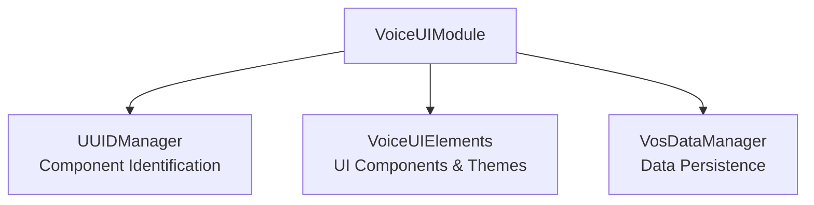

# VoiceUI Developer Manual

## Overview
VoiceUI is a comprehensive UI framework for voice-controlled and spatial interfaces, implementing VOS4 direct access patterns for optimal performance.

## Architecture

### VOS4 Direct Implementation Pattern
```
VoiceUIModule (Direct Access)
├── gestureManager: GestureManager
├── windowManager: WindowManager  
├── themeEngine: ThemeEngine
├── hudSystem: HUDSystem
├── notificationSystem: NotificationSystem
├── voiceCommandSystem: VoiceCommandSystem
└── dataVisualization: DataVisualization
```

### Module Dependencies


## Usage Examples

### Basic Initialization
```kotlin
// Get VoiceUI instance
val voiceUI = VoiceUIModule.getInstance(context)

// Initialize module
lifecycleScope.launch {
    val success = voiceUI.initialize()
    if (success) {
        // Module ready for use
    }
}
```

### Direct Component Access (VOS4 Pattern)
```kotlin
// Direct property access - NO getters
val gesture = voiceUI.gestureManager
val window = voiceUI.windowManager
val theme = voiceUI.themeEngine

// Configure components
voiceUI.setTheme("arvision")
voiceUI.enableHotReload(true)
```

### Component Usage Examples

#### Gesture Management
```kotlin
voiceUI.gestureManager.apply {
    enableMultiTouch(true)
    setSpatialTracking(true)
    
    // Listen for gestures
    gestureFlow.collect { gesture ->
        when (gesture.type) {
            GestureType.TAP -> handleTap(gesture)
            GestureType.SWIPE -> handleSwipe(gesture)
        }
    }
}
```

#### Window Management
```kotlin
voiceUI.windowManager.apply {
    // Create spatial window
    val windowId = createSpatialWindow(
        title = "Voice Settings",
        size = WindowSize(800, 600),
        position = WindowPosition(0f, 0f, -2f)
    )
    
    // Show window
    showWindow(windowId)
}
```

#### Theme Management
```kotlin
voiceUI.themeEngine.apply {
    // Available themes: arvision, material, visionos
    setTheme("arvision")
    
    // Listen for theme changes
    themeFlow.collect { theme ->
        updateUIComponents(theme)
    }
}
```

## API Reference

### VoiceUIModule Class

#### Properties (Direct Access)
- `gestureManager: GestureManager` - Multi-touch gesture recognition
- `windowManager: WindowManager` - Spatial window management
- `themeEngine: ThemeEngine` - Theme and styling system
- `hudSystem: HUDSystem` - Smart glasses HUD overlay
- `notificationSystem: NotificationSystem` - Custom notifications
- `voiceCommandSystem: VoiceCommandSystem` - Voice command processing
- `dataVisualization: DataVisualization` - Charts and graphs

#### Methods
- `suspend fun initialize(): Boolean` - Initialize all subsystems
- `suspend fun shutdown()` - Clean shutdown of all subsystems  
- `fun isReady(): Boolean` - Check if module is initialized
- `fun setTheme(themeName: String)` - Change active theme
- `fun enableHotReload(enabled: Boolean)` - Enable/disable hot reload

## Migration from Interface Pattern

### Before (Old Pattern)
```kotlin
// Interface-based access (DEPRECATED)
val voiceUI: IVoiceUIModule = VoiceUIModule.getInstance(context)
val gesture = voiceUI.getGestureManager()
val window = voiceUI.getWindowManager()
```

### After (VOS4 Direct Pattern)
```kotlin
// Direct access pattern
val voiceUI = VoiceUIModule.getInstance(context)
val gesture = voiceUI.gestureManager  // Direct property
val window = voiceUI.windowManager    // Direct property
```

## Performance Considerations

### Memory Usage
- **Target**: <20MB heap usage
- **Components**: Lazy initialization for unused subsystems
- **Cleanup**: Always call `shutdown()` when done

### Rendering Performance  
- **60 FPS**: Required for XR applications
- **Spatial Tracking**: 6DOF position updates at 90Hz
- **Gesture Recognition**: <16ms latency for touch events

## Testing

### Unit Tests
```bash
./gradlew :apps:VoiceUI:testDebugUnitTest
```

### Integration Tests
```bash  
./gradlew :apps:VoiceUI:connectedDebugAndroidTest
```

### Manual Testing
1. Initialize VoiceUIModule
2. Test each component access
3. Verify theme changes
4. Test gesture recognition
5. Validate window management

## Troubleshooting

### Common Issues

#### Module Won't Initialize
- Check context is valid application context
- Verify all dependencies are available
- Check device permissions for camera/sensors

#### Gestures Not Recognized
- Ensure `enableMultiTouch(true)` called
- Check touch event permissions
- Verify spatial tracking calibration

#### Themes Not Applied
- Theme name must match: "arvision", "material", "visionos"
- Check theme files exist in assets
- Verify theme engine initialization

---
**Module:** VoiceUI  
**Version:** 3.0.0  
**Architecture:** VOS4 Direct Implementation  
**Last Updated:** 2025-01-23