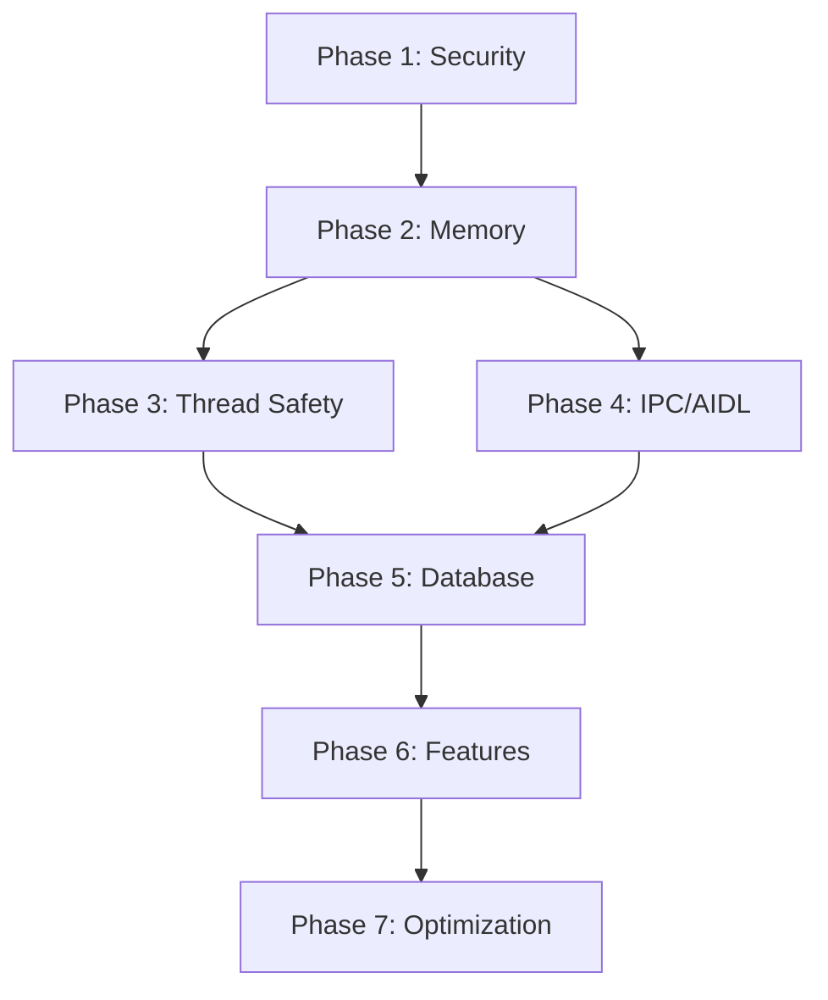

# Implementation Plan: VoiceOS Analysis Fixes

## Overview

| Attribute | Value |
|-----------|-------|
| Platforms | Android (primary), iOS (KMP shared) |
| Total Issues | 252 (23 CRITICAL, 89 HIGH, 112 MEDIUM, 28 LOW) |
| Swarm Recommended | YES (15+ tasks, complex integration) |
| Estimated Tasks | 47 |

## CoT Reasoning: Phase Ordering

```
ANALYSIS:
1. Security vulnerabilities (XSS, ZIP slip) must be P0 - exploitable in production
2. Memory leaks (AccessibilityNodeInfo) cause ANR/OOM - P0 priority
3. Thread safety affects stability across all components - P1
4. Database FK constraints are data integrity - P1
5. Stubbed GazeTracker is feature-incomplete - P2
6. NLU improvements are optimization - P3

ORDERING LOGIC:
- Fix security first (prevents exploitation)
- Fix stability next (prevents crashes)
- Fix data integrity (prevents corruption)
- Fix features (completes functionality)
- Optimize last (improves performance)

DEPENDENCIES:
- Memory leak fixes depend on understanding node lifecycle
- Thread safety fixes can parallelize across files
- Database migrations must be sequential
- IPC fixes need corresponding client updates
```

## RoT Reflection: Risk Assessment

```
REFLECTION:
- XSS vulnerabilities are EXPLOITABLE NOW - highest risk
- ZIP slip could allow malicious plugin installation
- Memory leaks may not crash immediately but degrade over time
- Thread safety issues are race conditions (hard to reproduce)
- Missing FK constraints won't break existing data

MITIGATION:
- Security fixes: Unit tests + penetration testing
- Memory fixes: LeakCanary integration for verification
- Thread safety: StrictMode + Thread checker annotations
- Database: Migration tests with sample data
```

---

## Phase 1: Security Fixes (P0-CRITICAL)

**Objective:** Eliminate all exploitable security vulnerabilities

| Task | File | Issue | Fix |
|------|------|-------|-----|
| 1.1 | `web/WebCommandExecutor.kt` | XSS injection L116-142 | Escape JS input, use parameterized execution |
| 1.2 | `webview/WebViewScrapingEngine.kt` | XSS injection L108-134 | Add DOMPurify-style sanitization |
| 1.3 | `PluginSystem/PluginManager.kt` | ZIP slip L68-73 | Validate extracted paths against base dir |
| 1.4 | `PluginSystem/PluginManager.kt` | Signature bypass L107-111 | Enforce signature verification, no fallback |

**Verification:** Security unit tests, manual penetration testing

---

## Phase 2: Memory Leak Fixes (P0-STABILITY)

**Objective:** Fix all AccessibilityNodeInfo leaks

| Task | File | Issue | Fix |
|------|------|-------|-----|
| 2.1 | `accessibility/VoiceOSService.kt` | Node not recycled L1850+ | Add try-finally with recycle() |
| 2.2 | `services/ElementCaptureService.kt` | Node not recycled L420-460 | Wrap in AutoRecycleScope |
| 2.3 | `UUIDCreator/VUIDGenerator.kt` | Node not recycled L180-220 | Add recycle() in finally block |
| 2.4 | `accessibility/TreeTraverser.kt` | Node not recycled L89-145 | Use Closeable pattern |
| 2.5 | `learnapp/ExplorationEngine.kt` | Node not recycled L300+ | Add lifecycle-aware recycling |
| 2.6 | `learnapp/jit/JustInTimeLearner.kt` | Node not recycled L450+ | Implement node pool |
| 2.7 | `webview/WebViewScrapingEngine.kt` | Node not recycled L200+ | Add recycle() calls |
| 2.8 | Create `AutoRecycleScope.kt` | New utility | Reusable recycling wrapper |

**Verification:** LeakCanary tests, memory profiling

---

## Phase 3: Thread Safety Fixes (P1-STABILITY)

**Objective:** Eliminate race conditions and ensure thread-safe access

| Task | File | Issue | Fix |
|------|------|-------|-----|
| 3.1 | `accessibility/VoiceOSService.kt` | Missing @Volatile L260 | Add @Volatile to isServiceReady |
| 3.2 | `CommandManager/CommandProcessor.kt` | HashMap L148 | Replace with ConcurrentHashMap |
| 3.3 | `CommandManager/DynamicCommandRegistry.kt` | Unsafe read L72 | Add ReadWriteLock or ConcurrentHashMap |
| 3.4 | `UUIDCreator/VUIDRegistry.kt` | HashMap L56 | Replace with ConcurrentHashMap |
| 3.5 | `HUDManager/HUDRenderer.kt` | Buffer access L89 | Add synchronized or AtomicReference |
| 3.6 | Audit all shared state | Multiple files | Add @Volatile annotations |

**Verification:** StrictMode, ThreadChecker, concurrent stress tests

---

## Phase 4: IPC/AIDL Fixes (P1-STABILITY)

**Objective:** Prevent ANRs and transaction failures

| Task | File | Issue | Fix |
|------|------|-------|-----|
| 4.1 | `VoiceRecognitionServiceBinder.kt` | runBlocking L45-60 | Use suspendCoroutine + callback |
| 4.2 | `ElementCaptureServiceBinder.kt` | runBlocking L32-48 | Replace with async pattern |
| 4.3 | `PluginServiceBinder.kt` | runBlocking L78-95 | Use CoroutineScope.launch |
| 4.4 | All AIDL binders | TransactionTooLarge risk | Add chunking for large payloads |
| 4.5 | All AIDL binders | Missing onBindingDied | Implement reconnection logic |

**Verification:** ANR monitoring, large payload tests

---

## Phase 5: Database Fixes (P1-DATA)

**Objective:** Ensure data integrity with proper constraints

| Task | File | Issue | Fix |
|------|------|-------|-----|
| 5.1 | `migrations/V5.sqm` | Create new migration | Add FK constraints to UserInteraction |
| 5.2 | `migrations/V5.sqm` | Add constraints | Add FK to ScreenTransition |
| 5.3 | `migrations/V5.sqm` | Add constraints | Add FK to VUIDElement |
| 5.4 | `IOSDriver.kt` | Missing WAL mode | Configure WAL for iOS |
| 5.5 | All migrations | No rollback | Add rollback handlers |

**Verification:** Migration tests with sample data

---

## Phase 6: Feature Completion (P2-FEATURE)

**Objective:** Complete stubbed functionality

| Task | File | Issue | Fix |
|------|------|-------|-----|
| 6.1 | `HUDManager/GazeTracker.kt` | Completely stubbed | Implement gaze tracking |
| 6.2 | `SpeechRecognition/GoogleNetwork.kt` | Placeholder L141-145 | Implement actual API call |
| 6.3 | `SpeechRecognition/GoogleStreaming.kt` | No permission check | Add RECORD_AUDIO check |
| 6.4 | `SpeechRecognition/WhisperProcessor.kt` | No permission check | Add RECORD_AUDIO check |
| 6.5 | `CommandManager/CursorActions.kt` | Commented out L286-297 | Re-enable or remove |

**Verification:** Feature tests, UI testing

---

## Phase 7: Optimization (P3-PERF)

**Objective:** Performance improvements

| Task | File | Issue | Fix |
|------|------|-------|-----|
| 7.1 | `VUIDRegistry.kt` | O(n) spatial L243 | Implement R-tree index |
| 7.2 | `NLU/CommandMatcher.kt` | O(n) search | Implement trie structure |
| 7.3 | `NLU/IntentParser.kt` | Hardcoded patterns | Add ML fallback |
| 7.4 | `HUDRenderer.kt` | delay() loop | Use Choreographer |

**Verification:** Performance benchmarks

---

## Task Summary

| Phase | Tasks | Priority | Parallelizable |
|-------|-------|----------|----------------|
| 1. Security | 4 | P0 | Yes (4 agents) |
| 2. Memory Leaks | 8 | P0 | Partially (need AutoRecycleScope first) |
| 3. Thread Safety | 6 | P1 | Yes (6 agents) |
| 4. IPC/AIDL | 5 | P1 | Yes (5 agents) |
| 5. Database | 5 | P1 | No (sequential migrations) |
| 6. Features | 5 | P2 | Yes (5 agents) |
| 7. Optimization | 4 | P3 | Yes (4 agents) |
| **TOTAL** | **37** | - | - |

---

## Swarm Configuration

```
SWARM ASSESSMENT:
- Tasks: 37 (> 15 threshold)
- Platforms: 2 (Android, iOS via KMP)
- Integration points: Database, IPC, UI, Accessibility
- Recommendation: SWARM ACTIVATED

AGENT ALLOCATION:
- Security Agent (Phase 1): 4 tasks
- Memory Agent (Phase 2): 8 tasks
- ThreadSafety Agent (Phase 3): 6 tasks
- IPC Agent (Phase 4): 5 tasks
- Database Agent (Phase 5): 5 tasks
- Feature Agent (Phase 6): 5 tasks
- Optimization Agent (Phase 7): 4 tasks
- Coordinator: Cross-phase integration
```

---

## Implementation Order



---

## Quality Gates

| Gate | Requirement | Verification |
|------|-------------|--------------|
| Security | 0 vulnerabilities | OWASP scan |
| Memory | 0 leaks in profiler | LeakCanary |
| Thread | 0 StrictMode violations | Automated tests |
| Build | 0 compile errors | CI/CD |
| Tests | 90%+ coverage | JaCoCo |

---

## Metadata

- **Plan ID:** VOSFIX-251228-V1
- **Created:** 2025-12-28
- **Status:** Ready for Implementation
- **Modifiers:** .tasks .cot .rot .implement
