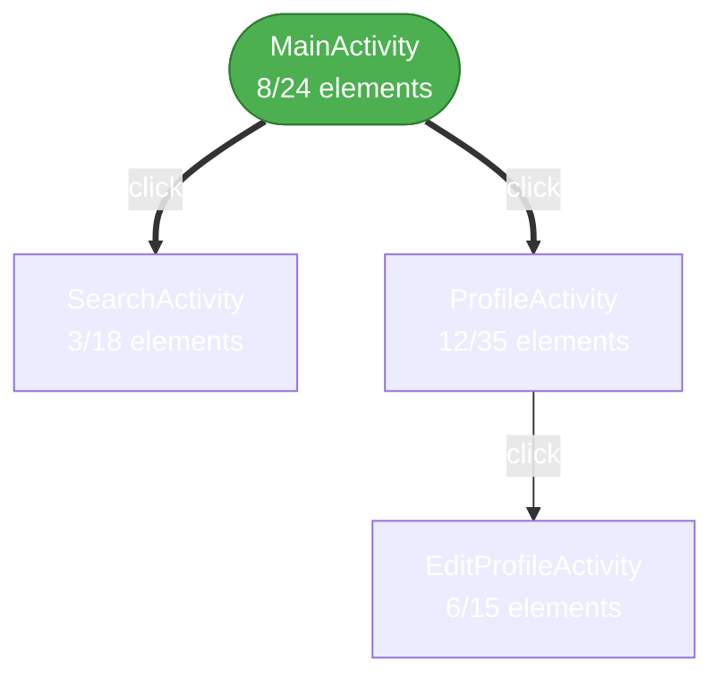

# VoiceOS App Hierarchy Map Feature Design

**Version:** 1.0
**Date:** 2025-12-30
**Author:** VoiceOS Development Team
**Status:** Design Complete

---

## Executive Summary

This document designs the App Hierarchy Map feature for VoiceOS, enabling users to visualize and export the learned navigation structure of any application. The feature leverages existing NavigationGraph infrastructure and database repositories to generate visual/textual hierarchy representations.

---

## 1. Requirements

### 1.1 Functional Requirements

| ID | Requirement | Priority |
|----|-------------|----------|
| FR-01 | Generate hierarchy map for any learned app by package name | P0 |
| FR-02 | Display screens as nodes with their elements | P0 |
| FR-03 | Show navigation paths between screens | P0 |
| FR-04 | Export in multiple formats (ASCII, JSON, Mermaid) | P1 |
| FR-05 | Integrate with existing stats UI drill-down | P1 |
| FR-06 | Support per-app "View Hierarchy" action | P1 |
| FR-07 | Export to file functionality | P2 |

### 1.2 Non-Functional Requirements

| ID | Requirement | Target |
|----|-------------|--------|
| NFR-01 | Generation time for <100 screens | <1 second |
| NFR-02 | Memory usage per map | <10 MB |
| NFR-03 | Thread safety | Required |

---

## 2. Architecture Overview

### 2.1 Component Diagram

```
+------------------+     +---------------------+     +------------------+
|                  |     |                     |     |                  |
| VoiceOSDatabase  |---->| HierarchyMapGenerator|---->| Export Formats   |
| Manager          |     |                     |     | - ASCII Tree     |
|                  |     +---------------------+     | - JSON           |
| Repositories:    |             |                   | - Mermaid        |
| - screenContexts |             |                   +------------------+
| - scrapedElements|             v
| - screenTransitions           +---------------------+
|                  |             |                     |
+------------------+             | NavigationGraph     |
                                 | (existing)          |
                                 |                     |
                                 +---------------------+
```

### 2.2 Data Flow

```
1. User requests hierarchy for package
   |
2. HierarchyMapGenerator.generateForApp(packageName)
   |
3. Query repositories:
   +-- screenContexts.getByPackage(packageName)
   +-- scrapedElements.getByApp(packageName)
   +-- screenTransitions.getFromScreen() [for each screen]
   |
4. Build NavigationGraph from database data
   |
5. Convert to requested format:
   +-- toAsciiTree()
   +-- toJson()
   +-- toMermaid()
   |
6. Return/Export result
```

---

## 3. Detailed Design

### 3.1 New Class: HierarchyMapGenerator

**Location:** `apps/VoiceOSCore/src/main/java/com/augmentalis/voiceoscore/learnapp/hierarchy/HierarchyMapGenerator.kt`

```kotlin
/**
 * HierarchyMapGenerator.kt - Generates visual hierarchy maps from learned app data
 *
 * Copyright (C) Manoj Jhawar/Aman Jhawar, Intelligent Devices LLC
 * Author: VoiceOS Development Team
 * Created: 2025-12-30
 *
 * Generates hierarchy maps in multiple formats:
 * - ASCII tree view for text display
 * - JSON for programmatic use
 * - Mermaid diagram syntax for visual rendering
 */
package com.augmentalis.voiceoscore.learnapp.hierarchy

import android.util.Log
import com.augmentalis.database.VoiceOSDatabaseManager
import com.augmentalis.database.dto.ScreenContextDTO
import com.augmentalis.database.dto.ScrapedElementDTO
import com.augmentalis.database.dto.ScreenTransitionDTO
import com.augmentalis.voiceoscore.learnapp.navigation.NavigationGraph
import com.augmentalis.voiceoscore.learnapp.navigation.NavigationGraphBuilder
import com.augmentalis.voiceoscore.learnapp.navigation.ScreenNode
import kotlinx.coroutines.Dispatchers
import kotlinx.coroutines.withContext

/**
 * Hierarchy Map Generator
 *
 * Generates visual hierarchy maps from learned app navigation data.
 *
 * ## Usage:
 * ```kotlin
 * val generator = HierarchyMapGenerator(databaseManager)
 *
 * // Generate ASCII tree
 * val asciiMap = generator.generateAsciiTree("com.instagram.android")
 *
 * // Generate JSON
 * val jsonMap = generator.generateJson("com.instagram.android")
 *
 * // Generate Mermaid diagram
 * val mermaidMap = generator.generateMermaid("com.instagram.android")
 *
 * // Get full hierarchy data object
 * val hierarchy = generator.generateHierarchy("com.instagram.android")
 * ```
 *
 * @param databaseManager VoiceOS database manager instance
 */
class HierarchyMapGenerator(
    private val databaseManager: VoiceOSDatabaseManager
) {
    companion object {
        private const val TAG = "HierarchyMapGenerator"
        private const val MAX_ELEMENT_LABEL_LENGTH = 30
        private const val INDENT = "  "
    }

    /**
     * Generate complete hierarchy data for an app
     *
     * @param packageName Package name of the app
     * @return AppHierarchy containing all screens, elements, and navigation paths
     */
    suspend fun generateHierarchy(packageName: String): AppHierarchy = withContext(Dispatchers.IO) {
        val startTime = System.currentTimeMillis()

        try {
            // 1. Get all screens for the app
            val screens = databaseManager.screenContexts.getByPackage(packageName)

            if (screens.isEmpty()) {
                Log.w(TAG, "No screens found for package: $packageName")
                return@withContext AppHierarchy.empty(packageName)
            }

            // 2. Get elements for each screen
            val screenElements = mutableMapOf<String, List<ScrapedElementDTO>>()
            for (screen in screens) {
                val elements = databaseManager.scrapedElements.getByScreenHash(
                    packageName,
                    screen.screenHash
                )
                screenElements[screen.screenHash] = elements
            }

            // 3. Get all navigation transitions
            val transitions = mutableListOf<ScreenTransitionDTO>()
            for (screen in screens) {
                val fromTransitions = databaseManager.screenTransitions.getFromScreen(screen.screenHash)
                transitions.addAll(fromTransitions)
            }

            // 4. Build hierarchy nodes
            val hierarchyNodes = screens.map { screen ->
                val elements = screenElements[screen.screenHash] ?: emptyList()
                HierarchyNode(
                    screenHash = screen.screenHash,
                    activityName = screen.activityName,
                    windowTitle = screen.windowTitle,
                    screenType = screen.screenType,
                    navigationLevel = screen.navigationLevel.toInt(),
                    elements = elements.map { elem ->
                        HierarchyElement(
                            uuid = elem.uuid,
                            elementHash = elem.elementHash,
                            className = elem.className,
                            label = elem.text ?: elem.contentDescription ?: elem.viewIdResourceName,
                            isClickable = elem.isClickable > 0,
                            isEditable = elem.isEditable > 0,
                            isScrollable = elem.isScrollable > 0,
                            semanticRole = elem.semanticRole
                        )
                    },
                    visitCount = screen.visitCount.toInt()
                )
            }

            // 5. Build navigation edges
            val navigationEdges = transitions.map { trans ->
                HierarchyEdge(
                    fromScreenHash = trans.fromScreenHash,
                    toScreenHash = trans.toScreenHash,
                    triggerElementHash = trans.triggerElementHash,
                    triggerAction = trans.triggerAction,
                    transitionCount = trans.transitionCount.toInt()
                )
            }

            // 6. Identify root screen (first discovered or home screen)
            val rootScreen = findRootScreen(hierarchyNodes, navigationEdges)

            val elapsed = System.currentTimeMillis() - startTime
            Log.i(TAG, "Generated hierarchy in ${elapsed}ms: ${hierarchyNodes.size} screens, ${navigationEdges.size} edges")

            AppHierarchy(
                packageName = packageName,
                appName = null, // Could be looked up from ScrapedApps
                nodes = hierarchyNodes,
                edges = navigationEdges,
                rootScreenHash = rootScreen,
                stats = HierarchyStats(
                    totalScreens = hierarchyNodes.size,
                    totalElements = hierarchyNodes.sumOf { it.elements.size },
                    totalEdges = navigationEdges.size,
                    maxDepth = calculateMaxDepth(hierarchyNodes, navigationEdges, rootScreen),
                    clickableElements = hierarchyNodes.sumOf { node ->
                        node.elements.count { it.isClickable }
                    }
                ),
                generatedAt = System.currentTimeMillis()
            )
        } catch (e: Exception) {
            Log.e(TAG, "Error generating hierarchy for $packageName", e)
            AppHierarchy.empty(packageName)
        }
    }

    /**
     * Generate ASCII tree representation
     *
     * @param packageName Package name of the app
     * @return ASCII tree string
     */
    suspend fun generateAsciiTree(packageName: String): String {
        val hierarchy = generateHierarchy(packageName)
        return toAsciiTree(hierarchy)
    }

    /**
     * Generate JSON representation
     *
     * @param packageName Package name of the app
     * @return JSON string
     */
    suspend fun generateJson(packageName: String): String {
        val hierarchy = generateHierarchy(packageName)
        return toJson(hierarchy)
    }

    /**
     * Generate Mermaid diagram
     *
     * @param packageName Package name of the app
     * @return Mermaid diagram syntax string
     */
    suspend fun generateMermaid(packageName: String): String {
        val hierarchy = generateHierarchy(packageName)
        return toMermaid(hierarchy)
    }

    /**
     * Convert hierarchy to ASCII tree format
     */
    fun toAsciiTree(hierarchy: AppHierarchy): String {
        if (hierarchy.nodes.isEmpty()) {
            return "No screens discovered for ${hierarchy.packageName}"
        }

        val output = StringBuilder()
        output.appendLine("=".repeat(60))
        output.appendLine("App Hierarchy: ${hierarchy.packageName}")
        output.appendLine("=".repeat(60))
        output.appendLine()
        output.appendLine("Statistics:")
        output.appendLine("  Screens: ${hierarchy.stats.totalScreens}")
        output.appendLine("  Elements: ${hierarchy.stats.totalElements}")
        output.appendLine("  Navigation Paths: ${hierarchy.stats.totalEdges}")
        output.appendLine("  Max Depth: ${hierarchy.stats.maxDepth}")
        output.appendLine("  Clickable Elements: ${hierarchy.stats.clickableElements}")
        output.appendLine()
        output.appendLine("-".repeat(60))
        output.appendLine("Screen Hierarchy:")
        output.appendLine("-".repeat(60))
        output.appendLine()

        // Build adjacency list for tree traversal
        val adjacencyList = mutableMapOf<String, MutableList<HierarchyEdge>>()
        hierarchy.edges.forEach { edge ->
            adjacencyList.getOrPut(edge.fromScreenHash) { mutableListOf() }.add(edge)
        }

        // Map screen hashes to nodes for quick lookup
        val nodeMap = hierarchy.nodes.associateBy { it.screenHash }

        // BFS to render tree starting from root
        val visited = mutableSetOf<String>()
        val queue = mutableListOf<Pair<String, Int>>() // screenHash, depth

        val rootHash = hierarchy.rootScreenHash ?: hierarchy.nodes.firstOrNull()?.screenHash
        if (rootHash != null) {
            queue.add(rootHash to 0)
        }

        while (queue.isNotEmpty()) {
            val (screenHash, depth) = queue.removeAt(0)
            if (screenHash in visited) continue
            visited.add(screenHash)

            val node = nodeMap[screenHash] ?: continue
            val indent = INDENT.repeat(depth)
            val prefix = if (depth == 0) "[ROOT] " else "[${depth}] "

            // Screen line
            val screenName = node.activityName?.substringAfterLast('.')
                ?: node.windowTitle
                ?: "Screen ${screenHash.take(8)}"
            output.appendLine("$indent$prefix$screenName")

            // Elements under this screen
            if (node.elements.isNotEmpty()) {
                val elementIndent = INDENT.repeat(depth + 1)
                val actionableElements = node.elements.filter { it.isClickable || it.isEditable }

                if (actionableElements.isNotEmpty()) {
                    output.appendLine("$elementIndent|-- Elements (${actionableElements.size} actionable):")
                    actionableElements.take(10).forEach { elem ->
                        val label = truncateLabel(elem.label ?: elem.className.substringAfterLast('.'))
                        val type = when {
                            elem.isEditable -> "[input]"
                            elem.isScrollable -> "[scroll]"
                            elem.isClickable -> "[click]"
                            else -> ""
                        }
                        output.appendLine("$elementIndent|   - $label $type")
                    }
                    if (actionableElements.size > 10) {
                        output.appendLine("$elementIndent|   ... and ${actionableElements.size - 10} more")
                    }
                }
            }

            // Add child screens to queue
            val children = adjacencyList[screenHash] ?: emptyList()
            children.forEach { edge ->
                if (edge.toScreenHash !in visited) {
                    queue.add(edge.toScreenHash to depth + 1)
                }
            }
        }

        // Show any disconnected screens
        val disconnected = hierarchy.nodes.filter { it.screenHash !in visited }
        if (disconnected.isNotEmpty()) {
            output.appendLine()
            output.appendLine("-".repeat(60))
            output.appendLine("Disconnected Screens (${disconnected.size}):")
            output.appendLine("-".repeat(60))
            disconnected.forEach { node ->
                val screenName = node.activityName?.substringAfterLast('.')
                    ?: "Screen ${node.screenHash.take(8)}"
                output.appendLine("  [?] $screenName (${node.elements.size} elements)")
            }
        }

        // Navigation paths section
        if (hierarchy.edges.isNotEmpty()) {
            output.appendLine()
            output.appendLine("-".repeat(60))
            output.appendLine("Navigation Paths (${hierarchy.edges.size}):")
            output.appendLine("-".repeat(60))
            hierarchy.edges.take(20).forEach { edge ->
                val fromName = nodeMap[edge.fromScreenHash]?.activityName?.substringAfterLast('.')
                    ?: edge.fromScreenHash.take(8)
                val toName = nodeMap[edge.toScreenHash]?.activityName?.substringAfterLast('.')
                    ?: edge.toScreenHash.take(8)
                val trigger = edge.triggerAction
                output.appendLine("  $fromName --[$trigger]--> $toName (${edge.transitionCount}x)")
            }
            if (hierarchy.edges.size > 20) {
                output.appendLine("  ... and ${hierarchy.edges.size - 20} more paths")
            }
        }

        output.appendLine()
        output.appendLine("=".repeat(60))

        return output.toString()
    }

    /**
     * Convert hierarchy to JSON format
     */
    fun toJson(hierarchy: AppHierarchy): String {
        val output = StringBuilder()
        output.appendLine("{")
        output.appendLine("  \"packageName\": \"${hierarchy.packageName}\",")
        hierarchy.appName?.let { output.appendLine("  \"appName\": \"$it\",") }
        output.appendLine("  \"generatedAt\": ${hierarchy.generatedAt},")
        output.appendLine("  \"stats\": {")
        output.appendLine("    \"totalScreens\": ${hierarchy.stats.totalScreens},")
        output.appendLine("    \"totalElements\": ${hierarchy.stats.totalElements},")
        output.appendLine("    \"totalEdges\": ${hierarchy.stats.totalEdges},")
        output.appendLine("    \"maxDepth\": ${hierarchy.stats.maxDepth},")
        output.appendLine("    \"clickableElements\": ${hierarchy.stats.clickableElements}")
        output.appendLine("  },")
        output.appendLine("  \"rootScreenHash\": ${hierarchy.rootScreenHash?.let { "\"$it\"" } ?: "null"},")

        // Screens
        output.appendLine("  \"screens\": [")
        hierarchy.nodes.forEachIndexed { index, node ->
            output.appendLine("    {")
            output.appendLine("      \"screenHash\": \"${node.screenHash}\",")
            output.appendLine("      \"activityName\": ${node.activityName?.let { "\"$it\"" } ?: "null"},")
            output.appendLine("      \"windowTitle\": ${node.windowTitle?.let { "\"${escapeJson(it)}\"" } ?: "null"},")
            output.appendLine("      \"screenType\": ${node.screenType?.let { "\"$it\"" } ?: "null"},")
            output.appendLine("      \"navigationLevel\": ${node.navigationLevel},")
            output.appendLine("      \"visitCount\": ${node.visitCount},")
            output.appendLine("      \"elements\": [")
            node.elements.forEachIndexed { elemIndex, elem ->
                output.appendLine("        {")
                output.appendLine("          \"uuid\": ${elem.uuid?.let { "\"$it\"" } ?: "null"},")
                output.appendLine("          \"elementHash\": \"${elem.elementHash}\",")
                output.appendLine("          \"className\": \"${elem.className}\",")
                output.appendLine("          \"label\": ${elem.label?.let { "\"${escapeJson(it)}\"" } ?: "null"},")
                output.appendLine("          \"isClickable\": ${elem.isClickable},")
                output.appendLine("          \"isEditable\": ${elem.isEditable},")
                output.appendLine("          \"isScrollable\": ${elem.isScrollable},")
                output.appendLine("          \"semanticRole\": ${elem.semanticRole?.let { "\"$it\"" } ?: "null"}")
                output.append("        }")
                if (elemIndex < node.elements.size - 1) output.append(",")
                output.appendLine()
            }
            output.appendLine("      ]")
            output.append("    }")
            if (index < hierarchy.nodes.size - 1) output.append(",")
            output.appendLine()
        }
        output.appendLine("  ],")

        // Navigation edges
        output.appendLine("  \"navigationPaths\": [")
        hierarchy.edges.forEachIndexed { index, edge ->
            output.appendLine("    {")
            output.appendLine("      \"fromScreenHash\": \"${edge.fromScreenHash}\",")
            output.appendLine("      \"toScreenHash\": \"${edge.toScreenHash}\",")
            output.appendLine("      \"triggerElementHash\": ${edge.triggerElementHash?.let { "\"$it\"" } ?: "null"},")
            output.appendLine("      \"triggerAction\": \"${edge.triggerAction}\",")
            output.appendLine("      \"transitionCount\": ${edge.transitionCount}")
            output.append("    }")
            if (index < hierarchy.edges.size - 1) output.append(",")
            output.appendLine()
        }
        output.appendLine("  ]")
        output.appendLine("}")

        return output.toString()
    }

    /**
     * Convert hierarchy to Mermaid diagram format
     */
    fun toMermaid(hierarchy: AppHierarchy): String {
        if (hierarchy.nodes.isEmpty()) {
            return "graph TD\n  empty[No screens discovered]"
        }

        val output = StringBuilder()
        output.appendLine("graph TD")
        output.appendLine("  %% App: ${hierarchy.packageName}")
        output.appendLine("  %% Generated: ${java.text.SimpleDateFormat("yyyy-MM-dd HH:mm").format(hierarchy.generatedAt)}")
        output.appendLine()

        // Create node definitions with safe IDs
        val nodeIdMap = mutableMapOf<String, String>()
        hierarchy.nodes.forEachIndexed { index, node ->
            val safeId = "S${index}"
            nodeIdMap[node.screenHash] = safeId

            val label = node.activityName?.substringAfterLast('.')
                ?: node.windowTitle?.take(20)
                ?: "Screen ${node.screenHash.take(6)}"
            val elementCount = node.elements.size
            val clickableCount = node.elements.count { it.isClickable }

            // Node shape: root is stadium, others are rectangles
            val isRoot = node.screenHash == hierarchy.rootScreenHash
            if (isRoot) {
                output.appendLine("  $safeId([\"$label<br/>${clickableCount}/${elementCount} elements\"])")
            } else {
                output.appendLine("  $safeId[\"$label<br/>${clickableCount}/${elementCount} elements\"]")
            }
        }

        output.appendLine()
        output.appendLine("  %% Navigation Edges")

        // Create edges
        hierarchy.edges.forEach { edge ->
            val fromId = nodeIdMap[edge.fromScreenHash] ?: return@forEach
            val toId = nodeIdMap[edge.toScreenHash] ?: return@forEach
            val label = edge.triggerAction.take(15)

            // Edge style based on transition count
            val edgeStyle = when {
                edge.transitionCount > 10 -> "==>"  // Thick arrow for frequent
                edge.transitionCount > 3 -> "-->"   // Normal arrow
                else -> "-.->"                       // Dotted for rare
            }

            output.appendLine("  $fromId $edgeStyle|$label| $toId")
        }

        // Styling
        output.appendLine()
        output.appendLine("  %% Styling")
        output.appendLine("  classDef root fill:#4CAF50,stroke:#2E7D32,color:#fff")
        output.appendLine("  classDef screen fill:#2196F3,stroke:#1565C0,color:#fff")
        output.appendLine("  classDef disconnected fill:#9E9E9E,stroke:#616161,color:#fff")

        // Apply root style
        hierarchy.rootScreenHash?.let { rootHash ->
            nodeIdMap[rootHash]?.let { rootId ->
                output.appendLine("  class $rootId root")
            }
        }

        return output.toString()
    }

    // Private helper methods

    private fun findRootScreen(nodes: List<HierarchyNode>, edges: List<HierarchyEdge>): String? {
        if (nodes.isEmpty()) return null

        // Find nodes that are never navigation targets (true roots)
        val targetHashes = edges.map { it.toScreenHash }.toSet()
        val rootCandidates = nodes.filter { it.screenHash !in targetHashes }

        // Prefer lowest navigation level
        return rootCandidates.minByOrNull { it.navigationLevel }?.screenHash
            ?: nodes.minByOrNull { it.navigationLevel }?.screenHash
    }

    private fun calculateMaxDepth(
        nodes: List<HierarchyNode>,
        edges: List<HierarchyEdge>,
        rootHash: String?
    ): Int {
        if (nodes.isEmpty() || rootHash == null) return 0

        val adjacencyList = mutableMapOf<String, List<String>>()
        edges.forEach { edge ->
            adjacencyList[edge.fromScreenHash] =
                (adjacencyList[edge.fromScreenHash] ?: emptyList()) + edge.toScreenHash
        }

        var maxDepth = 0
        val visited = mutableSetOf<String>()

        fun dfs(hash: String, depth: Int) {
            if (hash in visited) return
            visited.add(hash)
            maxDepth = maxOf(maxDepth, depth)
            adjacencyList[hash]?.forEach { child ->
                dfs(child, depth + 1)
            }
        }

        dfs(rootHash, 0)
        return maxDepth
    }

    private fun truncateLabel(label: String): String {
        return if (label.length > MAX_ELEMENT_LABEL_LENGTH) {
            label.take(MAX_ELEMENT_LABEL_LENGTH - 3) + "..."
        } else {
            label
        }
    }

    private fun escapeJson(str: String): String {
        return str
            .replace("\\", "\\\\")
            .replace("\"", "\\\"")
            .replace("\n", "\\n")
            .replace("\r", "\\r")
            .replace("\t", "\\t")
    }
}
```

### 3.2 Data Models

**Location:** `apps/VoiceOSCore/src/main/java/com/augmentalis/voiceoscore/learnapp/hierarchy/HierarchyModels.kt`

```kotlin
/**
 * HierarchyModels.kt - Data models for app hierarchy representation
 *
 * Copyright (C) Manoj Jhawar/Aman Jhawar, Intelligent Devices LLC
 * Author: VoiceOS Development Team
 * Created: 2025-12-30
 */
package com.augmentalis.voiceoscore.learnapp.hierarchy

/**
 * Complete hierarchy representation of a learned app
 */
data class AppHierarchy(
    val packageName: String,
    val appName: String?,
    val nodes: List<HierarchyNode>,
    val edges: List<HierarchyEdge>,
    val rootScreenHash: String?,
    val stats: HierarchyStats,
    val generatedAt: Long
) {
    companion object {
        fun empty(packageName: String) = AppHierarchy(
            packageName = packageName,
            appName = null,
            nodes = emptyList(),
            edges = emptyList(),
            rootScreenHash = null,
            stats = HierarchyStats(0, 0, 0, 0, 0),
            generatedAt = System.currentTimeMillis()
        )
    }
}

/**
 * A screen node in the hierarchy
 */
data class HierarchyNode(
    val screenHash: String,
    val activityName: String?,
    val windowTitle: String?,
    val screenType: String?,
    val navigationLevel: Int,
    val elements: List<HierarchyElement>,
    val visitCount: Int
)

/**
 * An element within a screen
 */
data class HierarchyElement(
    val uuid: String?,
    val elementHash: String,
    val className: String,
    val label: String?,
    val isClickable: Boolean,
    val isEditable: Boolean,
    val isScrollable: Boolean,
    val semanticRole: String?
)

/**
 * A navigation edge between screens
 */
data class HierarchyEdge(
    val fromScreenHash: String,
    val toScreenHash: String,
    val triggerElementHash: String?,
    val triggerAction: String,
    val transitionCount: Int
)

/**
 * Statistics about the hierarchy
 */
data class HierarchyStats(
    val totalScreens: Int,
    val totalElements: Int,
    val totalEdges: Int,
    val maxDepth: Int,
    val clickableElements: Int
)
```

---

## 4. UI Integration Options

### 4.1 Option A: Stats Drill-Down Integration

Add to existing learned apps stats screen with a "View Hierarchy" button:

```kotlin
// In LearnedAppsViewModel or equivalent
fun viewHierarchy(packageName: String) {
    viewModelScope.launch {
        _hierarchyState.value = HierarchyState.Loading
        val hierarchy = hierarchyMapGenerator.generateHierarchy(packageName)
        _hierarchyState.value = HierarchyState.Success(hierarchy)
    }
}

// In LearnedAppsScreen Composable
Button(onClick = { viewModel.viewHierarchy(app.packageName) }) {
    Text("View Hierarchy")
}
```

### 4.2 Option B: Dedicated Hierarchy Screen

Create a new `HierarchyMapActivity`:

```kotlin
class HierarchyMapActivity : AppCompatActivity() {
    private val viewModel: HierarchyMapViewModel by viewModels()

    override fun onCreate(savedInstanceState: Bundle?) {
        super.onCreate(savedInstanceState)

        val packageName = intent.getStringExtra(EXTRA_PACKAGE_NAME) ?: return finish()

        setContent {
            HierarchyMapScreen(
                packageName = packageName,
                viewModel = viewModel
            )
        }
    }
}

@Composable
fun HierarchyMapScreen(packageName: String, viewModel: HierarchyMapViewModel) {
    val state by viewModel.state.collectAsState()

    LaunchedEffect(packageName) {
        viewModel.loadHierarchy(packageName)
    }

    Column {
        // Format selector (ASCII/JSON/Mermaid)
        FormatSelector(
            selectedFormat = state.format,
            onFormatSelected = { viewModel.setFormat(it) }
        )

        // Display area
        when (val hierarchyState = state.hierarchyState) {
            is HierarchyState.Loading -> LoadingIndicator()
            is HierarchyState.Success -> {
                HierarchyDisplay(
                    hierarchy = hierarchyState.hierarchy,
                    format = state.format
                )
            }
            is HierarchyState.Error -> ErrorDisplay(hierarchyState.message)
        }

        // Export button
        Button(onClick = { viewModel.exportToFile() }) {
            Text("Export")
        }
    }
}
```

### 4.3 Option C: Developer Settings Integration

Add to existing DeveloperSettingsFragment:

```kotlin
// In DeveloperSettingsFragment
private fun addHierarchyOption() {
    val learnedApps = runBlocking {
        databaseManager.scrapedApps.getAll()
    }

    learnedApps.forEach { app ->
        addPreference("View ${app.appName} Hierarchy") {
            showHierarchyDialog(app.packageName)
        }
    }
}

private fun showHierarchyDialog(packageName: String) {
    lifecycleScope.launch {
        val asciiTree = hierarchyMapGenerator.generateAsciiTree(packageName)

        AlertDialog.Builder(requireContext())
            .setTitle("App Hierarchy")
            .setMessage(asciiTree)
            .setPositiveButton("Export") { _, _ -> exportHierarchy(packageName) }
            .setNegativeButton("Close", null)
            .show()
    }
}
```

---

## 5. Export Functionality

### 5.1 File Export

```kotlin
/**
 * Export hierarchy to file
 *
 * @param hierarchy The hierarchy to export
 * @param format Export format
 * @param context Android context for file access
 * @return File path if successful, null otherwise
 */
suspend fun exportToFile(
    hierarchy: AppHierarchy,
    format: ExportFormat,
    context: Context
): String? = withContext(Dispatchers.IO) {
    try {
        val exportDir = File(context.filesDir, "hierarchy_exports")
        if (!exportDir.exists()) exportDir.mkdirs()

        val timestamp = SimpleDateFormat("yyyyMMdd_HHmm", Locale.US)
            .format(Date(hierarchy.generatedAt))
        val safePackageName = hierarchy.packageName.replace(".", "_")

        val (extension, content) = when (format) {
            ExportFormat.ASCII -> "txt" to toAsciiTree(hierarchy)
            ExportFormat.JSON -> "json" to toJson(hierarchy)
            ExportFormat.MERMAID -> "mmd" to toMermaid(hierarchy)
        }

        val fileName = "${safePackageName}_hierarchy_$timestamp.$extension"
        val file = File(exportDir, fileName)
        file.writeText(content)

        file.absolutePath
    } catch (e: Exception) {
        Log.e(TAG, "Failed to export hierarchy", e)
        null
    }
}

enum class ExportFormat {
    ASCII, JSON, MERMAID
}
```

### 5.2 Share Intent

```kotlin
fun shareHierarchy(
    context: Context,
    hierarchy: AppHierarchy,
    format: ExportFormat
) {
    val content = when (format) {
        ExportFormat.ASCII -> toAsciiTree(hierarchy)
        ExportFormat.JSON -> toJson(hierarchy)
        ExportFormat.MERMAID -> toMermaid(hierarchy)
    }

    val intent = Intent(Intent.ACTION_SEND).apply {
        type = "text/plain"
        putExtra(Intent.EXTRA_SUBJECT, "App Hierarchy: ${hierarchy.packageName}")
        putExtra(Intent.EXTRA_TEXT, content)
    }

    context.startActivity(Intent.createChooser(intent, "Share Hierarchy"))
}
```

---

## 6. Output Examples

### 6.1 ASCII Tree Example

```
============================================================
App Hierarchy: com.instagram.android
============================================================

Statistics:
  Screens: 12
  Elements: 156
  Navigation Paths: 18
  Max Depth: 4
  Clickable Elements: 89

------------------------------------------------------------
Screen Hierarchy:
------------------------------------------------------------

[ROOT] MainActivity
  |-- Elements (8 actionable):
  |   - Home [click]
  |   - Search [click]
  |   - Create [click]
  |   - Reels [click]
  |   - Profile [click]
  [1] SearchActivity
    |-- Elements (3 actionable):
    |   - Search field [input]
    |   - Recent searches [scroll]
    |   - Cancel [click]
  [1] ProfileActivity
    |-- Elements (12 actionable):
    |   - Edit profile [click]
    |   - Posts grid [scroll]
    |   - Followers [click]
    |   - Following [click]
    [2] EditProfileActivity
      |-- Elements (6 actionable):
      |   - Name [input]
      |   - Username [input]
      |   - Bio [input]
      |   - Save [click]

------------------------------------------------------------
Navigation Paths (18):
------------------------------------------------------------
  MainActivity --[click]--> SearchActivity (45x)
  MainActivity --[click]--> ProfileActivity (32x)
  ProfileActivity --[click]--> EditProfileActivity (8x)
  ... and 15 more paths

============================================================
```

### 6.2 Mermaid Output Example



---

## 7. Testing Strategy

### 7.1 Unit Tests

```kotlin
class HierarchyMapGeneratorTest {

    @Test
    fun `generateHierarchy returns empty for unknown package`() = runTest {
        val generator = HierarchyMapGenerator(mockDatabaseManager)
        whenever(mockDatabaseManager.screenContexts.getByPackage(any()))
            .thenReturn(emptyList())

        val result = generator.generateHierarchy("com.unknown.app")

        assertTrue(result.nodes.isEmpty())
        assertEquals("com.unknown.app", result.packageName)
    }

    @Test
    fun `toAsciiTree generates valid output`() = runTest {
        val hierarchy = createTestHierarchy()
        val generator = HierarchyMapGenerator(mockDatabaseManager)

        val ascii = generator.toAsciiTree(hierarchy)

        assertTrue(ascii.contains("App Hierarchy:"))
        assertTrue(ascii.contains("Statistics:"))
        assertTrue(ascii.contains("Screen Hierarchy:"))
    }

    @Test
    fun `toJson generates valid JSON`() = runTest {
        val hierarchy = createTestHierarchy()
        val generator = HierarchyMapGenerator(mockDatabaseManager)

        val json = generator.toJson(hierarchy)

        // Should be parseable JSON
        val parsed = JSONObject(json)
        assertEquals(hierarchy.packageName, parsed.getString("packageName"))
    }

    @Test
    fun `toMermaid generates valid diagram syntax`() = runTest {
        val hierarchy = createTestHierarchy()
        val generator = HierarchyMapGenerator(mockDatabaseManager)

        val mermaid = generator.toMermaid(hierarchy)

        assertTrue(mermaid.startsWith("graph TD"))
        assertTrue(mermaid.contains("-->"))
    }
}
```

### 7.2 Integration Tests

```kotlin
class HierarchyMapIntegrationTest {

    @Test
    fun `full hierarchy generation from real database`() = runTest {
        // Setup real database with test data
        val testPackage = "com.test.app"
        insertTestScreens(testPackage, count = 5)
        insertTestElements(testPackage, elementsPerScreen = 10)
        insertTestTransitions(testPackage, count = 8)

        val generator = HierarchyMapGenerator(databaseManager)
        val hierarchy = generator.generateHierarchy(testPackage)

        assertEquals(5, hierarchy.stats.totalScreens)
        assertEquals(50, hierarchy.stats.totalElements)
        assertEquals(8, hierarchy.stats.totalEdges)
    }
}
```

---

## 8. Implementation Plan

### Phase 1: Core Generator (2 days)

| Task | Effort | Priority |
|------|--------|----------|
| Create HierarchyModels.kt | 2h | P0 |
| Create HierarchyMapGenerator.kt | 4h | P0 |
| Implement generateHierarchy() | 3h | P0 |
| Implement toAsciiTree() | 2h | P0 |
| Implement toJson() | 2h | P0 |
| Implement toMermaid() | 2h | P0 |
| Unit tests | 3h | P0 |

### Phase 2: UI Integration (1 day)

| Task | Effort | Priority |
|------|--------|----------|
| Add to DeveloperSettings | 2h | P1 |
| Create simple dialog viewer | 2h | P1 |
| Add export button | 1h | P1 |
| Integration tests | 2h | P1 |

### Phase 3: Enhanced UI (Optional, 2 days)

| Task | Effort | Priority |
|------|--------|----------|
| Dedicated HierarchyMapActivity | 4h | P2 |
| Interactive Mermaid rendering | 4h | P2 |
| Share functionality | 2h | P2 |
| Format selection UI | 2h | P2 |

---

## 9. Dependencies

### 9.1 Existing Infrastructure Used

| Component | Purpose |
|-----------|---------|
| VoiceOSDatabaseManager | Database access singleton |
| IScreenContextRepository | Screen data queries |
| IScrapedElementRepository | Element data queries |
| IScreenTransitionRepository | Navigation edge queries |
| NavigationGraph | Graph algorithms (reference) |
| AIContextSerializer | Export pattern reference |

### 9.2 No New Dependencies Required

The feature uses only existing infrastructure and standard Kotlin/Android APIs.

---

## 10. Risk Assessment

| Risk | Likelihood | Impact | Mitigation |
|------|------------|--------|------------|
| Large app causes OOM | Low | High | Lazy loading, pagination |
| Slow generation for complex apps | Medium | Medium | Coroutine-based, background thread |
| Cyclic navigation causes infinite loop | Low | High | Visited set in traversal |
| Missing screen data | Low | Low | Graceful handling, show disconnected |

---

## 11. Future Enhancements

1. **Interactive Mermaid Viewer**: Embed Mermaid.js for real-time diagram rendering
2. **Diff Between Versions**: Compare hierarchy changes across app updates
3. **AI-Powered Path Suggestions**: Use NavigationGraph.findPath() to suggest routes
4. **Export to PlantUML**: Additional diagram format
5. **Cloud Sync**: Share hierarchies across devices

---

## Approval

| Role | Name | Date |
|------|------|------|
| Design | VoiceOS Team | 2025-12-30 |
| Technical Review | Pending | |
| Implementation | Pending | |
