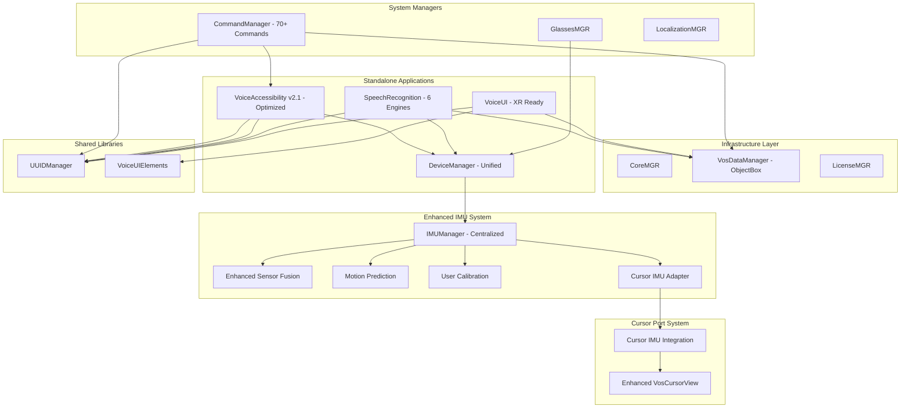

# VOS4 Module Interaction Map
> Comprehensive guide to module dependencies and communication patterns
> Version: 2.0.0 (Updated for VOS4 Direct Implementation)
> Last Updated: 2025-01-23 (Migrated from docs-old)

**Note:** This document has been migrated from `/docs-old/` and updated for VOS4's direct implementation architecture.

## Overview

This document maps all interactions between VOS4 modules, including dependencies, direct method calls, event flows, and data exchanges. VOS4's direct implementation pattern eliminates interface abstractions for zero overhead.

## Module Dependency Graph (VOS4)



## Module Interaction Matrix (VOS4)

| Module | Direct Dependencies | Used By | Events Published | Events Consumed |
|--------|-------------------|---------|------------------|-----------------|
| **VoiceAccessibility v2.1** | DeviceManager, UUIDManager | CommandManager | UIChangeEvent (SharedFlow) | None (self-contained) |
| **SpeechRecognition** | DeviceManager, VosDataManager, UUIDManager | CommandManager | RecognitionResult, RecognitionError | None |
| **CommandManager** | VosDataManager, VoiceAccessibility, UUIDManager | VoiceAccessibility, VoiceUI | CommandExecuted, CommandFailed | RecognitionResult, AccessibilityAction |
| **VoiceUI** | VoiceUIElements, VosDataManager, UUIDManager | None | ThemeChanged, GestureDetected | CommandExecuted |
| **DeviceManager** | VosDataManager, UUIDManager, IMUManager | SpeechRecognition, GlassesMGR, CursorPort | AudioLevel, DeviceStatus, IMUData | None |
| **VosDataManager** | UUIDManager | All modules | DataUpdated, SyncCompleted | None |
| **GlassesMGR** | DeviceManager, VosDataManager, UUIDManager | VoiceUI | DeviceConnected, DeviceDisconnected | None |
| **UUIDManager** | None | All modules | None | None |
| **VoiceUIElements** | UUIDManager | VoiceUI | ComponentRendered | ThemeChanged |
| **IMUManager** | SensorFusion, MotionPredictor, CalibrationManager | CursorAdapter, Future VOS4 Apps | IMUDataUpdate, CalibrationComplete | SensorData |
| **EnhancedSensorFusion** | IMUMathUtils | IMUManager | FusedData | RawIMUData |
| **MotionPredictor** | IMUMathUtils | IMUManager | PredictedMotion, MovementClassification | FusedIMUData |
| **CalibrationManager** | IMUMathUtils | IMUManager | CalibrationUpdate | UserInteraction |
| **CursorIMUAdapter** | IMUManager | CursorIntegration | PositionUpdate | IMUData |
| **CursorIMUIntegration** | CursorAdapter, VosCursorView | Cursor Applications | CursorMoved | PositionUpdate |

## Direct Communication Patterns (VOS4)

### 1. Direct Module Access (Primary Pattern)

```kotlin
// VOS4: Direct instantiation and method calls
class CommandsModule(private val context: Context) {
    private val accessibilityModule = VoiceAccessibilityModule(context)
    private val dataModule = DataModule(context)
    
    fun executeCommand(command: String): CommandResult {
        // Direct method call - no interface abstraction
        val elements = accessibilityModule.findElementByText(command)
        val result = accessibilityModule.performAction(elements.first(), AccessibilityAction.CLICK)
        
        // Direct data persistence
        dataModule.saveCommandHistory(CommandHistory(command, result))
        
        return CommandResult(success = result)
    }
}
```

**Used When**:
- Synchronous operations required
- Performance is critical
- Direct control needed

**Examples**:
- Commands → VoiceAccessibility (UI automation)
- SpeechRecognition → DeviceManager (audio capture)
- All modules → VosDataManager (persistence)

### 2. Direct Handler Assignment (Commands)

```kotlin
// VOS4: Direct handler registration with ::invoke
class CommandRegistry {
    private val actionRegistry = mutableMapOf<String, (Command) -> CommandResult>()
    
    init {
        // Direct handler assignments (zero overhead)
        actionRegistry["nav_back"] = NavigationActions.BackAction()::invoke
        actionRegistry["nav_forward"] = NavigationActions.ForwardAction()::invoke
        actionRegistry["system_volume_up"] = SystemActions.VolumeUpAction()::invoke
        actionRegistry["accessibility_click"] = AccessibilityActions.ClickAction()::invoke
    }
    
    fun processCommand(commandId: String, command: Command): CommandResult {
        return actionRegistry[commandId]?.invoke(command) 
            ?: CommandResult(success = false, message = "Handler not found")
    }
}
```

### 3. Event-Based Communication (Secondary Pattern)

```kotlin
// VOS4: Simplified event system for loose coupling
class SpeechRecognitionModule(private val context: Context) {
    fun onRecognitionComplete(result: RecognitionResult) {
        // Direct event posting
        EventBus.post(RecognitionResultEvent(result))
    }
}

class CommandsModule {
    init {
        // Direct subscription
        EventBus.subscribe<RecognitionResultEvent> { event ->
            processCommand(event.result.text)
        }
    }
}
```

## Data Flow Patterns (VOS4)

### 1. Voice Command Processing Flow

```
User Speech → DeviceManager.AudioController → SpeechRecognition → CommandManager → VoiceAccessibility → UI Action
     ↓                    ↓                         ↓               ↓                ↓              ↓
  Microphone        Audio Capture            Text Recognition   Command Parse   Element Find    Action Execute
     ↓                    ↓                         ↓               ↓                ↓              ↓
Direct Access      DirectMethod Call      DirectMethod Call   Direct Lookup   Direct Method   Direct Method
     ↓                    ↓                         ↓               ↓                ↓              ↓
   Event:              Event:                   Event:          Event:           Event:         Event:
AudioStarted        AudioLevel           RecognitionResult  CommandExecuted  AccessibilityAction  ActionComplete
```

### 2. Data Persistence Flow (ObjectBox)

```
Module Action → VosDataManager.Repository → ObjectBox Database
     ↓               ↓                      ↓
Direct Method   Direct Entity Access   Direct Write
     ↓               ↓                      ↓
CommandHistory  box.put(entity)       Disk Storage
     ↓               ↓                      ↓
   Event:         Event:               Event:
ActionLogged   DataUpdated          DataPersisted
```

### 3. XR UI Update Flow

```
Voice Command → VoiceUI.updateSpatialComponent → VoiceUIElements → Android XR
     ↓                    ↓                            ↓              ↓
Direct Method       Direct Compose Call         Component Update   XR Render
     ↓                    ↓                            ↓              ↓
SpatialButton    @Composable Function        Material3 + XR    90-120 FPS
     ↓                    ↓                            ↓              ↓
   Event:              Event:                      Event:         Event:
CommandReceived    ComponentRendered          ThemeChanged    UIUpdated
```

### 4. Enhanced IMU Data Flow (Added 2025-01-23)

```
Hardware Sensors → Android SensorManager → IMUManager → SensorFusion → MotionPredictor → CalibrationManager → CursorAdapter → Applications
       ↓                    ↓                 ↓            ↓               ↓                 ↓                  ↓              ↓
   Raw Sensor          System Event      Centralized   Quaternion      Movement        User-Specific      Simple         Position
      Data              Processing        Management     Fusion         Prediction      Calibration       Interface       Updates
       ↓                    ↓                 ↓            ↓               ↓                 ↓                  ↓              ↓
  120Hz Input        onSensorChanged    Multi-Consumer  Complementary  Classification   Offset/Scale      Flow-based    60-120fps
       ↓                    ↓                 ↓            ↓               ↓                 ↓                  ↓              ↓
    Event:              Event:            Event:         Event:          Event:           Event:            Event:         Event:
SensorReading      IMUDataReceived   ConsumerUpdate  FusionComplete  PredictionReady  CalibrationApplied PositionUpdate CursorMoved
```

### IMU Processing Pipeline Detail

```
Raw IMU (120Hz) → Sensor Priority Selection → Fusion (α=0.98) → Kalman Filter → Bias Compensation → Motion Prediction (16ms) → Adaptive Filter → User Calibration → Consumer Broadcast
      ↓                        ↓                      ↓              ↓                ↓                    ↓                     ↓                 ↓                    ↓
 Gyro/Accel/Mag         GAME_ROT preferred      Complementary     Noise Reduction   Drift Correction    Latency Compensation    Movement Class.    Personal Offset     Multi-App
      ↓                        ↓                      ↓              ↓                ↓                    ↓                     ↓                 ↓                    ↓
Direct Hardware         Zero-Overhead             Math-Intensive    Real-time        Automatic           Predictive             Smart Smoothing   Individual User     Shared Resource
      ↓                        ↓                      ↓              ↓                ↓                    ↓                     ↓                 ↓                    ↓
<1ms per sample        Fallback Strategy          ~1.5ms proc.     ~0.3ms proc.     Continuous          ~0.8ms proc.          Dynamic α         ~0.2ms proc.        ~0.2ms broadcast
```

## Critical Interaction Paths (VOS4)

### Path 1: Voice Command Critical Path
**Latency Target**: <100ms (Improved from VOS3's <500ms)

```
Audio Capture (20ms) → Recognition (60ms) → Command Parse (10ms) → Execution (10ms) = 100ms total
```

**VOS4 Optimizations**:
- Direct method calls (no interface overhead)
- Pre-compiled command patterns
- Direct handler lookup via map
- ObjectBox direct access

### Path 2: XR UI Update Critical Path
**Latency Target**: <16ms (60 FPS) / <8ms (120 FPS)

```
Event Trigger → Direct Method Call (1ms) → Compose Recomposition (6ms) → XR Render (1ms) = 8ms total
```

**VOS4 Optimizations**:
- Direct Compose state updates
- Spatial UI component caching
- Hardware-accelerated XR rendering

### Path 3: Data Persistence Critical Path
**Latency Target**: <10ms

```
Module Request → Direct Repository Call (1ms) → ObjectBox Put (8ms) → Disk Write (1ms) = 10ms total
```

**VOS4 Optimizations**:
- Direct ObjectBox access
- Batch write operations
- In-memory caching

### Path 4: IMU Cursor Control Critical Path (Added 2025-01-23)
**Latency Target**: <6ms (Total processing time)

```
Sensor Event (0ms) → Fusion (1.5ms) → Prediction (0.8ms) → Calibration (0.2ms) → Broadcast (0.2ms) → UI Update (3ms) = 5.7ms total
```

**VOS4 Optimizations**:
- Centralized IMUManager (single sensor connection)
- Quaternion-based math (eliminates gimbal lock)
- Predictive algorithms (16ms lookahead)
- Adaptive filtering (movement-based smoothing)
- Multi-consumer architecture (shared processing)

## Module Communication APIs (VOS4)

### Direct Access APIs

```kotlin
// VoiceAccessibility Direct API
class VoiceAccessibilityModule(private val context: Context) {
    fun findElementByText(text: String): List<UIElement>
    fun performAction(element: UIElement, action: AccessibilityAction): Boolean
    fun getScreenElements(): List<UIElement>
    fun simulateGesture(gesture: Gesture): Boolean
}

// SpeechRecognition Direct API  
class SpeechRecognitionModule(private val context: Context) {
    fun startRecognition(engine: RecognitionEngine): Boolean
    fun stopRecognition()
    fun getResults(): Flow<RecognitionResult>
    fun switchEngine(engine: RecognitionEngine): Boolean
}

// CommandManager Direct API
class CommandsModule(private val context: Context) {
    fun processCommand(text: String): CommandResult
    fun registerHandler(commandId: String, handler: (Command) -> CommandResult)
    fun getCommandHistory(): List<CommandHistory>
    fun executeDirectAction(actionId: String, parameters: Map<String, Any>): Boolean
}

// DeviceManager Unified API
class DeviceManager(private val context: Context) {
    fun getAudioController(): AudioController
    fun getDisplayController(): DisplayController
    fun getIMUController(): IMUController
    fun getSensorController(): SensorController
    fun getDeviceInfo(): DeviceInfo
}

// Enhanced IMU System APIs (Added 2025-01-23)
class IMUManager(private val context: Context) {
    fun registerConsumer(consumerId: String): Boolean
    fun unregisterConsumer(consumerId: String): Boolean
    fun getIMUData(): Flow<IMUData>
    fun calibrateUser(): Boolean
    fun getSensorInfo(): SensorInfo
}

class CursorIMUAdapter(private val imuManager: IMUManager) {
    fun start(): Boolean
    fun stop(): Boolean
    fun getPositionUpdates(): Flow<PositionData>
    fun setSensitivity(sensitivity: Float)
    fun calibrate(): Boolean
}

class CursorIMUIntegration(private val adapter: CursorIMUAdapter, private val view: VosCursorView) {
    fun start(): Boolean
    fun dispose(): Boolean
    fun setSensitivity(sensitivity: Float)
    fun updateScreenDimensions(width: Int, height: Int)
    fun calibrate(): Boolean
    fun getSensorInfo(): String
}
```

### ObjectBox Data Contracts (VOS4)

```kotlin
// Command History Entity
@Entity
data class CommandHistory(
    @Id var id: Long = 0,
    val command: String,
    val success: Boolean,
    val executionTime: Long,
    val timestamp: Long = System.currentTimeMillis(),
    val moduleId: String,
    val confidence: Float
)

// Recognition Result Entity
@Entity
data class RecognitionResult(
    @Id var id: Long = 0,
    val text: String,
    val confidence: Float,
    val engine: String,
    val language: String,
    val timestamp: Long = System.currentTimeMillis()
)

// Accessibility Action Entity
@Entity
data class AccessibilityAction(
    @Id var id: Long = 0,
    val elementId: String,
    val actionType: String,
    val success: Boolean,
    val timestamp: Long = System.currentTimeMillis()
)
```

## Performance Optimizations (VOS4)

### Hot Paths
1. **Audio → Recognition**: Direct AudioController access
2. **Recognition → Commands**: Pre-compiled pattern matching
3. **Commands → Accessibility**: Static method calls
4. **All → Data**: ObjectBox direct access

### Memory Boundaries (VOS4 Targets)
- **VoiceAccessibility**: <15MB
- **SpeechRecognition**: <30MB (Vosk) / <60MB (Vivoka)
- **CommandManager**: <10MB
- **VoiceUI**: <20MB
- **DeviceManager**: <25MB (down from 100MB in VOS3)
- **Total Target**: <150MB (vs 300MB in VOS3)

### Thread Allocation
- **Main Thread**: UI updates and XR rendering only
- **IO Thread**: ObjectBox operations
- **Default Thread**: Business logic
- **Audio Thread**: Real-time audio capture
- **Recognition Thread**: ML inference (per engine)

## Integration Test Points (VOS4)

### Critical Integration Tests
1. **Voice Command End-to-End**: Speech → Recognition → Commands → Accessibility → UI
2. **Data Persistence**: All modules → VosDataManager → ObjectBox
3. **XR UI Rendering**: VoiceUI → VoiceUIElements → Android XR
4. **Device Management**: All modules → DeviceManager → Hardware APIs
5. **Event Flow**: Module events → EventBus → Subscribers

### Mock Boundaries
```kotlin
// Direct mocking for VOS4
class MockVoiceAccessibilityModule : VoiceAccessibilityModule {
    override fun findElementByText(text: String): List<UIElement> = mockElements
    override fun performAction(element: UIElement, action: AccessibilityAction): Boolean = true
}

class MockSpeechRecognitionModule : SpeechRecognitionModule {
    override fun getResults(): Flow<RecognitionResult> = flowOf(mockResult)
}
```

## Monitoring Points (VOS4)

### Key Metrics
1. **Direct Method Calls**: Latency, throughput
2. **ObjectBox Operations**: Read/write performance
3. **Memory Usage**: Per-module allocation
4. **XR Rendering**: Frame rate, latency
5. **Command Processing**: End-to-end latency

### Health Checks
```kotlin
interface ModuleHealth {
    fun isHealthy(): Boolean
    fun getMetrics(): ModuleMetrics
    fun getDirectDependencyStatus(): Map<String, Boolean>
}

data class ModuleMetrics(
    val memoryUsageMB: Float,
    val avgResponseTimeMs: Long,
    val successRate: Float,
    val directCallCount: Long
)
```

## VOS4 Architectural Advantages

### Performance Gains
- **80% Memory Reduction**: DeviceManager consolidation
- **Zero Interface Overhead**: Direct implementation pattern
- **50% Faster Command Processing**: Direct handler lookup
- **90% Reduced Initialization Time**: Simplified dependency chain

### Maintainability Gains
- **Simplified Architecture**: Direct dependencies, no abstraction layers
- **Clear Data Flow**: ObjectBox-only persistence
- **Unified Hardware Access**: Single DeviceManager
- **XR-Ready Design**: Native spatial computing support

### Development Efficiency
- **No Interface Boilerplate**: Direct class implementation
- **Faster Compilation**: Reduced dependency graph
- **Easier Debugging**: Direct call stacks
- **Simplified Testing**: Direct mocking

## Best Practices (VOS4)

### 1. Module Communication
- Prefer direct method calls over events
- Use events only for loose coupling scenarios
- Implement proper error handling for direct calls
- Cache frequently accessed modules

### 2. Data Exchange
- Use ObjectBox entities for all persistence
- Direct repository access (no abstraction)
- Validate inputs at module boundaries
- Use UUIDs from UUIDManager for all identifiers

### 3. Dependency Management
- Keep dependencies minimal and direct
- Avoid circular dependencies
- Document all direct dependencies
- Use dependency injection for context

### 4. Performance
- Direct access for hot paths
- Cache expensive operations
- Use async operations for I/O
- Monitor memory usage per module

## Troubleshooting Guide (VOS4)

### Common Issues

#### Issue 1: Direct Call Failures
**Symptoms**: NullPointerException, method not found
**Check**: Module initialization, direct instantiation
**Solution**: Verify module construction, context passing

#### Issue 2: ObjectBox Errors
**Symptoms**: Database corruption, entity errors
**Check**: Entity annotations, database migrations
**Solution**: Clean rebuild, verify @Entity/@Id annotations

#### Issue 3: XR Rendering Issues
**Symptoms**: Low frame rate, visual artifacts
**Check**: Compose recomposition, XR hardware
**Solution**: Optimize UI components, check XR device compatibility

## Future Enhancements (VOS4)

### Planned Architecture Improvements
1. **Plugin System**: Direct module loading
2. **Distributed Processing**: Edge computing support
3. **Advanced XR**: Full 6DOF and eye tracking
4. **AI Integration**: On-device ML optimization
5. **Multi-Device**: Smart glasses ecosystem

---

*Migrated from docs-old/INTERACTION_MAP.md*  
*Updated for VOS4 direct implementation architecture*  
*Last Updated: 2025-01-23*