# VoiceCursor Architecture Diagrams
## Visual Technical Documentation

**Last Updated:** January 26, 2025  
**Version:** 3.0.0

---

## 1. System Architecture Overview

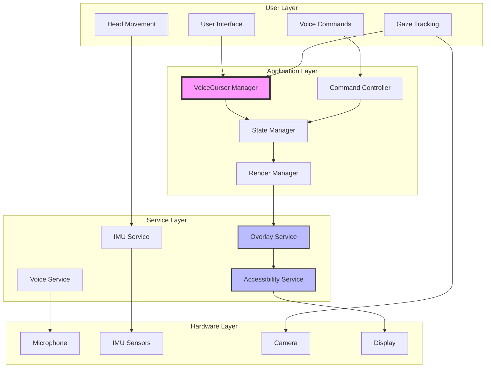

---

## 2. Component Interaction Flow

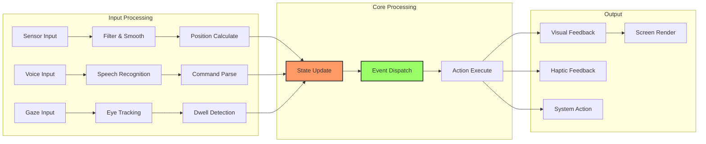

---

## 3. State Management Diagram

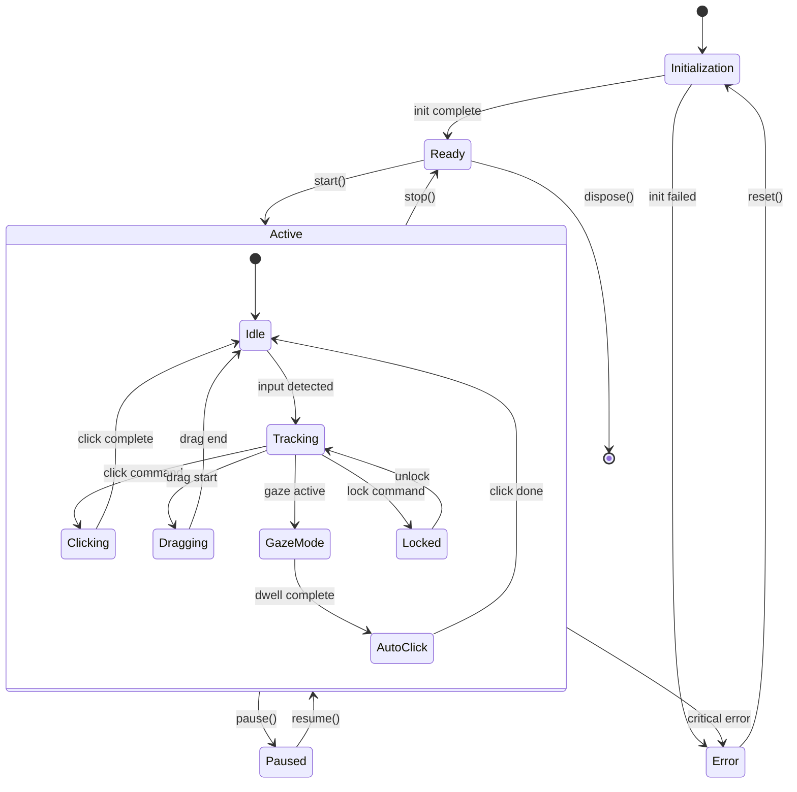

---

## 4. Data Flow Architecture

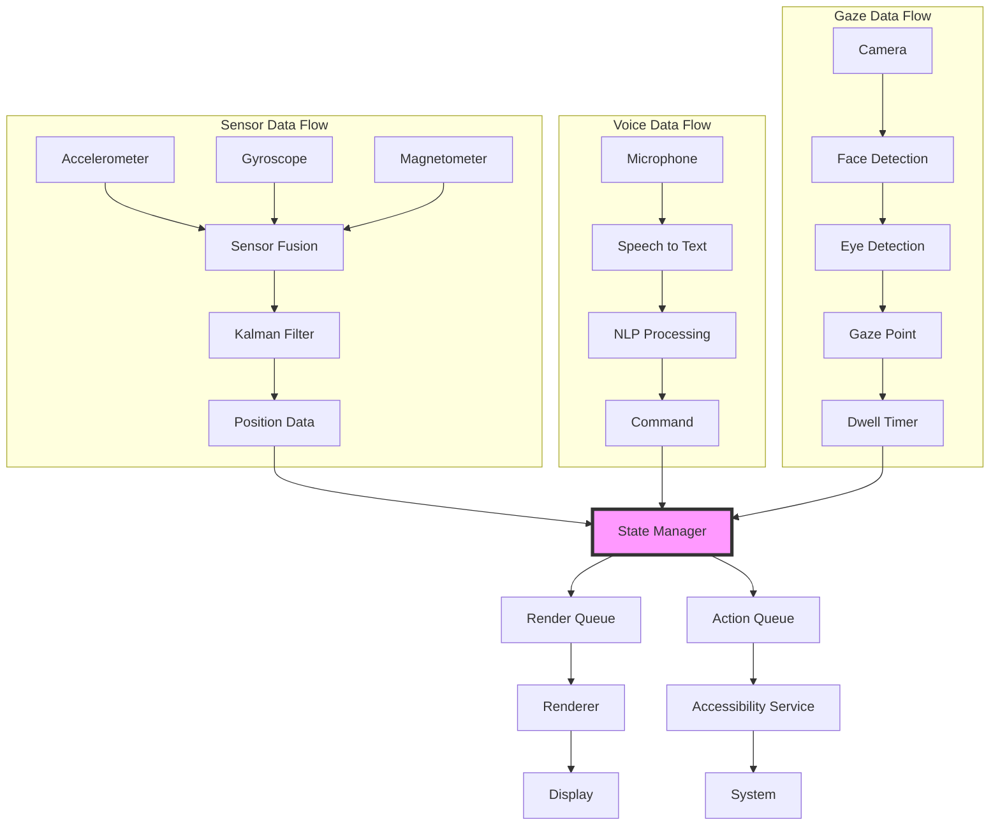

---

## 5. Thread & Concurrency Model

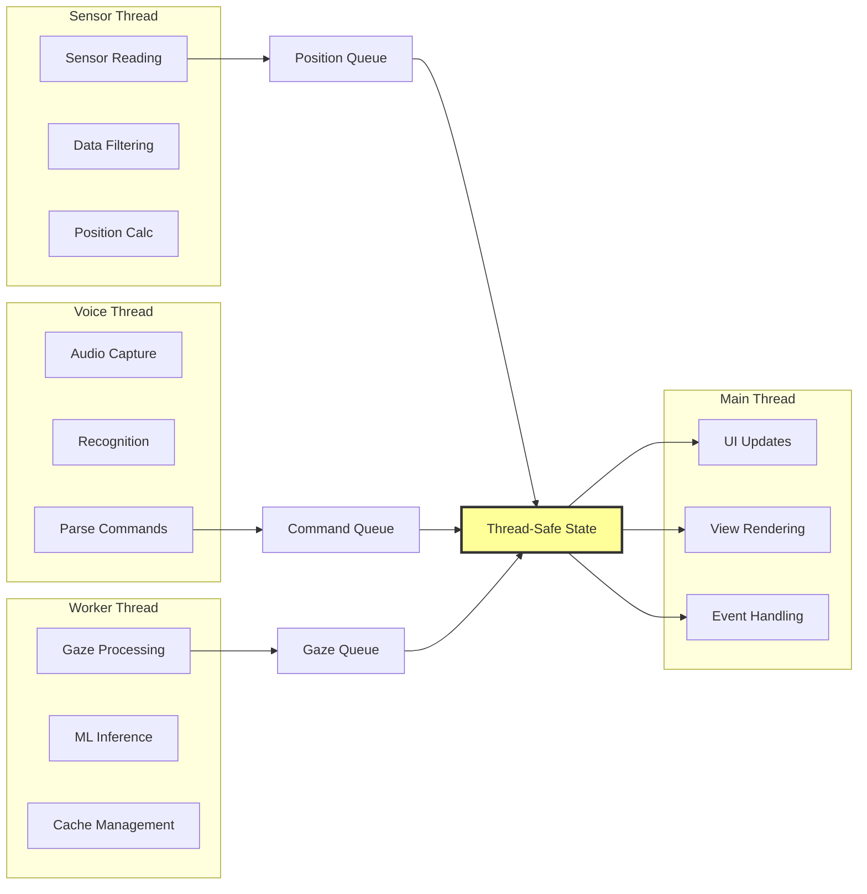

---

## 6. Service Lifecycle

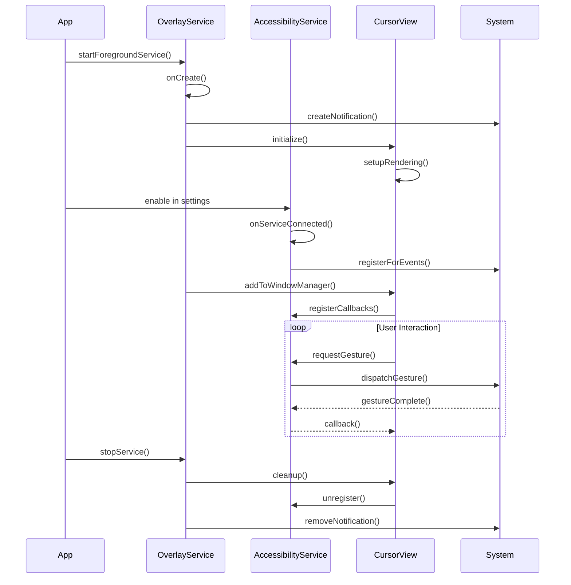

---

## 7. Sensor Processing Pipeline

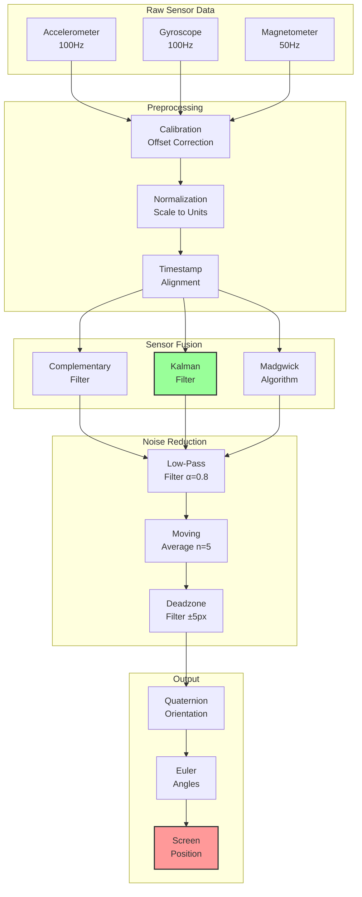

---

## 8. Rendering Pipeline

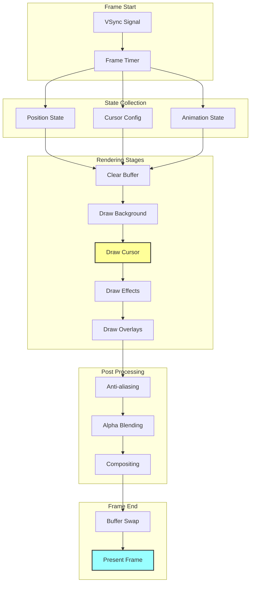

---

## 9. Voice Command Processing

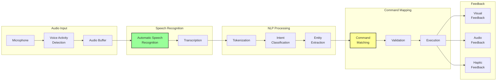

---

## 10. Gaze Tracking System

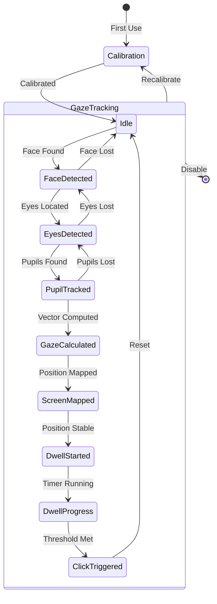

---

## 11. Memory Management

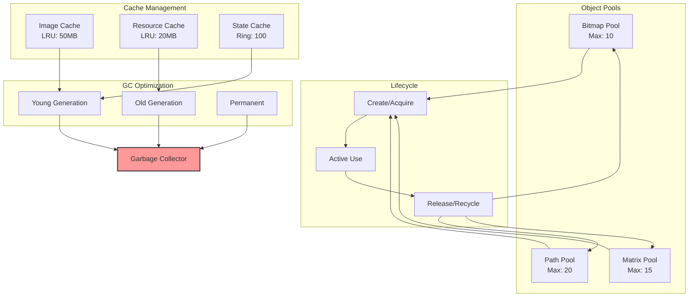

---

## 12. Performance Monitoring

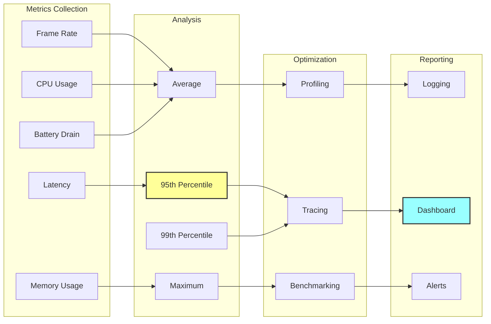

---

## 13. Error Handling Flow

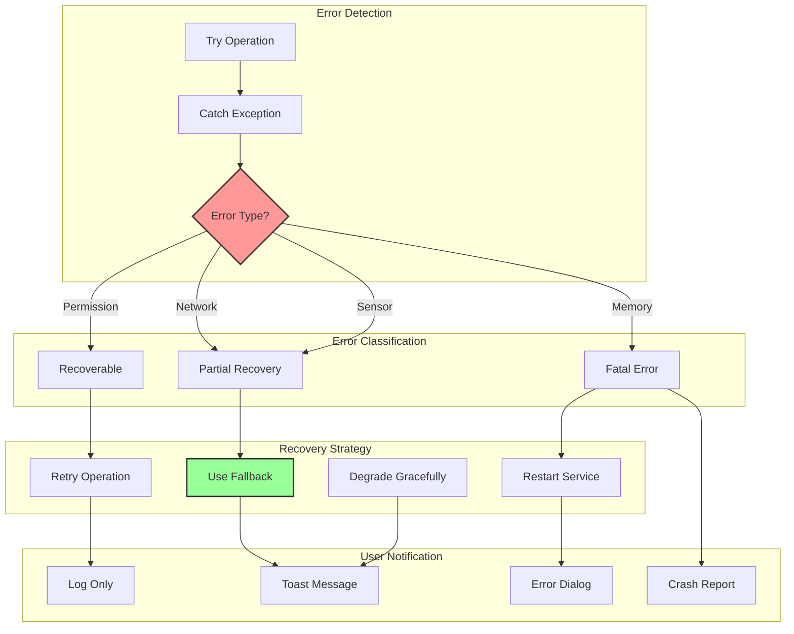

---

## 14. Security Architecture

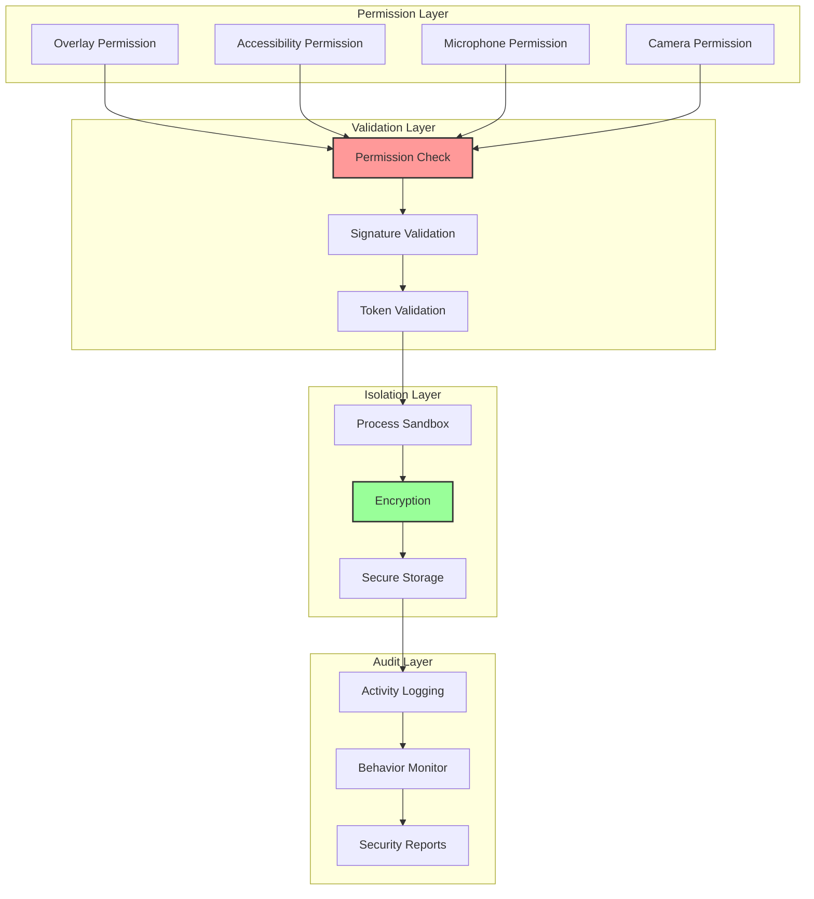

---

## 15. Module Dependencies

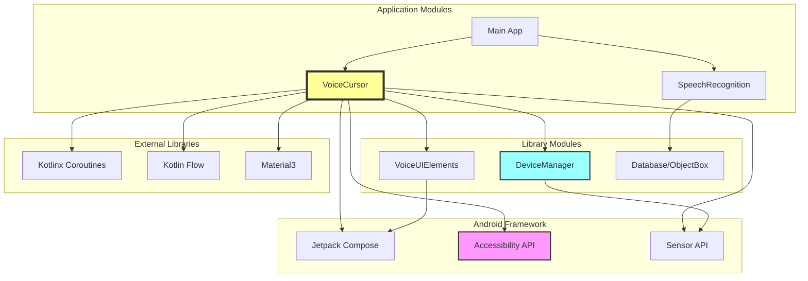

---

## Conclusion

These architecture diagrams provide a comprehensive visual understanding of the VoiceCursor system. Each diagram focuses on a specific aspect of the architecture, from high-level system overview to detailed component interactions. Use these diagrams as reference when implementing, debugging, or extending the VoiceCursor functionality.

---

**Legend:**
- 🟨 Yellow boxes: Critical components
- 🟦 Blue boxes: Service components  
- 🟩 Green boxes: Optimized/efficient components
- 🟥 Red boxes: Performance-critical or error-prone areas
- Thick borders: Primary flow paths
- Thin borders: Secondary flow paths