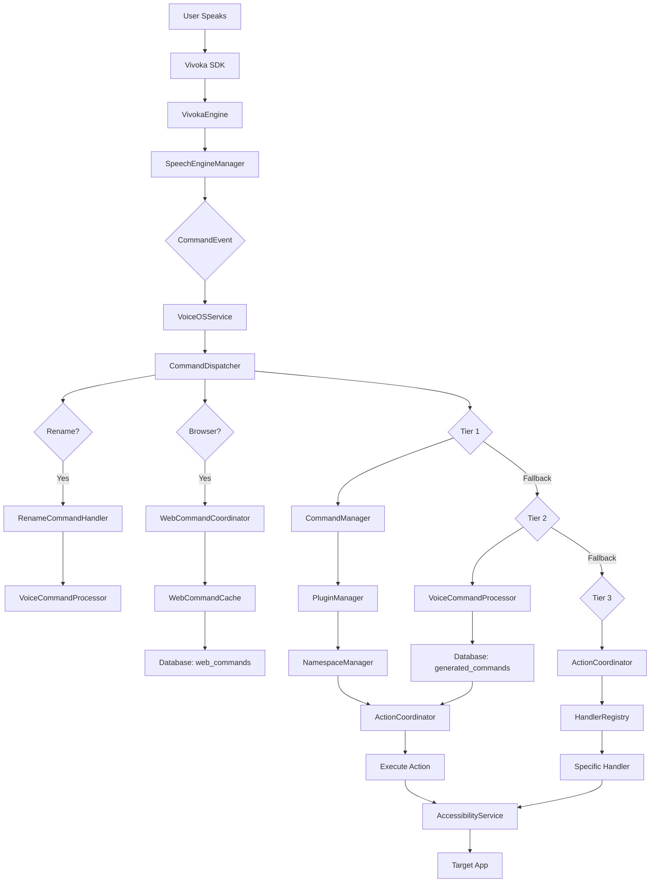
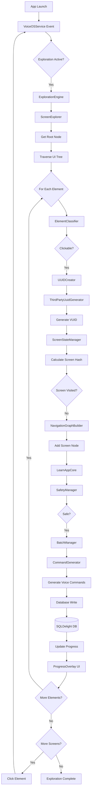
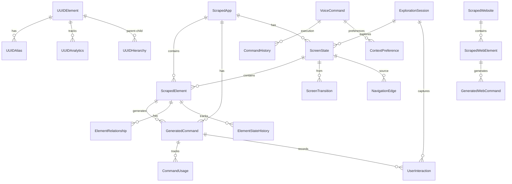
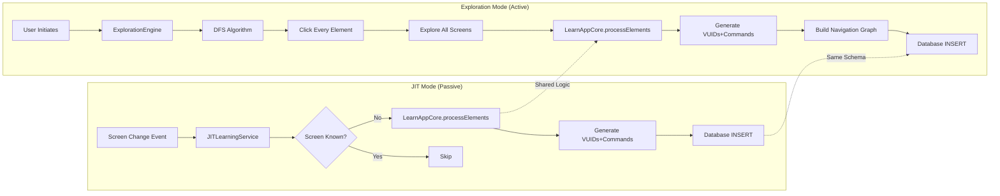
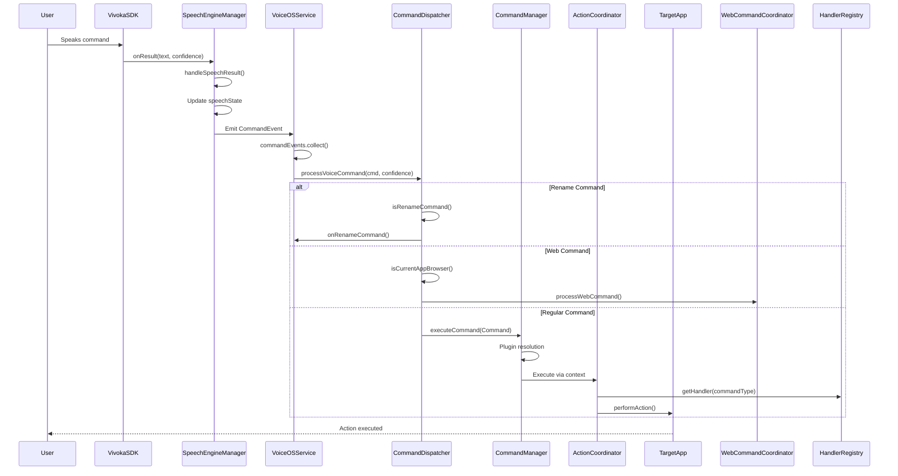
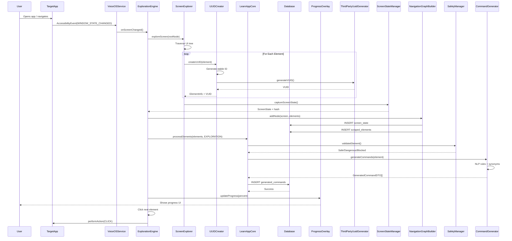
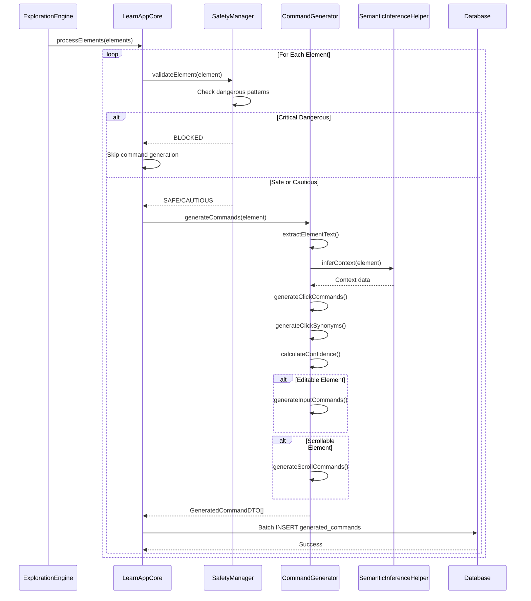
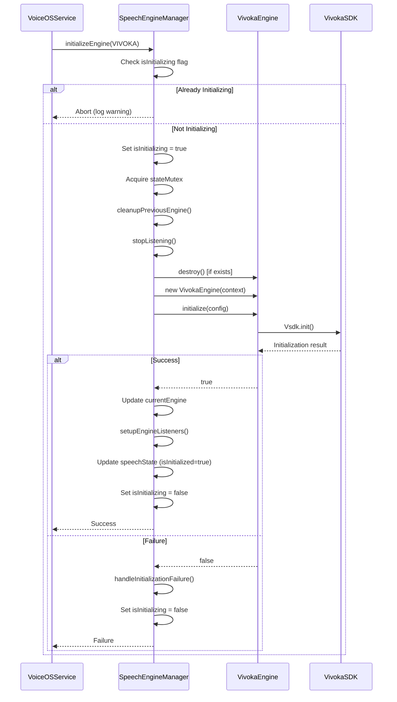

# VoiceOS Interdependency and Data Flow Analysis

**Document Version:** V1
**Created:** 2025-12-22
**Author:** Claude Code (AI Analysis)
**Scope:** VoiceOSCore, LearnAppCore, JITLearning, and associated modules

---

## Table of Contents

1. [Module Dependencies](#1-module-dependencies)
2. [Component Call Graph](#2-component-call-graph)
3. [Data Flow Diagrams](#3-data-flow-diagrams)
4. [Sequence Diagrams](#4-sequence-diagrams)
5. [Database Flow Patterns](#5-database-flow-patterns)
6. [Cross-Module Communication](#6-cross-module-communication)

---

## 1. Module Dependencies

### 1.1 VoiceOSCore Dependencies

**Direct Dependencies:**

| Category | Module | Purpose |
|----------|--------|---------|
| **Core KMP Libraries** | `:Modules:VoiceOS:core:result` | Type-safe error handling |
| | `:Modules:VoiceOS:core:hash` | SHA-256 hashing utilities |
| | `:Modules:VoiceOS:core:constants` | Centralized configuration |
| | `:Modules:VoiceOS:core:validation` | Input validation |
| | `:Modules:VoiceOS:core:exceptions` | Exception hierarchy |
| | `:Modules:VoiceOS:core:command-models` | Command data structures |
| | `:Modules:VoiceOS:core:accessibility-types` | Accessibility enums |
| | `:Modules:VoiceOS:core:voiceos-logging` | PII-safe logging |
| | `:Modules:VoiceOS:core:text-utils` | Text manipulation |
| | `:Modules:VoiceOS:core:json-utils` | JSON utilities |
| | `:Modules:VoiceOS:core:database` | SQLDelight KMP database |
| **Libraries** | `:Modules:VoiceOS:libraries:SpeechRecognition` | Voice recognition engines |
| | `:Modules:VoiceOS:libraries:UUIDCreator` | Element identification |
| | `:Modules:VoiceOS:libraries:DeviceManager` | Hardware integration |
| | `:Modules:VoiceOS:libraries:VoiceUIElements` | UI components |
| | `:Modules:VoiceOS:libraries:JITLearning` | JIT service with AIDL |
| | `:Modules:VoiceOS:libraries:LearnAppCore` | Shared business logic |
| **Managers** | `:Modules:VoiceOS:managers:HUDManager` | Gaze tracking & HUD |
| | `:Modules:VoiceOS:managers:CommandManager` | Command execution |
| **Apps** | `:Modules:VoiceOS:apps:VoiceCursor` | Cursor control |
| **External** | Vivoka VSDK | Speech recognition SDK |
| | Vosk Android | Offline speech recognition |

**Transitive Dependencies:**
- CommandManager → UniversalIPC → Core database
- SpeechRecognition → VoiceDataManager → Core database
- UUIDCreator → Core database

### 1.2 LearnAppCore Dependencies

**Direct Dependencies:**

| Module | Purpose |
|--------|---------|
| `:Modules:VoiceOS:core:database` | Command/element persistence |
| `:Modules:VoiceOS:libraries:UUIDCreator` | ThirdPartyUuidGenerator |
| `kotlinx-coroutines-android` | Async operations |
| `androidx.datastore:datastore-preferences` | Configuration persistence |
| `androidx.work:work-runtime-ktx` | Offline-first sync |

**Key Interfaces:**
- `IBatchManager` - Batch element processing
- `IBatchManagerInterface` - Core batch interface
- `SafetyManager` - Safety validation

### 1.3 JITLearning Dependencies

**Direct Dependencies:**

| Module | Purpose |
|--------|---------|
| `:Modules:VoiceOS:libraries:LearnAppCore` | Shared business logic |
| `:Modules:VoiceOS:core:database` | Data persistence |
| `kotlinx-coroutines-android` | Async operations |

**Architecture:**
- Foreground service in VoiceOSCore process
- AIDL interface for coordination with standalone LearnApp
- Zero dependencies between JIT and LearnApp (only shared core)

### 1.4 CommandManager Dependencies

**Direct Dependencies:**

| Module | Purpose |
|--------|---------|
| `:Modules:VoiceOS:libraries:SpeechRecognition` | Voice command input |
| `:Modules:VoiceOS:apps:VoiceCursor` | Cursor integration |
| `:Modules:VoiceOS:libraries:UniversalIPC` | Universal IPC Protocol |
| `:Modules:VoiceOS:core:command-models` | Command structures |
| `:Modules:VoiceOS:core:database` | SQLDelight database |

**Key Components:**
- `PluginManager` - Plugin system
- `NamespaceManager` - Command namespacing
- `ContextManager` - Context management

### 1.5 Circular Dependencies

**None Detected** - The architecture uses a clean layered dependency model:

```
Apps (VoiceOSCore, LearnApp, VoiceCursor)
  ↓
Managers (CommandManager, HUDManager, VoiceDataManager)
  ↓
Libraries (SpeechRecognition, LearnAppCore, JITLearning, UUIDCreator)
  ↓
Core (database, result, hash, constants, validation, etc.)
```

**Isolation Patterns:**
- JITLearning ↔ LearnApp: Isolated via LearnAppCore shared logic
- VoiceOSCore ↔ CommandManager: One-way dependency (VoiceOSCore depends on CommandManager)
- Web commands: Isolated via WebCommandCoordinator

---

## 2. Component Call Graph

### 2.1 Voice Command Execution Flow

```
User Voice Input
    ↓
SpeechEngineManager (VivokaEngine)
    ↓ (CommandEvent via SharedFlow)
VoiceOSService.commandEvents.collect()
    ↓
CommandDispatcher.processVoiceCommand()
    ↓
    ├─→ [RENAME TIER] RenameCommandHandler
    │   └─→ VoiceCommandProcessor.renameCommand()
    │
    ├─→ [WEB TIER] WebCommandCoordinator (if browser)
    │   └─→ WebCommandCache + WebViewScrapingEngine
    │
    ├─→ [TIER 1 - PRIMARY] CommandManager.executeCommand()
    │   ├─→ PluginManager.resolveCommand()
    │   ├─→ NamespaceManager.matchCommand()
    │   └─→ ActionCoordinator (via CommandContext)
    │
    ├─→ [TIER 2 - SECONDARY] VoiceCommandProcessor.processCommand()
    │   ├─→ Database query (hash-based app commands)
    │   └─→ ActionCoordinator.executeAction()
    │
    └─→ [TIER 3 - FALLBACK] ActionCoordinator.executeAction()
        ├─→ HandlerRegistry.getHandler()
        ├─→ Handler.execute() (AppHandler, NavigationHandler, etc.)
        └─→ AccessibilityService.performGlobalAction()
```

### 2.2 LearnApp Screen Exploration Flow

```
User launches target app
    ↓
VoiceOSService.onAccessibilityEvent()
    ↓
ExplorationEngine.startExploration(packageName)
    ↓
DFS Exploration Loop:
    │
    ├─→ ScreenExplorer.exploreScreen(rootNode)
    │   ├─→ ElementClassifier.classify(element)
    │   ├─→ UUIDCreator.createUUID(element)
    │   └─→ ThirdPartyUuidGenerator.generateVUID()
    │
    ├─→ ScreenStateManager.captureScreenState()
    │   └─→ ScreenHashCalculator.calculateHash()
    │
    ├─→ NavigationGraphBuilder.addNode(screen)
    │   └─→ Database: INSERT screen, elements, edges
    │
    ├─→ ElementClickTracker.markAsClicked(vuid)
    │
    ├─→ LearnAppCore.processElements() [Phase 3]
    │   ├─→ SafetyManager.validateElement()
    │   ├─→ BatchManager.addToBatch()
    │   └─→ CommandGenerator.generateCommands()
    │       └─→ Database: INSERT generated_command
    │
    └─→ Click next unexplored element → Repeat
```

### 2.3 JIT Learning (Passive) Flow

```
VoiceOSService.onCreate()
    ↓
JITLearningService.start() [Foreground Service]
    ↓
Listen for screen changes:
    │
VoiceOSService.onAccessibilityEvent(TYPE_WINDOW_STATE_CHANGED)
    ↓
JITLearningService.onScreenChanged()
    ↓
LearnAppCore.processElements(elements, mode=JIT)
    ├─→ Check if screen already learned (database)
    ├─→ If new: Generate VUIDs + Commands
    └─→ Database: INSERT incrementally
```

### 2.4 SpeechEngineManager Internal Flow

```
VoiceOSService.onCreate()
    ↓
SpeechEngineManager.initializeEngine(SpeechEngine.VIVOKA)
    ↓
    ├─→ cleanupPreviousEngine()
    ├─→ createEngineInstance() → VivokaEngine
    ├─→ initializeEngineInstanceWithRetry()
    │   └─→ VivokaEngine.initialize(config)
    └─→ setupEngineListeners()
        ├─→ onResult → handleSpeechResult()
        │   ├─→ Update _speechState (StateFlow)
        │   └─→ Emit CommandEvent (SharedFlow)
        ├─→ onError → Update _speechState
        └─→ onStateChange → Update _speechState

SpeechEngineManager.startListening()
    ↓
VivokaEngine.startListening()
    ↓
VivokaEngine.setDynamicCommands(commandList)
    ↓
[User speaks] → Vivoka SDK processes audio
    ↓
VivokaEngine.onResult callback
    ↓
SpeechEngineManager.handleSpeechResult()
    ↓
Emit CommandEvent → VoiceOSService collects
```

### 2.5 Database Write Paths

```
[LearnApp Exploration]
ExplorationEngine → LearnAppRepository → VoiceOSDatabaseManager → SQLDelight Queries

[Command Generation]
CommandGenerator → GeneratedCommandQueries.insert() → SQLDelight

[User Interactions]
ActionCoordinator → UserInteractionQueries.insert() → SQLDelight

[Command Usage]
CommandManager → CommandUsageQueries.insert() → SQLDelight

[Web Scraping]
WebViewScrapingEngine → WebScrapingDatabase → ScrapedWebElementQueries → SQLDelight
```

### 2.6 Database Read Paths

```
[Command Matching]
CommandManager → VoiceCommandQueries.getByText() → SQLDelight

[App Commands]
VoiceCommandProcessor → GeneratedCommandQueries.getByPackage() → SQLDelight

[Screen History]
ExplorationEngine → ScreenStateQueries.getByHash() → SQLDelight

[Element Lookup]
ActionCoordinator → ScrapedElementQueries.getByHash() → SQLDelight

[Web Commands]
WebCommandCoordinator → GeneratedWebCommandQueries.getByUrl() → SQLDelight
```

---

## 3. Data Flow Diagrams

### 3.1 Voice Command Flow (Mermaid)



### 3.2 LearnApp Exploration Flow (Mermaid)



### 3.3 Database Schema Relationships (Mermaid)



### 3.4 JIT vs Exploration Mode Comparison (Mermaid)



---

## 4. Sequence Diagrams

### 4.1 User Executes Voice Command



### 4.2 LearnApp Learns New Screen



### 4.3 Command Generation Process



### 4.4 SpeechEngineManager Initialization



---

## 5. Database Flow Patterns

### 5.1 Write Patterns

#### Pattern A: Batch Inserts (LearnApp Exploration)

```kotlin
// High throughput, transaction-based
LearnAppRepository.saveExplorationSession {
    transaction {
        // 1. Screen state
        screenStateQueries.insert(screenHash, activityName, ...)

        // 2. All elements in batch
        elements.forEach { element ->
            scrapedElementQueries.insert(elementHash, text, ...)
        }

        // 3. All commands in batch
        commands.forEach { command ->
            generatedCommandQueries.insert(commandText, elementHash, ...)
        }

        // 4. Navigation edges
        navigationEdgeQueries.insert(fromHash, toHash, ...)
    }
}
```

#### Pattern B: Incremental Inserts (JIT Learning)

```kotlin
// Low latency, single element
JITLearningService.onScreenChanged {
    if (!isScreenKnown(hash)) {
        // Insert screen
        screenStateQueries.insert(hash, ...)

        // Insert elements one-by-one
        elements.forEach { element ->
            scrapedElementQueries.insert(...)
            generatedCommandQueries.insert(...)
        }
    }
}
```

#### Pattern C: Usage Tracking (Command Execution)

```kotlin
// Real-time updates
CommandManager.executeCommand {
    // Increment usage count
    commandUsageQueries.incrementUsage(commandId)

    // Record interaction
    userInteractionQueries.insert(
        timestamp = now,
        commandId = commandId,
        result = success/failure
    )
}
```

### 5.2 Read Patterns

#### Pattern A: Command Matching (Hot Path)

```kotlin
// Fast hash-based lookup
VoiceCommandProcessor.processCommand(text) {
    val command = generatedCommandQueries
        .getByTextAndPackage(text, packageName)
        .executeAsOneOrNull()
}
```

#### Pattern B: Screen History Check (Cache + DB)

```kotlin
// Cache-first, fallback to DB
ExplorationEngine.isScreenVisited(hash) {
    // 1. Check in-memory cache
    if (visitedScreens.contains(hash)) return true

    // 2. Check database
    val screen = screenStateQueries
        .getByHash(hash)
        .executeAsOneOrNull()

    return screen != null
}
```

#### Pattern C: Analytics Queries (Batch Reads)

```kotlin
// Complex aggregations
AnalyticsManager.getAppStats(packageName) {
    val stats = database.transactionWithResult {
        val elementCount = scrapedElementQueries.countByPackage(packageName)
        val commandCount = generatedCommandQueries.countByPackage(packageName)
        val sessionCount = explorationSessionQueries.countByPackage(packageName)

        AppStats(elementCount, commandCount, sessionCount)
    }
}
```

### 5.3 Database Schema Summary

**Core Tables:**

| Table | Purpose | Key Columns |
|-------|---------|-------------|
| `scraped_app` | App metadata | `id`, `package_name`, `version_code` |
| `screen_state` | Screen snapshots | `id`, `screen_hash`, `activity_name` |
| `scraped_element` | UI elements | `id`, `element_hash`, `text`, `vuid` |
| `generated_command` | Voice commands | `id`, `command_text`, `element_hash` |
| `navigation_edge` | Screen transitions | `from_screen_hash`, `to_screen_hash` |
| `element_relationship` | Parent-child | `parent_hash`, `child_hash` |
| `user_interaction` | Usage analytics | `timestamp`, `command_id`, `result` |

**UUID Tables:**

| Table | Purpose |
|-------|---------|
| `uuid_element` | VUID storage |
| `uuid_alias` | Human-readable aliases |
| `uuid_analytics` | VUID usage tracking |
| `uuid_hierarchy` | Parent-child relationships |

**Web Tables:**

| Table | Purpose |
|-------|---------|
| `scraped_website` | Website metadata |
| `scraped_web_element` | DOM elements |
| `generated_web_command` | Browser commands |

---

## 6. Cross-Module Communication

### 6.1 AIDL Communication (JIT ↔ LearnApp)

**Interface:** `IJITLearningService.aidl`

```
LearnApp (Standalone) ──AIDL──> JITLearningService (VoiceOSCore Process)
                      <──AIDL──

Commands:
- startPassiveLearning(packageName)
- stopPassiveLearning()
- getLearnedScreens(packageName)
- queryLearningStatus()
```

### 6.2 IPC Communication (CommandManager ↔ VoiceOSService)

**Protocol:** UniversalIPC

```
VoiceOSService ──IPC──> CommandManager
              <──IPC──

Messages:
- executeCommand(Command)
- getAvailableCommands()
- registerCommandHandler(namespace)
- unregisterCommandHandler(namespace)
```

### 6.3 Event Bus (Internal - VoiceOSService)

**Pattern:** Kotlin SharedFlow

```kotlin
// Speech events
SpeechEngineManager.commandEvents: SharedFlow<CommandEvent>

// Exploration events
ExplorationEngine.explorationState: StateFlow<ExplorationState>

// Service events
ServiceLifecycleManager.serviceState: StateFlow<ServiceState>
```

### 6.4 Repository Pattern (Data Layer)

**Interface:** `LearnAppRepository`

```kotlin
interface LearnAppRepository {
    suspend fun saveScreen(screen: ScreenState)
    suspend fun saveElements(elements: List<ScrapedElementDTO>)
    suspend fun saveCommands(commands: List<GeneratedCommandDTO>)
    suspend fun getScreen(hash: String): ScreenState?
    suspend fun getCommands(packageName: String): List<GeneratedCommandDTO>
}

Implementation: LearnAppRepositoryImpl (SQLDelight)
```

---

## Summary

### Key Architectural Patterns

1. **Layered Dependencies** - Clean separation (Apps → Managers → Libraries → Core)
2. **Zero Circular Dependencies** - All dependencies flow downward
3. **Shared Logic via Core** - LearnAppCore isolates JIT ↔ LearnApp
4. **Multi-Tier Command System** - Rename → Web → Tier 1 → Tier 2 → Tier 3
5. **Event-Driven Architecture** - SharedFlow for commands, StateFlow for state
6. **Repository Pattern** - Abstract database access
7. **AIDL for Cross-Process** - JIT ↔ LearnApp communication
8. **IPC for Cross-Module** - UniversalIPC protocol

### Critical Data Flows

1. **Voice Command:** User → Vivoka → SpeechEngineManager → CommandDispatcher → CommandManager/ActionCoordinator → Target App
2. **Screen Learning:** App Change → ExplorationEngine → ScreenExplorer → UUIDCreator → LearnAppCore → CommandGenerator → Database
3. **JIT Learning:** Screen Change → JITService → LearnAppCore → Database (incremental)
4. **Command Execution:** Database → CommandManager → ActionCoordinator → AccessibilityService

### Performance Considerations

- **Hot Path:** Command matching (hash-based, indexed)
- **Batch Operations:** Exploration uses transactions
- **Incremental Updates:** JIT uses single inserts
- **Caching:** In-memory visited screens cache
- **Async Processing:** Coroutines + Dispatchers.IO for DB operations

---

**End of Document**
